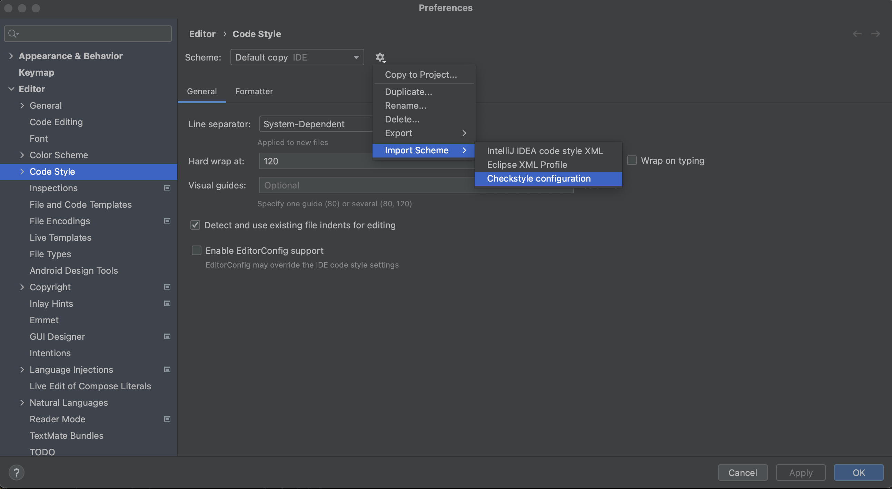
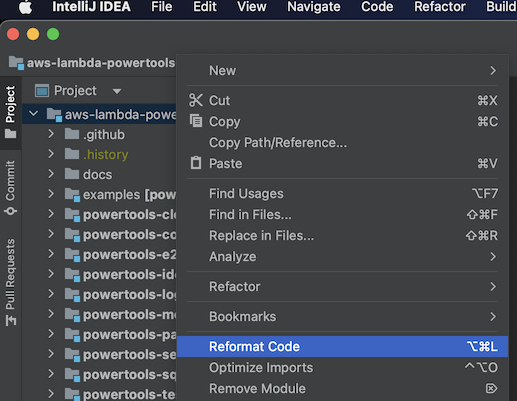
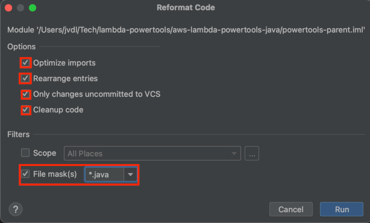

<!-- markdownlint-disable MD043 MD041 -->
# Table of contents <!-- omit in toc -->

- [Contributing Guidelines](#contributing-guidelines)
    - [Reporting Bugs/Feature Requests](#reporting-bugsfeature-requests)
    - [Contributing via Pull Requests](#contributing-via-pull-requests)
        - [Dev setup](#dev-setup)
        - [Local documentation](#local-documentation)
    - [Conventions](#conventions)
        - [General terminology and practices](#general-terminology-and-practices)
        - [Testing definition](#testing-definition)
    - [Finding contributions to work on](#finding-contributions-to-work-on)
    - [Code of Conduct](#code-of-conduct)
    - [Security issue notifications](#security-issue-notifications)
    - [Troubleshooting](#troubleshooting)
        - [API reference documentation](#api-reference-documentation)
    - [Licensing](#licensing)

# Contributing Guidelines

<!-- markdownlint-disable MD013 -->
Thank you for your interest in contributing to our project. Whether it's a [bug report](https://github.com/aws-powertools/powertools-lambda-java/issues/new?assignees=&labels=bug%2C+triage&projects=&template=bug_report.md&title=Bug%3A+TITLE), [new feature](https://github.com/aws-powertools/powertools-lambda-java/issues/new?assignees=&labels=feature-request%2C+triage&projects=&template=feature_request.md&title=Feature+request%3A+TITLE) or [additional documentation](https://github.com/aws-powertools/powertools-lambda-java/issues/new?assignees=&labels=documentation%2Ctriage&projects=&template=documentation_improvements.yml&title=Docs%3A+TITLE), we greatly value feedback and contributions from our community.
<!-- markdownlint-enable MD013 -->

Please read through this document before submitting any issues or pull requests to ensure we have all the necessary
information to effectively respond to your bug report or contribution.

## Reporting Bugs/Feature Requests

We welcome you to use the GitHub issue tracker to report bugs, suggest features, or documentation improvements.

<!-- markdownlint-disable MD013 -->
[When filing an issue](https://github.com/aws-powertools/powertools-lambda-java/issues/new/choose), please check [existing open](https://github.com/aws-powertools/powertools-lambda-java/issues?q=is%3Aissue+is%3Aopen+sort%3Aupdated-desc), or [recently closed](https://github.com/aws-powertools/powertools-lambda-java/issues?q=is%3Aissue+sort%3Aupdated-desc+is%3Aclosed) issues to make sure somebody else hasn't already reported the issue. Please try to include as much information as you can.
<!-- markdownlint-enable MD013 -->

## Contributing via Pull Requests

Contributions via pull requests are much appreciated. Before sending us a pull request, please ensure that:

1. You are working on a fork. [Fork the repository](https://github.com/aws-powertools/powertools-lambda-java/fork).
2. You are working against the latest source on the **main** branch.
3. You check existing open, and recently merged pull requests to make sure someone else hasn't addressed the problem already.
4. You open an [issue](https://github.com/aws-powertools/powertools-lambda-java/issues/new/choose) before you begin any implementation. We value your time and bandwidth. As such, any pull requests created on non-triaged issues might not be successful.

### Dev setup

We recommend using [IntelliJ IDEA](https://www.jetbrains.com/idea/) from Jetbrains. 
A community version is available and largely enough for our purpose.

#### Code Formatting

We strongly recommend to install the CheckStyle-IDEA plugin and apply the provided [checkstyle.xml](checkstyle.xml) in order to comply with our formatting rules: 

1. Install the [CheckStyle-IDEA plugin](https://plugins.jetbrains.com/plugin/1065-checkstyle-idea) and restart IntelliJ.

2. After installing the plugin, open the preferences (`⌘,` on macOS, or `Ctrl+Alt+S` on Windows/Linux) and search for _Code Style_. Click on the gear icon near the scheme and import checkstyle configuration. Click on "Apply" and "OK".

3. Select the code you've created (module, package, class) and reformat code: `⌘⌥L` (macOS), or `Ctrl+Alt+L` (Windows/Linux):

4. Apply the reformat, optimize imports, rearrange and cleanup to your code and only to java files:

#### License headers
All the java files should contain the licence/copyright header. You can copy past it from the [license-header](license-header) file.

### Creating the pull request

To send us a pull request, please follow these steps:

1. Create a new branch to focus on the specific change you are contributing e.g. `improv/logger-debug-sampling`
2. Run all tests, and code baseline checks: `mvn clean verify -P build-with-spotbugs`
3. Commit to your fork using clear commit messages.
4. Send us a pull request with a [conventional semantic title](.github/semantic.yml), and answering any default questions in the pull request interface.
5. Pay attention to any automated CI failures reported in the pull request, and stay involved in the conversation.

GitHub provides additional document on [forking a repository](https://help.github.com/articles/fork-a-repo/) and
[creating a pull request](https://help.github.com/articles/creating-a-pull-request/).

### Local documentation

If you work on the documentation, you may find useful to display it locally while editing, using the following command:

- **Docs website**: `make docs-local-docker`

## Conventions

### General terminology and practices

| Category              | Convention                                                                                                                                                                                                                                                                  |
|-----------------------|-----------------------------------------------------------------------------------------------------------------------------------------------------------------------------------------------------------------------------------------------------------------------------|
| **Style guide**       | We use Checkstyle and Sonar to enforce beyond good practices.                                                                                                                                                                                                               |
| **Exceptions**        | Specific exceptions live within utilities themselves and use `Exception` suffix e.g. `IdempotencyKeyException`.                                                                                                                                                             |
| **Git commits**       | We follow [conventional commits](https://www.conventionalcommits.org/en/v1.0.0/). We do not enforce conventional commits on contributors to lower the entry bar. Instead, we enforce a conventional PR title so our label automation and changelog are generated correctly. |
| **API documentation** | API reference docs are generated from Javadoc which should have examples to allow developers to have what they need within their own IDE. Documentation website covers the wider usage, tips, and strive to be concise.                                                     |
| **Documentation**     | We treat it like a product. We sub-divide content aimed at getting started (80% of customers) vs advanced usage (20%). We also ensure customers know how to unit test their code when using our features.                                                                   |

### Testing definition

We group tests in different categories

| Test              | When to write                                                                                         | Notes                                                                                                                           | Speed                                             |
| ----------------- | ----------------------------------------------------------------------------------------------------- | ------------------------------------------------------------------------------------------------------------------------------- | ------------------------------------------------- |
| Unit tests        | Verify the smallest possible unit works.                                                              | Networking access is prohibited. Prefer Functional tests given our complexity.                                                  | Lightning fast (nsec to ms)                       |
| End-to-end tests  | Gain confidence that a Lambda function with our code operates as expected.                            | It simulates how customers configure, deploy, and run their Lambda function - Event Source configuration, IAM permissions, etc. | Slow (minutes)                                    |

**NOTE**: Unit tests are mandatory. End-to-end tests should be created for new modules.

## Finding contributions to work on

Looking at the existing issues is a great way to find something to contribute on. As our projects, by default, use the default GitHub issue labels (enhancement/bug/help wanted/invalid/question/documentation), [looking at any 'good first issue' issues is a great place to start](https://github.com/aws-powertools/powertools-lambda-java/issues?q=is%3Aissue+is%3Aopen+label%3A%22good+first+issue%22).

## Code of Conduct

This project has adopted the [Amazon Open Source Code of Conduct](https://aws.github.io/code-of-conduct).
For more information see the [Code of Conduct FAQ](https://aws.github.io/code-of-conduct-faq) or contact
<opensource-codeofconduct@amazon.com> with any additional questions or comments.

## Security issue notifications

If you discover a potential security issue in this project we ask that you notify AWS/Amazon Security via our [vulnerability reporting page](http://aws.amazon.com/security/vulnerability-reporting/). Please do **not** create a public github issue.

## Troubleshooting

## Licensing

See the [LICENSE](LICENSE) file for our project's licensing. We will ask you to confirm the licensing of your contribution.

We may ask you to sign a [Contributor License Agreement (CLA)](http://en.wikipedia.org/wiki/Contributor_License_Agreement) for larger changes.

## Contributing via Pull Requests
Contributions via pull requests are much appreciated. Before sending us a pull request, please ensure that:

1. You are working against the latest source on the *main* branch.
2. You check existing open, and recently merged, pull requests to make sure someone else hasn't addressed the problem already.
3. You open an issue to discuss any significant work - we would hate for your time to be wasted.

To send us a pull request, please:

1. Fork the repository.
2. Modify the source; please focus on the specific change you are contributing. If you also reformat all the code, it will be hard for us to focus on your change.
3. Ensure local tests pass: `mvn clean test`
4. Ensure your code is formatted with the provided [checkstyle.xml](https://github.com/aws-powertools/powertools-lambda-java/blob/main/checkstyle.xml): `mvn clean verify`
5. Commit to your fork using clear commit messages.
6. Send us a pull request, answering any default questions in the pull request interface.
7. Pay attention to any automated CI failures reported in the pull request, and stay involved in the conversation.

GitHub provides additional document on [forking a repository](https://help.github.com/articles/fork-a-repo/) and
[creating a pull request](https://help.github.com/articles/creating-a-pull-request/).

## Finding contributions to work on
Looking at the existing issues is a great way to find something to contribute on. As our projects, by default, use the default GitHub issue labels (enhancement/bug/duplicate/help wanted/invalid/question/wontfix), looking at any 'help wanted' issues is a great place to start.

## Code of Conduct
This project has adopted the [Amazon Open Source Code of Conduct](https://aws.github.io/code-of-conduct).
For more information see the [Code of Conduct FAQ](https://aws.github.io/code-of-conduct-faq) or contact
opensource-codeofconduct@amazon.com with any additional questions or comments.

## Security issue notifications
If you discover a potential security issue in this project we ask that you notify AWS/Amazon Security via our [vulnerability reporting page](http://aws.amazon.com/security/vulnerability-reporting/). Please do **not** create a public github issue.

## Licensing

See the [LICENSE](LICENSE) file for our project's licensing. We will ask you to confirm the licensing of your contribution.

We may ask you to sign a [Contributor License Agreement (CLA)](http://en.wikipedia.org/wiki/Contributor_License_Agreement) for larger changes.