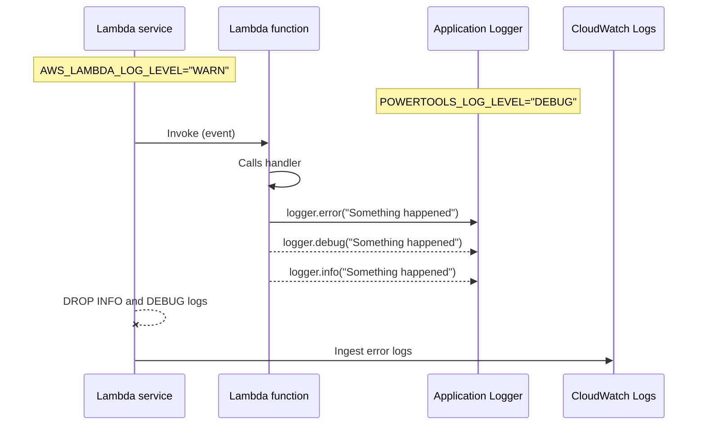

Logging provides an opinionated logger with output structured as JSON.

## Key features

* Leverages standard logging libraries: [_SLF4J_](https://www.slf4j.org/){target="_blank"} as the API, and [_log4j2_](https://logging.apache.org/log4j/2.x/){target="_blank"} or [_logback_](https://logback.qos.ch/){target="_blank"} for the implementation
* Captures key fields from Lambda context, cold start and structures logging output as JSON
* Optionally logs Lambda request
* Optionally logs Lambda response
* Optionally supports log sampling by including a configurable percentage of DEBUG logs in logging output
* Allows additional keys to be appended to the structured log at any point in time


## Getting started

???+ tip
    You can find complete examples in the [project repository](https://github.com/aws-powertools/powertools-lambda-java/tree/v2/examples/powertools-examples-core-utilities){target="_blank"}.

### Installation
Depending on preference, you must choose to use either _log4j2_ or _logback_ as your log provider. In both cases you need to configure _aspectj_
to weave the code and make sure the annotation is processed.

#### Maven
=== "log4j2"

    ```xml hl_lines="3-7 24-27"
    <dependencies>
        ...
        <dependency>
            <groupId>software.amazon.lambda</groupId>
            <artifactId>powertools-logging-log4j</artifactId>
            <version>{{ powertools.version }}</version>
        </dependency>
        ...
    </dependencies>
    ...
    <!-- configure the aspectj-maven-plugin to compile-time weave (CTW) the aws-lambda-powertools-java aspects into your project -->
    <build>
        <plugins>
            ...
            <plugin>
                 <groupId>dev.aspectj</groupId>
                 <artifactId>aspectj-maven-plugin</artifactId>
                 <version>1.13.1</version>
                 <configuration>
                     <source>11</source> <!-- or higher -->
                     <target>11</target> <!-- or higher -->
                     <complianceLevel>11</complianceLevel> <!-- or higher -->
                     <aspectLibraries>
                         <aspectLibrary>
                             <groupId>software.amazon.lambda</groupId>
                             <artifactId>powertools-logging</artifactId>
                         </aspectLibrary>
                     </aspectLibraries>
                 </configuration>
                 <executions>
                     <execution>
                         <goals>
                             <goal>compile</goal>
                         </goals>
                     </execution>
                 </executions>
            </plugin>
            ...
        </plugins>
    </build>
    ```

=== "logback"

    ```xml hl_lines="3-7 24-27"
    <dependencies>
        ...
        <dependency>
            <groupId>software.amazon.lambda</groupId>
            <artifactId>powertools-logging-logback</artifactId>
            <version>{{ powertools.version }}</version>
        </dependency>
        ...
    </dependencies>
    ...
    <!-- configure the aspectj-maven-plugin to compile-time weave (CTW) the aws-lambda-powertools-java aspects into your project -->
    <build>
        <plugins>
            ...
            <plugin>
                 <groupId>dev.aspectj</groupId>
                 <artifactId>aspectj-maven-plugin</artifactId>
                 <version>1.13.1</version>
                 <configuration>
                     <source>11</source> <!-- or higher -->
                     <target>11</target> <!-- or higher -->
                     <complianceLevel>11</complianceLevel> <!-- or higher -->
                     <aspectLibraries>
                         <aspectLibrary>
                             <groupId>software.amazon.lambda</groupId>
                             <artifactId>powertools-logging</artifactId>
                         </aspectLibrary>
                     </aspectLibraries>
                 </configuration>
                 <executions>
                     <execution>
                         <goals>
                             <goal>compile</goal>
                         </goals>
                     </execution>
                 </executions>
            </plugin>
            ...
        </plugins>
    </build>
    ```

#### Gradle

=== "log4j2"

    ```groovy hl_lines="3 11"
        plugins {
            id 'java'
            id 'io.freefair.aspectj.post-compile-weaving' version '8.1.0'
        }
        
        repositories {
            mavenCentral()
        }
        
        dependencies {
            aspect 'software.amazon.lambda:powertools-logging-log4j:{{ powertools.version }}'
        }
        
        sourceCompatibility = 11
        targetCompatibility = 11
    ```

=== "logback"

    ```groovy hl_lines="3 11"
        plugins {
            id 'java'
            id 'io.freefair.aspectj.post-compile-weaving' version '8.1.0'
        }
        
        repositories {
            mavenCentral()
        }
        
        dependencies {
            aspect 'software.amazon.lambda:powertools-logging-logback:{{ powertools.version }}'
        }
        
        sourceCompatibility = 11
        targetCompatibility = 11
    ```


### Configuration

#### Main environment variables

The logging module requires two settings:

| Environment variable      | Setting           | Description                                                                                                 |
|---------------------------|-------------------|-------------------------------------------------------------------------------------------------------------|
| `POWERTOOLS_LOG_LEVEL`    | **Logging level** | Sets how verbose Logger should be. If not set, will use the [Logging configuration](#logging-configuration) |
| `POWERTOOLS_SERVICE_NAME` | **Service**       | Sets service key that will be included in all log statements (Default is `service_undefined`)            |

Here is an example using AWS Serverless Application Model (SAM):

=== "template.yaml"
``` yaml hl_lines="10 11"
Resources:
  PaymentFunction:
    Type: AWS::Serverless::Function
    Properties:
      MemorySize: 512
      Timeout: 20
      Runtime: java17
      Environment:
        Variables:
          POWERTOOLS_LOG_LEVEL: WARN
          POWERTOOLS_SERVICE_NAME: payment
```

There are some other environment variables which can be set to modify Logging's settings at a global scope:

| Environment variable            | Type     | Description                                                                                                             |  
|---------------------------------|----------|-------------------------------------------------------------------------------------------------------------------------|  
| `POWERTOOLS_LOGGER_SAMPLE_RATE` | float    | Configure the sampling rate at which `DEBUG` logs should be included. See [sampling rate](#sampling-debug-logs)                  |  
| `POWERTOOLS_LOG_EVENT`          | boolean  | Specify if the incoming Lambda event should be logged. See [Logging event](#logging-incoming-event)                     |  
| `POWERTOOLS_LOG_RESPONSE`       | boolean  | Specify if the Lambda response should be logged. See [logging response](#logging-handler-response)                      |  
| `POWERTOOLS_LOG_ERROR`          | boolean  | Specify if a Lambda uncaught exception should be logged. See [logging exception](#logging-handler-uncaught-exception  ) |  

#### Logging configuration

Powertools for AWS Lambda (Java) simply extends the functionality of the underlying library you choose (_log4j2_ or _logback_).
You can leverage the standard configuration files (_log4j2.xml_ or _logback.xml_):

=== "log4j2.xml"

    With log4j2, we leverage the [`JsonTemplateLayout`](https://logging.apache.org/log4j/2.x/manual/json-template-layout.html){target="_blank"}
    to provide structured logging. A default template is provided in powertools ([_LambdaJsonLayout.json_](https://github.com/aws-powertools/powertools-lambda-java/tree/v2/powertools-logging/powertools-logging-log4j/src/main/resources/LambdaJsonLayout.json){target="_blank"}):

    ```xml hl_lines="5"
    <?xml version="1.0" encoding="UTF-8"?>
    <Configuration>
        <Appenders>
            <Console name="JsonAppender" target="SYSTEM_OUT">
                <JsonTemplateLayout eventTemplateUri="classpath:LambdaJsonLayout.json" />
            </Console>
        </Appenders>
        <Loggers>
            <Logger name="com.example" level="debug" additivity="false">
                <AppenderRef ref="JsonAppender"/>
            </Logger>
            <Root level="info">
                <AppenderRef ref="JsonAppender"/>
            </Root>
        </Loggers>
    </Configuration>
    ```

=== "logback.xml"

    With logback, we leverage a custom [Encoder](https://logback.qos.ch/manual/encoders.html){target="_blank"} 
    to provide structured logging:

    ```xml hl_lines="4 5"
    <?xml version="1.0" encoding="UTF-8"?>
    <configuration>
        <appender name="console" class="ch.qos.logback.core.ConsoleAppender">
            <encoder class="software.amazon.lambda.powertools.logging.LambdaJsonEncoder">
            </encoder>
        </appender>
        <logger name="com.example" level="DEBUG" additivity="false">
            <appender-ref ref="console" />
        </logger>
        <root level="INFO">
            <appender-ref ref="console" />
        </root>
    </configuration>
    ```

## Log level
Log level is generally configured in the `log4j2.xml` or `logback.xml`. But this level is static and needs a redeployment of the function to be changed.
Powertools for AWS Lambda permits to change this level dynamically thanks to an environment variable `POWERTOOLS_LOG_LEVEL`.

We support the following log levels (SLF4J levels): `TRACE`, `DEBUG`, `INFO`, `WARN`, `ERROR`.
If the level is set to `CRITICAL` (supported in log4j but not logback), we revert it back to `ERROR`.
If the level is set to any other value, we set it to the default value (`INFO`).

### AWS Lambda Advanced Logging Controls (ALC)

!!!question "When is it useful?"
    When you want to set a logging policy to drop informational or verbose logs for one or all AWS Lambda functions, regardless of runtime and logger used.

<!-- markdownlint-disable MD013 -->
With [AWS Lambda Advanced Logging Controls (ALC)](https://docs.aws.amazon.com/lambda/latest/dg/monitoring-cloudwatchlogs.html#monitoring-cloudwatchlogs-advanced){target="_blank"}, you can enforce a minimum log level that Lambda will accept from your application code.

When enabled, you should keep Powertools and ALC log level in sync to avoid data loss.

Here's a sequence diagram to demonstrate how ALC will drop both `INFO` and `DEBUG` logs emitted from `Logger`, when ALC log level is stricter than `Logger`.
<!-- markdownlint-enable MD013 -->



### Priority of log level settings in Powertools for AWS Lambda

We prioritise log level settings in this order:

1. `AWS_LAMBDA_LOG_LEVEL` environment variable
2. `POWERTOOLS_LOG_LEVEL` environment variable
3. level defined in the `log4j2.xml` or `logback.xml` files

If you set Powertools level lower than ALC, we will emit a warning informing you that your messages will be discarded by Lambda.

> **NOTE**
>
> With ALC enabled, we are unable to increase the minimum log level below the `AWS_LAMBDA_LOG_LEVEL` environment variable value, see [AWS Lambda service documentation](https://docs.aws.amazon.com/lambda/latest/dg/monitoring-cloudwatchlogs.html#monitoring-cloudwatchlogs-log-level){target="_blank"} for more details.

## Basic Usage

To use Lambda Powertools for AWS Lambda Logging, use the `@Logging` annotation in your code and the standard _SLF4J_ logger:

=== "PaymentFunction.java"

    ```java hl_lines="8 10 12 14"
    import org.slf4j.Logger;
    import org.slf4j.LoggerFactory;
    import software.amazon.lambda.powertools.logging.Logging;
    // ... other imports

    public class PaymentFunction implements RequestHandler<APIGatewayProxyRequestEvent, APIGatewayProxyResponseEvent> {
    
        private static final Logger LOGGER = LoggerFactory.getLogger(PaymentFunction.class);
        
        @Logging
        public APIGatewayProxyResponseEvent handleRequest(final APIGatewayProxyRequestEvent input, final Context context) {
            LOGGER.info("Collecting payment");
            // ...
            LOGGER.debug("order={}, amount={}", order.getId(), order.getAmount());
            // ...
        }
    }
    ```

## Standard structured keys

Your logs will always include the following keys in your structured logging:

| Key               | Type   | Example                                                                                             | Description                                                                                                                |
|-------------------|--------|-----------------------------------------------------------------------------------------------------|----------------------------------------------------------------------------------------------------------------------------|
| **timestamp**     | String | "2023-12-01T14:49:19.293Z"                                                                          | Timestamp of actual log statement, by default uses default AWS Lambda timezone (UTC)                                       |
| **level**         | String | "INFO"                                                                                              | Logging level (any level supported by _SLF4J_ (i.e. `TRACE`, `DEBUG`, `INFO`, `WARN`, `ERROR`)                             |
| **service**       | String | "payment"                                                                                           | Service name defined, by default `service_undefined`                                                                       |
| **sampling_rate** | float  | 0.1                                                                                                 | Debug logging sampling rate in percentage e.g. 10% in this case (logged if not 0)                                          |
| **message**       | String | "Collecting payment"                                                                                | Log statement value. Unserializable JSON values will be casted to string                                                   |
| **xray_trace_id** | String | "1-5759e988-bd862e3fe1be46a994272793"                                                               | X-Ray Trace ID when [Tracing is enabled](https://docs.aws.amazon.com/lambda/latest/dg/services-xray.html){target="_blank"} |
| **error**         | Map    | `{ "name": "InvalidAmountException", "message": "Amount must be superior to 0", "stack": "at..." }` | Eventual exception (e.g. when doing `logger.error("Error", new InvalidAmountException("Amount must be superior to 0"));`)  |

### Log messages as JSON
By default, `message` is logged as a `String` (e.g `"message": "The message"`). When logging JSON content, 
you may want to avoid the escaped String (`"message:"{\"key\":\"value\"}"`) for better readability. 
You can use `LoggingUtils.logMessagesAsJson(true)` to enable this programmatically. 

=== "PaymentFunction.java"

    ```java hl_lines="14 15 17-20"
    import static software.amazon.lambda.powertools.utilities.EventDeserializer.extractDataFrom;
    import software.amazon.lambda.powertools.logging.LoggingUtils;
    import software.amazon.lambda.powertools.utilities.JsonConfig;
    // ... other imports

    public class PaymentFunction implements RequestHandler<APIGatewayProxyRequestEvent, APIGatewayProxyResponseEvent> {
    
        private static final Logger LOGGER = LoggerFactory.getLogger(PaymentFunction.class);
        
        @Logging
        public APIGatewayProxyResponseEvent handleRequest(final APIGatewayProxyRequestEvent input, final Context context) {
            Order order = extractDataFrom(input).as(Order.class);

            // logged as a String
            LOGGER.debug("{}", JsonConfig.get().getObjectMapper().writeValueAsString(order));

            // Logged as JSON
            LoggingUtils.logMessagesAsJson(true);
            LOGGER.debug("{}", JsonConfig.get().getObjectMapper().writeValueAsString(order));
            LoggingUtils.logMessagesAsJson(false);

            // ...
        }
    }
    ```

=== "Order.java"

    ```java 
    public class Order {
        private String id;
        private Date date;
        private Double amount;
    }
    ```

=== "Example CloudWatch Logs"

    ```json hl_lines="3 9-13"
	{
		"level": "DEBUG",
	  	"message": "{\"id\":\"435iuh2j3hb4\", \"date\":\"2023-12-01T14:48:59\", \"amount\":435.5}",
		"timestamp": "2023-12-01T14:49:19.293Z",
	  	"service": "payment",
	}
	{
		"level": "DEBUG",
	  	"message": {
            "id": "435iuh2j3hb4", 
            "date": "2023-12-01T14:48:59", 
            "amount":435.5
        },
		"timestamp": "2023-12-01T14:49:19.312Z",
	  	"service": "payment",
	}
    ```

You can also achieve this more broadly for all JSON messages (see advanced configuration for [log4j](#log-messages-as-json_1) & [logback](#log-messages-as-json_2)).

## Additional structured keys

### Logging Lambda context information
The following keys will also be added to all your structured logs (unless [configured otherwise](#more-customization_1)):

| Key                      | Type    | Example                                                                                | Description                        |
|--------------------------|---------|----------------------------------------------------------------------------------------|------------------------------------|
| **cold_start**           | Boolean | false                                                                                  | ColdStart value                    |
| **function_name**        | String  | "example-PaymentFunction-1P1Z6B39FLU73"                                                | Name of the function               |
| **function_version**     | String  | "12"                                                                                   | Version of the function            |
| **function_memory_size** | String  | "512"                                                                                  | Memory configure for the function  |
| **function_arn**         | String  | "arn:aws:lambda:eu-west-1:012345678910:function:example-PaymentFunction-1P1Z6B39FLU73" | ARN of the function                |
| **function_request_id**  | String  | "899856cb-83d1-40d7-8611-9e78f15f32f4""                                                | AWS Request ID from lambda context |

### Logging additional keys

#### Logging a correlation ID

You can set a correlation ID using the `correlationIdPath` attribute of the `@Logging`annotation,
by passing a [JMESPath expression](https://jmespath.org/tutorial.html){target="_blank"}, 
including our custom [JMESPath Functions](../utilities/serialization.md#built-in-functions).

=== "AppCorrelationIdPath.java"

    ```java hl_lines="5"
    public class AppCorrelationIdPath implements RequestHandler<APIGatewayProxyRequestEvent, APIGatewayProxyResponseEvent> {
    
        private static final Logger LOGGER = LoggerFactory.getLogger(AppCorrelationIdPath.class);
    
        @Logging(correlationIdPath = "headers.my_request_id_header")
        public APIGatewayProxyResponseEvent handleRequest(final APIGatewayProxyRequestEvent input, final Context context) {
            // ...
            LOGGER.info("Collecting payment")
            // ...
        }
    }
    ```
=== "Example HTTP Event"

	```json hl_lines="3"
	{
	  "headers": {
		"my_request_id_header": "correlation_id_value"
	  }
	}
	```

=== "CloudWatch Logs"

    ```json hl_lines="6"
	{
		"level": "INFO",
	  	"message": "Collecting payment",
		"timestamp": "2023-12-01T14:49:19.293Z",
	  	"service": "payment",
	  	"correlation_id": "correlation_id_value"
	}
    ```

**setCorrelationId method**

You can also use `LoggingUtils.setCorrelationId()` method to inject it anywhere else in your code. 

=== "AppSetCorrelationId.java"

    ```java hl_lines="8"
    public class AppSetCorrelationId implements RequestHandler<ScheduledEvent, String> {
    
        private static final Logger LOGGER = LoggerFactory.getLogger(AppSetCorrelationId.class);
    
        @Logging
        public String handleRequest(final ScheduledEvent event, final Context context) {
            // ...
            LoggingUtils.setCorrelationId(event.getId());
            LOGGER.info("Scheduled Event")
            // ...
        }
    }
    ```

=== "Example Schedule Event"

	```json hl_lines="2"
    {
        "id": "cdc73f9d-aea9-11e3-9d5a-835b769c0d9c",
        "detail-type": "Scheduled Event",
        "source": "aws.events",
        "account": "123456789012",
        "time": "2023-12-01T14:49:19Z",
        "region": "us-east-1",
        "resources": [
            "arn:aws:events:us-east-1:123456789012:rule/ExampleRule"
        ],
        "detail": {}
    }
	```

=== "CloudWatch Logs with correlation id"

    ```json hl_lines="6"
	{
		"level": "INFO",
	  	"message": "Scheduled Event",
		"timestamp": "2023-12-01T14:49:19.293Z",
	  	"service": "payment",
	  	"correlation_id": "cdc73f9d-aea9-11e3-9d5a-835b769c0d9c"
	}
    ```
???+ tip
    You can retrieve correlation IDs via `LoggingUtils.getCorrelationId()` method if needed.
 
**Known correlation IDs**

To ease routine tasks like extracting correlation ID from popular event sources,
we provide [built-in JMESPath expressions](#built-in-correlation-id-expressions).

=== "AppCorrelationId.java"

    ```java hl_lines="1 7"
    import software.amazon.lambda.powertools.logging.CorrelationIdPaths;

    public class AppCorrelationId implements RequestHandler<APIGatewayProxyRequestEvent, APIGatewayProxyResponseEvent> {
    
        private static final Logger LOGGER = LoggerFactory.getLogger(AppCorrelationId.class);
    
        @Logging(correlationIdPath = CorrelationIdPaths.API_GATEWAY_REST)
        public APIGatewayProxyResponseEvent handleRequest(final APIGatewayProxyRequestEvent input, final Context context) {
            // ...
            LOGGER.info("Collecting payment")
            // ...
        }
    }
    ```

=== "Example Event"

	```json hl_lines="3"
	{
        "requestContext": {
            "requestId": "correlation_id_value"
        }
	}
	```

=== "Example CloudWatch Logs"

    ```json hl_lines="6"
	{
		"level": "INFO",
	  	"message": "Collecting payment",
		"timestamp": "2023-12-01T14:49:19.293Z",
	  	"service": "payment",
	  	"correlation_id": "correlation_id_value"
	}
    ```

#### Custom keys

???+ warning "Custom keys are persisted across warm invocations"
    Always set additional keys as part of your handler method to ensure they have the latest value, or explicitly clear them with [`clearState=true`](#clearing-state).

To append an additional key in your logs, you can use the `LoggingUtils.appendKey()` or `LoggingUtils.appendKeys()` for multiple keys:

=== "PaymentFunction.java"

    ```java hl_lines="8 9 15 16"
    public class PaymentFunction implements RequestHandler<APIGatewayProxyRequestEvent, APIGatewayProxyResponseEvent> {
    
        private static final Logger LOGGER = LoggerFactory.getLogger(AppLogResponse.class);
    
        @Logging
        public APIGatewayProxyResponseEvent handleRequest(final APIGatewayProxyRequestEvent input, final Context context) {
            // ...
            LoggingUtils.appendKey("orderId", order.getId());
            LOGGER.info("Collecting payment");
    
            // ...
            Map<String, String> customKeys = new HashMap<>();
            customKeys.put("paymentId", payment.getId());
            customKeys.put("amount", payment.getAmount);
            LoggingUtils.appendKeys(customKeys);
            LOGGER.info("Payment successful");
        }
    }
    ```

=== "Example CloudWatch Logs"

    ```json hl_lines="7 16-18"
    {
        "level": "INFO",
        "message": "Collecting payment",
        "service": "payment",
        "timestamp": "2023-12-01T14:49:19.293Z",
        "xray_trace_id": "1-6569f266-4b0c7f97280dcd8428d3c9b5",
        "orderId": "41376"
    }
    ...
    {
        "level": "INFO",
        "message": "Payment successful",
        "service": "payment",
        "timestamp": "2023-12-01T14:49:20.118Z",
        "xray_trace_id": "1-6569f266-4b0c7f97280dcd8428d3c9b5",
        "orderId": "41376",
        "paymentId": "3245",
        "amount": 345.99
    }
    ```

???+ tip "Additional keys are based on the MDC"
    Mapped Diagnostic Context (MDC) is essentially a Key-Value store. It is supported by the [SLF4J API](https://www.slf4j.org/manual.html#mdc){target="_blank"},
    [logback](https://logback.qos.ch/manual/mdc.html){target="_blank"} and log4j (known as [ThreadContext](https://logging.apache.org/log4j/2.x/manual/thread-context.html){target="_blank"}).
    
    `LoggingUtils.appendKey("key", "value")` is equivalent to `MDC.put("key", "value")`.


### Removing additional keys

You can remove any additional key from entry using `LoggingUtils.removeKey()` or `LoggingUtils.removeKeys()` for multiple keys:

=== "PaymentFunction.java"

    ```java hl_lines="19 20"
    public class PaymentFunction implements RequestHandler<APIGatewayProxyRequestEvent, APIGatewayProxyResponseEvent> {
    
        private static final Logger LOGGER = LoggerFactory.getLogger(AppLogResponse.class);
    
        @Logging(logResponse = true)
        public APIGatewayProxyResponseEvent handleRequest(final APIGatewayProxyRequestEvent input, final Context context) {
            // ...
            LoggingUtils.appendKey("orderId", order.getId());
            LOGGER.info("Collecting payment");
    
            // ...
            Map<String, String> customKeys = new HashMap<>();
            customKeys.put("paymentId", payment.getId());
            customKeys.put("amount", payment.getAmount);
            LoggingUtils.appendKeys(customKeys);
            LOGGER.info("Payment successful");

            // ...
            LoggingUtils.removeKey("orderId");
            LoggingUtils.removeKeys("paymentId", "amount");

            return response;
        }
    }
    ```

=== "Example CloudWatch Logs"
    Response is logged (`logResponse=true`) without the additional keys:

    ```json
    ...
    {
        "level": "INFO",
        "message": {
            "statusCode": 200,
            "isBase64Encoded": false,
            "body": ...,
            "headers": ...,
            "multiValueHeaders": ...
        },
        "service": "payment",
        "timestamp": "2023-12-01T14:49:20.118Z",
        "xray_trace_id": "1-6569f266-4b0c7f97280dcd8428d3c9b5"
    }
    ```

???+ tip "Additional keys are based on the MDC"
    `LoggingUtils.removeKey("key")` is equivalent to `MDC.remove("key")`.

#### Clearing state

Logger is commonly initialized in the global scope. Due to [Lambda Execution Context reuse](https://docs.aws.amazon.com/lambda/latest/dg/runtimes-context.html){target="_blank"},
this means that custom keys can be persisted across invocations. If you want all custom keys to be deleted, you can use
`clearState=true` attribute on the `@Logging` annotation.

=== "CreditCardFunction.java"

    ```java hl_lines="5 8"
    public class CreditCardFunction implements RequestHandler<APIGatewayProxyRequestEvent, APIGatewayProxyResponseEvent> {
    
        private static final Logger LOGGER = LoggerFactory.getLogger(CreditCardFunction.class);
    
        @Logging(clearState = true)
        public APIGatewayProxyResponseEvent handleRequest(final APIGatewayProxyRequestEvent input, final Context context) {
            // ...
            LoggingUtils.appendKey("cardNumber", card.getId());
            LOGGER.info("Updating card information");
            // ...
        }
    }
    ```

=== "#1 Request"

    ```json hl_lines="7"
    {
      "level": "INFO",
      "message": "Updating card information",
      "service": "card",
      "timestamp": "2023-12-01T14:49:19.293Z",
      "xray_trace_id": "1-6569f266-4b0c7f97280dcd8428d3c9b5",
      "cardNumber": "6818 8419 9395 5322"
    }
    ```

=== "#2 Request"

    ```json hl_lines="7"
    {
      "level": "INFO",
      "message": "Updating card information",
      "service": "card",
      "timestamp": "2023-12-01T14:49:20.213Z",
      "xray_trace_id": "2-7a518f43-5e9d2b1f6cfd5e8b3a4e1f9c",
      "cardNumber": "7201 6897 6685 3285"
    }
    ```

???+ tip "Additional keys are based on the MDC"
    `clearState` is based on `MDC.clear()`. State clearing is automatically done at the end of the execution of the handler if set to `true`.


## Logging incoming event

When debugging in non-production environments, you can instruct the `@Logging` annotation to log the incoming event with `logEvent` param or via `POWERTOOLS_LOGGER_LOG_EVENT` env var.

???+ warning
    This is disabled by default to prevent sensitive info being logged

=== "AppLogEvent.java"

    ```java hl_lines="5"
       public class AppLogEvent implements RequestHandler<APIGatewayProxyRequestEvent, APIGatewayProxyResponseEvent> {
    
        private static final Logger LOGGER = LoggerFactory.getLogger(AppLogEvent.class);
        
        @Logging(logEvent = true)
        public APIGatewayProxyResponseEvent handleRequest(final APIGatewayProxyRequestEvent input, final Context context) {
            // ...
        }
    }
    ```

## Logging handler response

When debugging in non-production environments, you can instruct the `@Logging` annotation to log the response with `logResponse` param or via `POWERTOOLS_LOGGER_LOG_RESPONSE` env var.

???+ warning
    This is disabled by default to prevent sensitive info being logged

=== "AppLogResponse.java"

    ```java hl_lines="5"
    public class AppLogResponse implements RequestHandler<APIGatewayProxyRequestEvent, APIGatewayProxyResponseEvent> {
    
        private static final Logger LOGGER = LoggerFactory.getLogger(AppLogResponse.class);
        
        @Logging(logResponse = true)
        public APIGatewayProxyResponseEvent handleRequest(final APIGatewayProxyRequestEvent input, final Context context) {
            // ...
        }
    }
    ```

## Logging handler uncaught exception
By default, AWS Lambda logs any uncaught exception that might happen in the handler. However, this log is not structured
and does not contain any additional context. You can instruct the `@Logging` annotation to log this kind of exception
with `logError` param or via `POWERTOOLS_LOGGER_LOG_ERROR` env var.

???+ warning
    This is disabled by default to prevent double logging

=== "AppLogResponse.java"

    ```java hl_lines="5"
    public class AppLogError implements RequestHandler<APIGatewayProxyRequestEvent, APIGatewayProxyResponseEvent> {
    
        private static final Logger LOGGER = LoggerFactory.getLogger(AppLogError.class);
        
        @Logging(logError = true)
        public APIGatewayProxyResponseEvent handleRequest(final APIGatewayProxyRequestEvent input, final Context context) {
            // ...
        }
    }
    ```

# Advanced

## Sampling debug logs

You can dynamically set a percentage of your logs to`DEBUG` level to be included in the logger output, regardless of configured log leve, using the`POWERTOOLS_LOGGER_SAMPLE_RATE` environment variable or
via `samplingRate` attribute on the `@Logging` annotation.

!!! info
    Configuration on environment variable is given precedence over sampling rate configuration on annotation, provided it's in valid value range.

=== "Sampling via annotation attribute"

    ```java hl_lines="5"
    public class App implements RequestHandler<APIGatewayProxyRequestEvent, APIGatewayProxyResponseEvent> {
    
        private static final Logger LOGGER = LoggerFactory.getLogger(App.class);
    
        @Logging(samplingRate = 0.5)
        public APIGatewayProxyResponseEvent handleRequest(final APIGatewayProxyRequestEvent input, final Context context) {
            // will eventually be logged based on the sampling rate
            LOGGER.debug("Handle payment");
        }
    }
    ```

=== "Sampling via environment variable"

    ```yaml hl_lines="8"
    Resources:
      PaymentFunction:
        Type: AWS::Serverless::Function
        Properties:
          ...
          Environment:
            Variables:
              POWERTOOLS_LOGGER_SAMPLE_RATE: 0.5

    ```

## Built-in Correlation ID expressions

You can use any of the following built-in JMESPath expressions as part of `@Logging(correlationIdPath = ...)`:

???+ note "Note: Any object key named with `-` must be escaped"
    For example, **`request.headers."x-amzn-trace-id"`**.

| Name                          | Expression                          | Description                     |
|-------------------------------|-------------------------------------|---------------------------------|
| **API_GATEWAY_REST**          | `"requestContext.requestId"`        | API Gateway REST API request ID |
| **API_GATEWAY_HTTP**          | `"requestContext.requestId"`        | API Gateway HTTP API request ID |
| **APPSYNC_RESOLVER**          | `request.headers."x-amzn-trace-id"` | AppSync X-Ray Trace ID          |
| **APPLICATION_LOAD_BALANCER** | `headers."x-amzn-trace-id"`         | ALB X-Ray Trace ID              |
| **EVENT_BRIDGE**              | `"id"`                              | EventBridge Event ID            |


## Customising fields in logs

Powertools for AWS Lambda comes with default json structure ([standard fields](#standard-structured-keys) & [lambda context fields](#logging-lambda-context-information)).

You can go further and customize which fields you want to keep in your logs or not. The configuration varies according to the underlying logging library.

### Log4j2 configuration
Log4j2 configuration is done in _log4j2.xml_ and  leverages `JsonTemplateLayout`:

```xml
    <Console name="console" target="SYSTEM_OUT">
        <JsonTemplateLayout eventTemplateUri="classpath:LambdaJsonLayout.json" />
    </Console>
```

The `JsonTemplateLayout` is automatically configured with the provided template:

??? example "LambdaJsonLayout.json"
    ```json
    {
        "level": {
            "$resolver": "level",
            "field": "name"
        },
        "message": {
            "$resolver": "powertools",
            "field": "message"
        },
        "error": {
            "message": {
                "$resolver": "exception",
                "field": "message"
            },
            "name": {
                "$resolver": "exception",
                "field": "className"
            },
            "stack": {
                "$resolver": "exception",
                "field": "stackTrace",
                "stackTrace": {
                    "stringified": true
                }
            }
        },
        "cold_start": {
            "$resolver": "powertools",
            "field": "cold_start"
        },
        "function_arn": {
            "$resolver": "powertools",
            "field": "function_arn"
        },
        "function_memory_size": {
            "$resolver": "powertools",
            "field": "function_memory_size"
        },
        "function_name": {
            "$resolver": "powertools",
            "field": "function_name"
        },
        "function_request_id": {
            "$resolver": "powertools",
            "field": "function_request_id"
        },
        "function_version": {
            "$resolver": "powertools",
            "field": "function_version"
        },
        "sampling_rate": {
            "$resolver": "powertools",
            "field": "sampling_rate"
        },
        "service": {
            "$resolver": "powertools",
            "field": "service"
        },
        "timestamp": {
            "$resolver": "timestamp",
            "pattern": {
                "format": "yyyy-MM-dd'T'HH:mm:ss.SSS'Z'"
            }
        },
        "xray_trace_id": {
            "$resolver": "powertools",
            "field": "xray_trace_id"
        },
        "": {
            "$resolver": "powertools"
        }
    }
    ```

You can create your own template and leverage the [PowertoolsResolver](https://github.com/aws-powertools/powertools-lambda-java/tree/v2/powertools-logging/powertools-logging-log4j/src/main/java/org/apache/logging/log4j/layout/template/json/resolver/PowertoolsResolver.java){target="_blank"} 
and any other resolver to log the desired fields with the desired format. Some examples of customization are given below:

#### Log messages as JSON
`message` field is not handled with the standard [`MessageResolver`](https://logging.apache.org/log4j/2.x/manual/json-template-layout.html#event-template-resolver-message){target="_blank"} but by the `PowertoolsResolver`. 
With this resolver, you can choose to log all the JSON messages as JSON and not as String.

=== "my-custom-template.json"

    ```json
    {
      "message": {
        "$resolver": "powertools",
        "field": "message",
        "asJson": true
      }
    }
    ```

#### Customising date format

Utility by default emits `timestamp` field in the logs in format `yyyy-MM-dd'T'HH:mm:ss.SSS'Z'` and in system default timezone. 
If you need to customize format and timezone, you can update your template.json or by configuring `log4j2.component.properties` as shown in examples below:

=== "my-custom-template.json"

    ```json
    {
        "timestamp": {
            "$resolver": "timestamp",
            "pattern": {
                "format": "yyyy-MM-dd HH:mm:ss",
                "timeZone": "Europe/Paris",
            }
        },
    }
    ```

=== "log4j2.component.properties"

    ```properties hl_lines="1 2"
    log4j.layout.jsonTemplate.timestampFormatPattern=yyyy-MM-dd'T'HH:mm:ss.SSSZz
    log4j.layout.jsonTemplate.timeZone=Europe/Oslo
    ```

See [`TimestampResolver` documentation](https://logging.apache.org/log4j/2.x/manual/json-template-layout.html#event-template-resolver-timestamp){target="_blank"} for more details. 

???+ warning "Lambda Advanced Logging Controls date format"
    When using the Lambda ALC, you must have a date format compatible with the [RFC3339](https://www.rfc-editor.org/rfc/rfc3339)

#### More customization
You can also customize how [exceptions are logged](https://logging.apache.org/log4j/2.x/manual/json-template-layout.html#event-template-resolver-exception){target="_blank"}, and much more.
See the [JSON Layout template documentation](https://logging.apache.org/log4j/2.x/manual/json-template-layout.html){target="_blank"} for more details.

### Logback configuration
Logback configuration is done in _logback.xml_ and the Powertools [`LambdaJsonEncoder`]():

```xml
    <appender name="console" class="ch.qos.logback.core.ConsoleAppender">
        <encoder class="software.amazon.lambda.powertools.logging.LambdaJsonEncoder">
        </encoder>
    </appender>
```

The `LambdaJsonEncoder` can be customized in different ways:

#### Log messages as JSON

With the following configuration, you choose to log all the JSON messages as JSON and not as String (default is `false`):

```xml
    <encoder class="software.amazon.lambda.powertools.logging.LambdaJsonEncoder">
        <logMessagesAsJson>true</logMessagesAsJson>
    </encoder>
```

#### Customising date format
Utility by default emits `timestamp` field in the logs in format `yyyy-MM-dd'T'HH:mm:ss.SSS'Z'` and in system default timezone.
If you need to customize format and timezone, you can change use the following:

```xml
    <encoder class="software.amazon.lambda.powertools.logging.LambdaJsonEncoder">
        <timestampFormat>yyyy-MM-dd HH:mm:ss</timestampFormat>
        <timestampFormatTimezoneId>Europe/Paris</timestampFormatTimezoneId>
    </encoder>
```

#### More customization

- You can use a standard `ThrowableHandlingConverter` to customize the exception format (default is no converter). Example:

```xml
    <encoder class="software.amazon.lambda.powertools.logging.LambdaJsonEncoder">
        <throwableConverter class="net.logstash.logback.stacktrace.ShortenedThrowableConverter">
            <maxDepthPerThrowable>30</maxDepthPerThrowable>
            <maxLength>2048</maxLength>
            <shortenedClassNameLength>20</shortenedClassNameLength>
            <exclude>sun\.reflect\..*\.invoke.*</exclude>
            <exclude>net\.sf\.cglib\.proxy\.MethodProxy\.invoke</exclude>
            <evaluator class="myorg.MyCustomEvaluator"/>
            <rootCauseFirst>true</rootCauseFirst>
            <inlineHash>true</inlineHash>
        </throwableConverter>
    </encoder>
```
  
- You can choose to add information about threads (default is `false`):

```xml
    <encoder class="software.amazon.lambda.powertools.logging.LambdaJsonEncoder">
        <includeThreadInfo>true</includeThreadInfo>
    </encoder>
```

- You can even choose to remove Powertools information from the logs like function name, arn:

```xml
    <encoder class="software.amazon.lambda.powertools.logging.LambdaJsonEncoder">
        <includePowertoolsInfo>false</includePowertoolsInfo>
    </encoder>
```

## Override default object mapper

You can optionally choose to override default object mapper which is used to serialize lambda function events. You might
want to supply custom object mapper in order to control how serialisation is done, for example, when you want to log only
specific fields from received event due to security.

=== "App.java"

    ```java hl_lines="6-10"
    public class App implements RequestHandler<APIGatewayProxyRequestEvent, APIGatewayProxyResponseEvent> {
    
        private static final Logger LOGGER = LoggerFactory.getLogger(App.class);

        static {
            ObjectMapper objectMapper = new ObjectMapper()
                .enable(DeserializationFeature.USE_BIG_DECIMAL_FOR_FLOATS)
                .disable(DeserializationFeature.FAIL_ON_UNKNOWN_PROPERTIES);
            LoggingUtils.setObjectMapper(objectMapper);
        }
    
        @Logging(logEvent = true)
        public APIGatewayProxyResponseEvent handleRequest(final APIGatewayProxyRequestEvent input, final Context context) {
            // ...
        }
    }
    ```

## Elastic Common Schema (ECS) Support

Utility also supports [Elastic Common Schema(ECS)](https://www.elastic.co/guide/en/ecs/current/ecs-reference.html){target="_blank"} format.
The field emitted in logs will follow specs from [ECS](https://www.elastic.co/guide/en/ecs/current/ecs-reference.html){target="_blank"} together with field captured by utility as mentioned [above](#standard-structured-keys).

### Log4j2 configuration

Use `LambdaEcsLayout.json` as `eventTemplateUri` when configuring `JsonTemplateLayout`.

=== "log4j2.xml"

    ```xml hl_lines="5"
    <?xml version="1.0" encoding="UTF-8"?>
    <Configuration>
        <Appenders>
            <Console name="JsonAppender" target="SYSTEM_OUT">
                <JsonTemplateLayout eventTemplateUri="classpath:LambdaEcsLayout.json" />
            </Console>
        </Appenders>
        <Loggers>
            <Root level="info">
                <AppenderRef ref="JsonAppender"/>
            </Root>
        </Loggers>
    </Configuration>
    ```

### Logback configuration

Use the `LambdaEcsEncoder` rather than the `LambdaJsonEncoder` when configuring the appender:

=== "logback.xml"

    ```xml hl_lines="3"
    <configuration>
        <appender name="console" class="ch.qos.logback.core.ConsoleAppender">
            <encoder class="software.amazon.lambda.powertools.logging.LambdaEcsEncoder">
            </encoder>
        </appender>
        <root level="INFO">
            <appender-ref ref="console" />
        </root>
    </configuration>
    ```