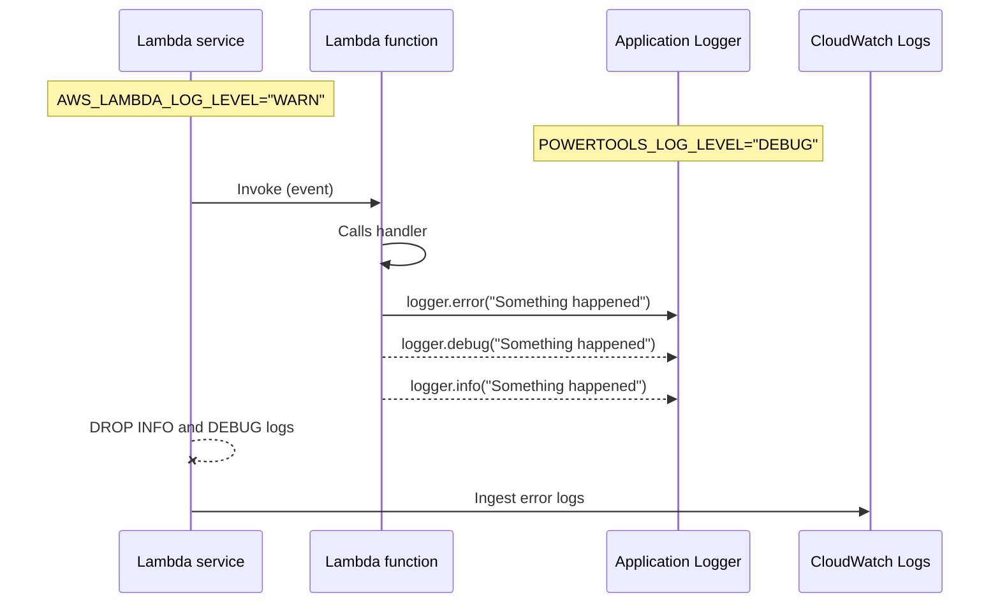

Logging provides an opinionated logger with output structured as JSON.

**Key features**

* Capture key fields from Lambda context, cold start and structures logging output as JSON
* Log Lambda event when instructed, disabled by default, can be enabled explicitly via annotation param
* Append additional keys to structured log at any point in time

## Install

Depending on your version of Java (either Java 1.8 or 11+), the configuration slightly changes.

=== "Maven Java 11+"

    ```xml hl_lines="3-7 16 18 24-27"
    <dependencies>
        ...
        <dependency>
            <groupId>software.amazon.lambda</groupId>
            <artifactId>powertools-logging</artifactId>
            <version>{{ powertools.version }}</version>
        </dependency>
        ...
    </dependencies>
    ...
    <!-- configure the aspectj-maven-plugin to compile-time weave (CTW) the aws-lambda-powertools-java aspects into your project -->
    <build>
        <plugins>
            ...
            <plugin>
                 <groupId>dev.aspectj</groupId>
                 <artifactId>aspectj-maven-plugin</artifactId>
                 <version>1.13.1</version>
                 <configuration>
                     <source>11</source> <!-- or higher -->
                     <target>11</target> <!-- or higher -->
                     <complianceLevel>11</complianceLevel> <!-- or higher -->
                     <aspectLibraries>
                         <aspectLibrary>
                             <groupId>software.amazon.lambda</groupId>
                             <artifactId>powertools-logging</artifactId>
                         </aspectLibrary>
                     </aspectLibraries>
                 </configuration>
                 <executions>
                     <execution>
                         <goals>
                             <goal>compile</goal>
                         </goals>
                     </execution>
                 </executions>
            </plugin>
            ...
        </plugins>
    </build>
    ```

=== "Maven Java 1.8"

    ```xml hl_lines="3-7 16 18 24-27"
    <dependencies>
        ...
        <dependency>
            <groupId>software.amazon.lambda</groupId>
            <artifactId>powertools-logging</artifactId>
            <version>{{ powertools.version }}</version>
        </dependency>
        ...
    </dependencies>
    ...
    <!-- configure the aspectj-maven-plugin to compile-time weave (CTW) the aws-lambda-powertools-java aspects into your project -->
    <build>
        <plugins>
            ...
            <plugin>
                 <groupId>org.codehaus.mojo</groupId>
                 <artifactId>aspectj-maven-plugin</artifactId>
                 <version>1.14.0</version>
                 <configuration>
                     <source>1.8</source>
                     <target>1.8</target>
                     <complianceLevel>1.8</complianceLevel>
                     <aspectLibraries>
                         <aspectLibrary>
                             <groupId>software.amazon.lambda</groupId>
                             <artifactId>powertools-logging</artifactId>
                         </aspectLibrary>
                     </aspectLibraries>
                 </configuration>
                 <executions>
                     <execution>
                         <goals>
                             <goal>compile</goal>
                         </goals>
                     </execution>
                 </executions>
            </plugin>
            ...
        </plugins>
    </build>
    ```

=== "Gradle Java 11+"

    ```groovy hl_lines="3 11"
        plugins {
            id 'java'
            id 'io.freefair.aspectj.post-compile-weaving' version '8.1.0'
        }
        
        repositories {
            mavenCentral()
        }
        
        dependencies {
            aspect 'software.amazon.lambda:powertools-logging:{{ powertools.version }}'
        }
        
        sourceCompatibility = 11
        targetCompatibility = 11
    ```

=== "Gradle Java 1.8"

    ```groovy hl_lines="3 11"
        plugins {
            id 'java'
            id 'io.freefair.aspectj.post-compile-weaving' version '6.6.3'
        }
        
        repositories {
            mavenCentral()
        }
        
        dependencies {
            aspect 'software.amazon.lambda:powertools-logging:{{ powertools.version }}'
        }
        
        sourceCompatibility = 1.8
        targetCompatibility = 1.8
    ```


## Initialization

Powertools for AWS Lambda (Java) extends the functionality of Log4J. Below is an example `#!xml log4j2.xml` file, with the `JsonTemplateLayout` using `#!json LambdaJsonLayout.json` configured. 

!!! info "LambdaJsonLayout is now deprecated"

    Configuring utiltiy using `<LambdaJsonLayout/>` plugin is deprecated now. While utility still supports the old configuration, we strongly recommend upgrading the 
    `log4j2.xml` configuration to `JsonTemplateLayout` instead. [JsonTemplateLayout](https://logging.apache.org/log4j/2.x/manual/json-template-layout.html) is recommended way of doing structured logging.
    
    Please follow [this guide](#upgrade-to-jsontemplatelayout-from-deprecated-lambdajsonlayout-configuration-in-log4j2xml) for upgrade steps.

=== "log4j2.xml"

    ```xml hl_lines="5"
    <?xml version="1.0" encoding="UTF-8"?>
    <Configuration>
        <Appenders>
            <Console name="JsonAppender" target="SYSTEM_OUT">
                <JsonTemplateLayout eventTemplateUri="classpath:LambdaJsonLayout.json" />
            </Console>
        </Appenders>
        <Loggers>
            <Logger name="JsonLogger" level="INFO" additivity="false">
                <AppenderRef ref="JsonAppender"/>
            </Logger>
            <Root level="info">
                <AppenderRef ref="JsonAppender"/>
            </Root>
        </Loggers>
    </Configuration>
    ```

You can also override log level by setting **`POWERTOOLS_LOG_LEVEL`** env var. Here is an example using AWS Serverless Application Model (SAM)

=== "template.yaml"
    ``` yaml hl_lines="9 10"
    Resources:
        HelloWorldFunction:
            Type: AWS::Serverless::Function
            Properties:
            ...
            Runtime: java11
            Environment:
                Variables:
                    POWERTOOLS_LOG_LEVEL: DEBUG
                    POWERTOOLS_SERVICE_NAME: example
    ```

You can also explicitly set a service name via **`POWERTOOLS_SERVICE_NAME`** env var. This sets **service** key that will be present across all log statements.

## Standard structured keys

Your logs will always include the following keys to your structured logging:

Key | Type | Example | Description
------------------------------------------------- | ------------------------------------------------- | --------------------------------------------------------------------------------- | -------------------------------------------------
**timestamp** | String | "2020-05-24 18:17:33,774" | Timestamp of actual log statement
**level** | String | "INFO" | Logging level
**coldStart** | Boolean | true| ColdStart value.
**service** | String | "payment" | Service name defined. "service_undefined" will be used if unknown
**samplingRate** | int |  0.1 | Debug logging sampling rate in percentage e.g. 10% in this case
**message** | String |  "Collecting payment" | Log statement value. Unserializable JSON values will be casted to string
**functionName**| String | "example-powertools-HelloWorldFunction-1P1Z6B39FLU73"
**functionVersion**| String | "12"
**functionMemorySize**| String | "128"
**functionArn**| String | "arn:aws:lambda:eu-west-1:012345678910:function:example-powertools-HelloWorldFunction-1P1Z6B39FLU73"
**xray_trace_id**| String | "1-5759e988-bd862e3fe1be46a994272793" | X-Ray Trace ID when Lambda function has enabled Tracing
**function_request_id**| String | "899856cb-83d1-40d7-8611-9e78f15f32f4"" | AWS Request ID from lambda context

## Capturing context Lambda info

When debugging in non-production environments, you can instruct Logger to log the incoming event with `@Logger(logEvent = true)` or via `POWERTOOLS_LOGGER_LOG_EVENT=true` environment variable.

!!! warning
    Log event is disabled by default to prevent sensitive info being logged.


=== "App.java"

    ```java hl_lines="14"
    import org.apache.logging.log4j.LogManager;
    import org.apache.logging.log4j.Logger;
    import software.amazon.lambda.powertools.logging.LoggingUtils;
    import software.amazon.lambda.powertools.logging.Logging;
    ...
    
    /**
     * Handler for requests to Lambda function.
     */
    public class App implements RequestHandler<APIGatewayProxyRequestEvent, APIGatewayProxyResponseEvent> {
    
        Logger log = LogManager.getLogger(App.class);
    
        @Logging
        public APIGatewayProxyResponseEvent handleRequest(final APIGatewayProxyRequestEvent input, final Context context) {
         ...
        }
    }
    ```

=== "AppLogEvent.java"
    
    ```java hl_lines="8"
    /**
     * Handler for requests to Lambda function.
     */
    public class AppLogEvent implements RequestHandler<APIGatewayProxyRequestEvent, APIGatewayProxyResponseEvent> {
    
        Logger log = LogManager.getLogger(AppLogEvent.class);
        
        @Logging(logEvent = true)
        public APIGatewayProxyResponseEvent handleRequest(final APIGatewayProxyRequestEvent input, final Context context) {
         ...
        }
    }
    ```

### Customising fields in logs

- Utility by default emits `timestamp` field in the logs in format `yyyy-MM-dd'T'HH:mm:ss.SSSZz` and in system default timezone. 
If you need to customize format and timezone, you can do so by configuring `log4j2.component.properties` and configuring properties as shown in example below:

=== "log4j2.component.properties"

    ```properties hl_lines="1 2"
    log4j.layout.jsonTemplate.timestampFormatPattern=yyyy-MM-dd'T'HH:mm:ss.SSSZz
    log4j.layout.jsonTemplate.timeZone=Europe/Oslo
    ```

- Utility also provides sample template for [Elastic Common Schema(ECS)](https://www.elastic.co/guide/en/ecs/current/ecs-reference.html) layout.
The field emitted in logs will follow specs from [ECS](https://www.elastic.co/guide/en/ecs/current/ecs-reference.html) together with field captured by utility as mentioned [above](#standard-structured-keys).

    Use `LambdaEcsLayout.json` as `eventTemplateUri` when configuring `JsonTemplateLayout`.

=== "log4j2.xml"

    ```xml hl_lines="5"
    <?xml version="1.0" encoding="UTF-8"?>
    <Configuration>
        <Appenders>
            <Console name="JsonAppender" target="SYSTEM_OUT">
                <JsonTemplateLayout eventTemplateUri="classpath:LambdaEcsLayout.json" />
            </Console>
        </Appenders>
        <Loggers>
            <Logger name="JsonLogger" level="INFO" additivity="false">
                <AppenderRef ref="JsonAppender"/>
            </Logger>
            <Root level="info">
                <AppenderRef ref="JsonAppender"/>
            </Root>
        </Loggers>
    </Configuration>
    ```

## Setting a Correlation ID

You can set a Correlation ID using `correlationIdPath` attribute by passing a [JSON Pointer expression](https://datatracker.ietf.org/doc/html/draft-ietf-appsawg-json-pointer-03){target="_blank"}.

=== "App.java"

    ```java hl_lines="8"
    /**
     * Handler for requests to Lambda function.
     */
    public class App implements RequestHandler<APIGatewayProxyRequestEvent, APIGatewayProxyResponseEvent> {
    
        Logger log = LogManager.getLogger(App.class);
    
        @Logging(correlationIdPath = "/headers/my_request_id_header")
        public APIGatewayProxyResponseEvent handleRequest(final APIGatewayProxyRequestEvent input, final Context context) {
            ...
            log.info("Collecting payment")
            ...
        }
    }
    ```
=== "Example Event"

	```json hl_lines="3"
	{
	  "headers": {
		"my_request_id_header": "correlation_id_value"
	  }
	}
	```

=== "Example CloudWatch Logs excerpt"

    ```json hl_lines="11"
	{
		"level": "INFO",
	  	"message": "Collecting payment",
		"timestamp": "2021-05-03 11:47:12,494+0200",
	  	"service": "payment",
	  	"coldStart": true,
	  	"functionName": "test",
	  	"functionMemorySize": 128,
	  	"functionArn": "arn:aws:lambda:eu-west-1:12345678910:function:test",
	  	"function_request_id": "52fdfc07-2182-154f-163f-5f0f9a621d72",
	  	"correlation_id": "correlation_id_value"
	}
    ```
We provide [built-in JSON Pointer expression](https://datatracker.ietf.org/doc/html/draft-ietf-appsawg-json-pointer-03){target="_blank"} 
for known event sources, where either a request ID or X-Ray Trace ID are present.

=== "App.java"

    ```java hl_lines="10"
    import software.amazon.lambda.powertools.logging.CorrelationIdPathConstants;

    /**
     * Handler for requests to Lambda function.
     */
    public class App implements RequestHandler<APIGatewayProxyRequestEvent, APIGatewayProxyResponseEvent> {
    
        Logger log = LogManager.getLogger(App.class);
    
        @Logging(correlationIdPath = CorrelationIdPathConstants.API_GATEWAY_REST)
        public APIGatewayProxyResponseEvent handleRequest(final APIGatewayProxyRequestEvent input, final Context context) {
            ...
            log.info("Collecting payment")
            ...
        }
    }
    ```

=== "Example Event"

	```json hl_lines="3"
	{
	  "requestContext": {
		"requestId": "correlation_id_value"
	  }
	}
	```

=== "Example CloudWatch Logs excerpt"

    ```json hl_lines="11"
	{
		"level": "INFO",
	  	"message": "Collecting payment",
		"timestamp": "2021-05-03 11:47:12,494+0200",
	  	"service": "payment",
	  	"coldStart": true,
	  	"functionName": "test",
	  	"functionMemorySize": 128,
	  	"functionArn": "arn:aws:lambda:eu-west-1:12345678910:function:test",
	  	"function_request_id": "52fdfc07-2182-154f-163f-5f0f9a621d72",
	  	"correlation_id": "correlation_id_value"
	}
    ```
	
## Appending additional keys

!!! info "Custom keys are persisted across warm invocations"
        Always set additional keys as part of your handler to ensure they have the latest value, or explicitly clear them with [`clearState=true`](#clearing-all-state).

You can append your own keys to your existing logs via `appendKey`.

=== "App.java"

    ```java hl_lines="11 19"
    /**
     * Handler for requests to Lambda function.
     */
    public class App implements RequestHandler<APIGatewayProxyRequestEvent, APIGatewayProxyResponseEvent> {
    
        Logger log = LogManager.getLogger(App.class);
    
        @Logging(logEvent = true)
        public APIGatewayProxyResponseEvent handleRequest(final APIGatewayProxyRequestEvent input, final Context context) {
            ...
            LoggingUtils.appendKey("test", "willBeLogged");
            ...
    
            ...
             Map<String, String> customKeys = new HashMap<>();
             customKeys.put("test", "value");
             customKeys.put("test1", "value1");
    
             LoggingUtils.appendKeys(customKeys);
            ...
        }
    }
    ```


### Removing additional keys

You can remove any additional key from entry using `LoggingUtils.removeKeys()`.

=== "App.java"

    ```java hl_lines="19 20"
    /**
     * Handler for requests to Lambda function.
     */
    public class App implements RequestHandler<APIGatewayProxyRequestEvent, APIGatewayProxyResponseEvent> {
    
        Logger log = LogManager.getLogger(App.class);
    
        @Logging(logEvent = true)
        public APIGatewayProxyResponseEvent handleRequest(final APIGatewayProxyRequestEvent input, final Context context) {
            ...
            LoggingUtils.appendKey("test", "willBeLogged");
            ...
            Map<String, String> customKeys = new HashMap<>();
            customKeys.put("test1", "value");
            customKeys.put("test2", "value1");
    
            LoggingUtils.appendKeys(customKeys);
            ...
            LoggingUtils.removeKey("test");
            LoggingUtils.removeKeys("test1", "test2");
            ...
        }
    }
    ```

### Clearing all state

Logger is commonly initialized in the global scope. Due to [Lambda Execution Context reuse](https://docs.aws.amazon.com/lambda/latest/dg/runtimes-context.html), 
this means that custom keys can be persisted across invocations. If you want all custom keys to be deleted, you can use 
`clearState=true` attribute on `@Logging` annotation.


=== "App.java"

    ```java hl_lines="8 12"
    /**
     * Handler for requests to Lambda function.
     */
    public class App implements RequestHandler<APIGatewayProxyRequestEvent, APIGatewayProxyResponseEvent> {
    
        Logger log = LogManager.getLogger(App.class);
    
        @Logging(clearState = true)
        public APIGatewayProxyResponseEvent handleRequest(final APIGatewayProxyRequestEvent input, final Context context) {
            ...
            if(input.getHeaders().get("someSpecialHeader")) {
                LoggingUtils.appendKey("specialKey", "value");
            }
            
            log.info("Collecting payment");
            ...
        }
    }
    ```
=== "#1 Request"

    ```json hl_lines="11"
	{
		"level": "INFO",
	  	"message": "Collecting payment",
		"timestamp": "2021-05-03 11:47:12,494+0200",
	  	"service": "payment",
	  	"coldStart": true,
	  	"functionName": "test",
	  	"functionMemorySize": 128,
	  	"functionArn": "arn:aws:lambda:eu-west-1:12345678910:function:test",
	  	"function_request_id": "52fdfc07-2182-154f-163f-5f0f9a621d72",
        "specialKey": "value"
	}
    ```

=== "#2 Request"

    ```json
	{
		"level": "INFO",
	  	"message": "Collecting payment",
		"timestamp": "2021-05-03 11:47:12,494+0200",
	  	"service": "payment",
	  	"coldStart": true,
	  	"functionName": "test",
	  	"functionMemorySize": 128,
	  	"functionArn": "arn:aws:lambda:eu-west-1:12345678910:function:test",
	  	"function_request_id": "52fdfc07-2182-154f-163f-5f0f9a621d72"
	}
    ```

## Override default object mapper

You can optionally choose to override default object mapper which is used to serialize lambda function events. You might
want to supply custom object mapper in order to control how serialisation is done, for example, when you want to log only
specific fields from received event due to security.

=== "App.java"

    ```java hl_lines="9 10"
    /**
     * Handler for requests to Lambda function.
     */
    public class App implements RequestHandler<APIGatewayProxyRequestEvent, APIGatewayProxyResponseEvent> {
    
        Logger log = LogManager.getLogger(App.class);

        static {
            ObjectMapper objectMapper = new ObjectMapper();
            LoggingUtils.defaultObjectMapper(objectMapper);
        }
    
        @Logging(logEvent = true)
        public APIGatewayProxyResponseEvent handleRequest(final APIGatewayProxyRequestEvent input, final Context context) {
            ...
        }
    }
    ```

## Sampling debug logs

You can dynamically set a percentage of your logs to **DEBUG** level via env var `POWERTOOLS_LOGGER_SAMPLE_RATE` or
via `samplingRate` attribute on annotation. 

!!! info
    Configuration on environment variable is given precedence over sampling rate configuration on annotation, provided it's in valid value range.

=== "Sampling via annotation attribute"

    ```java hl_lines="8"
    /**
     * Handler for requests to Lambda function.
     */
    public class App implements RequestHandler<APIGatewayProxyRequestEvent, APIGatewayProxyResponseEvent> {
    
        Logger log = LogManager.getLogger(App.class);
    
        @Logging(samplingRate = 0.5)
        public APIGatewayProxyResponseEvent handleRequest(final APIGatewayProxyRequestEvent input, final Context context) {
         ...
        }
    }
    ```

=== "Sampling via environment variable"

    ```yaml hl_lines="9"
    Resources:
        HelloWorldFunction:
            Type: AWS::Serverless::Function
            Properties:
            ...
            Runtime: java11
            Environment:
                Variables:
                    POWERTOOLS_LOGGER_SAMPLE_RATE: 0.5
    ```

## AWS Lambda Advanced Logging Controls (ALC)

!!!question "When is it useful?"
    When you want to set a logging policy to drop informational or verbose logs for one or all AWS Lambda functions, regardless of runtime and logger used.

<!-- markdownlint-disable MD013 -->
With [AWS Lambda Advanced Logging Controls (ALC)](https://docs.aws.amazon.com/lambda/latest/dg/monitoring-cloudwatchlogs.html#monitoring-cloudwatchlogs-advanced){target="_blank"}, you can enforce a minimum log level that Lambda will accept from your application code.

When enabled, you should keep `Logger` and ALC log level in sync to avoid data loss.

Here's a sequence diagram to demonstrate how ALC will drop both `INFO` and `DEBUG` logs emitted from `Logger`, when ALC log level is stricter than `Logger`.
<!-- markdownlint-enable MD013 -->



### Priority of log level settings in Powertools for AWS Lambda

We prioritise log level settings in this order:

1. `AWS_LAMBDA_LOG_LEVEL` environment variable
2. `POWERTOOLS_LOG_LEVEL` environment variable

If you set `Logger` level lower than ALC, we will emit a warning informing you that your messages will be discarded by Lambda.

> **NOTE**
>
> With ALC enabled, we are unable to increase the minimum log level below the `AWS_LAMBDA_LOG_LEVEL` environment variable value, see [AWS Lambda service documentation](https://docs.aws.amazon.com/lambda/latest/dg/monitoring-cloudwatchlogs.html#monitoring-cloudwatchlogs-log-level){target="_blank"} for more details.

### Timestamp format

When the Advanced Logging Controls feature is enabled, Powertools for AWS Lambda must comply with the timestamp format required by AWS Lambda, which is [RFC3339](https://www.rfc-editor.org/rfc/rfc3339). 
In this case the format will be `yyyy-MM-dd'T'HH:mm:ss.SSS'Z'`.

## Upgrade to JsonTemplateLayout from deprecated LambdaJsonLayout configuration in log4j2.xml

Prior to version [1.10.0](https://github.com/aws-powertools/powertools-lambda-java/releases/tag/v1.10.0), only supported way of configuring `log4j2.xml` was via  `<LambdaJsonLayout/>`. This plugin is 
deprecated now and will be removed in future version. Switching to `JsonTemplateLayout` is straight forward. 

Below examples shows deprecated and new configuration of `log4j2.xml`.

=== "Deprecated configuration of log4j2.xml"

    ```xml hl_lines="5"
    <?xml version="1.0" encoding="UTF-8"?>
    <Configuration>
        <Appenders>
            <Console name="JsonAppender" target="SYSTEM_OUT">
                <LambdaJsonLayout compact="true" eventEol="true"/>
            </Console>
        </Appenders>
        <Loggers>
            <Logger name="JsonLogger" level="INFO" additivity="false">
                <AppenderRef ref="JsonAppender"/>
            </Logger>
            <Root level="info">
                <AppenderRef ref="JsonAppender"/>
            </Root>
        </Loggers>
    </Configuration>
    ```

=== "New configuration of log4j2.xml"

    ```xml hl_lines="5"
    <?xml version="1.0" encoding="UTF-8"?>
    <Configuration>
        <Appenders>
            <Console name="JsonAppender" target="SYSTEM_OUT">
                <JsonTemplateLayout eventTemplateUri="classpath:LambdaJsonLayout.json" />
            </Console>
        </Appenders>
        <Loggers>
            <Logger name="JsonLogger" level="INFO" additivity="false">
                <AppenderRef ref="JsonAppender"/>
            </Logger>
            <Root level="info">
                <AppenderRef ref="JsonAppender"/>
            </Root>
        </Loggers>
    </Configuration>
    ```

