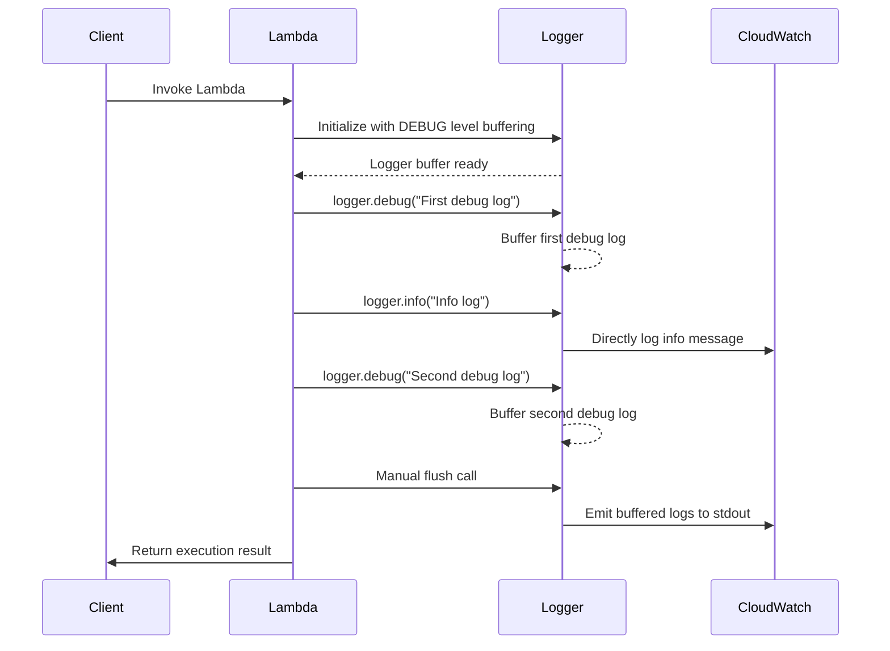
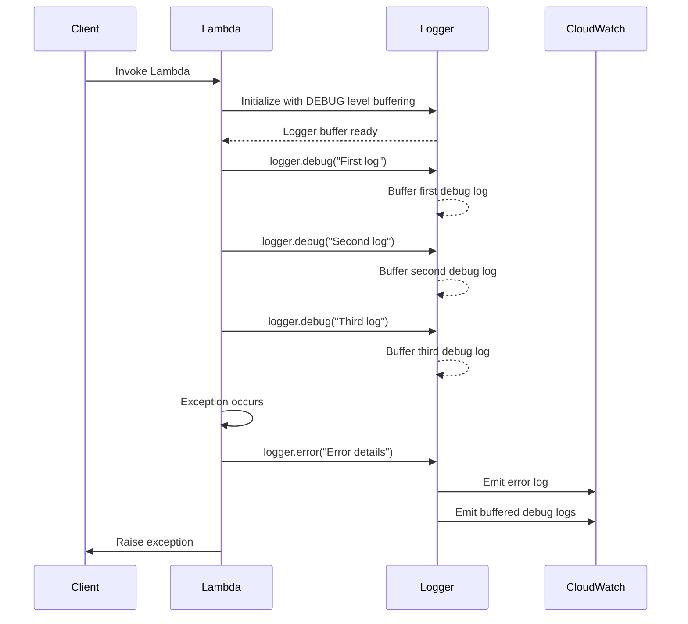
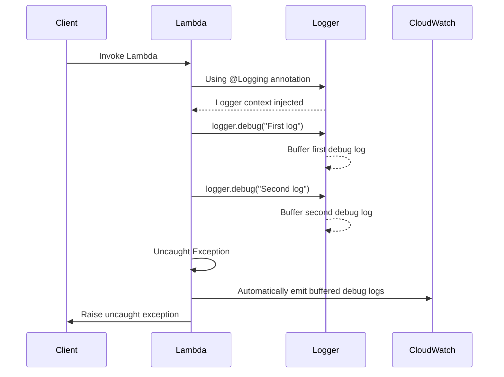

Logging provides an opinionated logger with output structured as JSON.

## Key features

* Leverages standard logging libraries: [_SLF4J_](https://www.slf4j.org/){target="_blank"} as the API, and [_log4j2_](https://logging.apache.org/log4j/2.x/){target="_blank"} or [_logback_](https://logback.qos.ch/){target="_blank"} for the implementation
* Captures key fields from Lambda context, cold start and structures logging output as JSON
* Optionally logs Lambda request
* Optionally logs Lambda response
* Optionally supports log sampling by including a configurable percentage of DEBUG logs in logging output
* Optionally supports buffering lower level logs and flushing them on error or manually
* Allows additional keys to be appended to the structured log at any point in time
* GraalVM support


## Getting started

???+ tip
    You can find complete examples in the [project repository](https://github.com/aws-powertools/powertools-lambda-java/tree/v2/examples/powertools-examples-core-utilities){target="_blank"}.

### Installation
Depending on preference, you must choose to use either _log4j2_ or _logback_ as your log provider. In both cases you need to configure _aspectj_
to weave the code and make sure the annotation is processed.

#### Maven
=== "log4j2"

    ```xml hl_lines="3-7 24-27"
    <dependencies>
        ...
        <dependency>
            <groupId>software.amazon.lambda</groupId>
            <artifactId>powertools-logging-log4j</artifactId>
            <version>{{ powertools.version }}</version>
        </dependency>
        ...
    </dependencies>
    ...
    <!-- configure the aspectj-maven-plugin to compile-time weave (CTW) the aws-lambda-powertools-java aspects into your project -->
    <build>
        <plugins>
            ...
            <plugin>
                 <groupId>dev.aspectj</groupId>
                 <artifactId>aspectj-maven-plugin</artifactId>
                 <version>1.14</version>
                 <configuration>
                     <source>11</source> <!-- or higher -->
                     <target>11</target> <!-- or higher -->
                     <complianceLevel>11</complianceLevel> <!-- or higher -->
                     <aspectLibraries>
                         <aspectLibrary>
                             <groupId>software.amazon.lambda</groupId>
                             <artifactId>powertools-logging</artifactId>
                         </aspectLibrary>
                     </aspectLibraries>
                 </configuration>
                <dependencies>
                    <dependency>
                        <groupId>org.aspectj</groupId>
                        <artifactId>aspectjtools</artifactId>
                        <!-- AspectJ compiler version, in sync with runtime -->
                        <version>1.9.22</version>
                    </dependency>
                </dependencies>
                 <executions>
                     <execution>
                         <goals>
                             <goal>compile</goal>
                         </goals>
                     </execution>
                 </executions>
            </plugin>
            ...
        </plugins>
    </build>
    ```

=== "logback"

    ```xml hl_lines="3-7 24-27"
    <dependencies>
        ...
        <dependency>
            <groupId>software.amazon.lambda</groupId>
            <artifactId>powertools-logging-logback</artifactId>
            <version>{{ powertools.version }}</version>
        </dependency>
        ...
    </dependencies>
    ...
    <!-- configure the aspectj-maven-plugin to compile-time weave (CTW) the aws-lambda-powertools-java aspects into your project -->
    <build>
        <plugins>
            ...
            <plugin>
                 <groupId>dev.aspectj</groupId>
                 <artifactId>aspectj-maven-plugin</artifactId>
                 <version>1.14</version>
                 <configuration>
                     <source>11</source> <!-- or higher -->
                     <target>11</target> <!-- or higher -->
                     <complianceLevel>11</complianceLevel> <!-- or higher -->
                     <aspectLibraries>
                         <aspectLibrary>
                             <groupId>software.amazon.lambda</groupId>
                             <artifactId>powertools-logging</artifactId>
                         </aspectLibrary>
                     </aspectLibraries>
                 </configuration>
                <dependencies>
                    <dependency>
                        <groupId>org.aspectj</groupId>
                        <artifactId>aspectjtools</artifactId>
                        <!-- AspectJ compiler version, in sync with runtime -->
                        <version>1.9.22</version>
                    </dependency>
                </dependencies>
                 <executions>
                     <execution>
                         <goals>
                             <goal>compile</goal>
                         </goals>
                     </execution>
                 </executions>
            </plugin>
            ...
        </plugins>
    </build>
    ```

#### Gradle

=== "log4j2"

    ```groovy hl_lines="3 11"
        plugins {
            id 'java'
            id 'io.freefair.aspectj.post-compile-weaving' version '8.1.0'
        }
        
        repositories {
            mavenCentral()
        }
        
        dependencies {
            aspect 'software.amazon.lambda:powertools-logging-log4j:{{ powertools.version }}'
        }
        
        sourceCompatibility = 11
        targetCompatibility = 11
    ```

=== "logback"

    ```groovy hl_lines="3 11"
        plugins {
            id 'java'
            id 'io.freefair.aspectj.post-compile-weaving' version '8.1.0'
        }
        
        repositories {
            mavenCentral()
        }
        
        dependencies {
            aspect 'software.amazon.lambda:powertools-logging-logback:{{ powertools.version }}'
        }
        
        sourceCompatibility = 11
        targetCompatibility = 11
    ```


### Configuration

#### Main environment variables

The logging module requires two settings:

| Environment variable      | Setting           | Description                                                                                                 |
|---------------------------|-------------------|-------------------------------------------------------------------------------------------------------------|
| `POWERTOOLS_LOG_LEVEL`    | **Logging level** | Sets how verbose Logger should be. If not set, will use the [Logging configuration](#logging-configuration) |
| `POWERTOOLS_SERVICE_NAME` | **Service**       | Sets service key that will be included in all log statements (Default is `service_undefined`)            |

Here is an example using AWS Serverless Application Model (SAM):

=== "template.yaml"
``` yaml hl_lines="10 11"
Resources:
  PaymentFunction:
    Type: AWS::Serverless::Function
    Properties:
      MemorySize: 512
      Timeout: 20
      Runtime: java17
      Environment:
        Variables:
          POWERTOOLS_LOG_LEVEL: WARN
          POWERTOOLS_SERVICE_NAME: payment
```

There are some other environment variables which can be set to modify Logging's settings at a global scope:

| Environment variable            | Type     | Description                                                                                                             |  
|---------------------------------|----------|-------------------------------------------------------------------------------------------------------------------------|  
| `POWERTOOLS_LOGGER_SAMPLE_RATE` | float    | Configure the sampling rate at which `DEBUG` logs should be included. See [sampling rate](#sampling-debug-logs)                  |  
| `POWERTOOLS_LOG_EVENT`          | boolean  | Specify if the incoming Lambda event should be logged. See [Logging event](#logging-incoming-event)                     |  
| `POWERTOOLS_LOG_RESPONSE`       | boolean  | Specify if the Lambda response should be logged. See [logging response](#logging-handler-response)                      |  
| `POWERTOOLS_LOG_ERROR`          | boolean  | Specify if a Lambda uncaught exception should be logged. See [logging exception](#logging-handler-uncaught-exception  ) |  

#### Logging configuration

Powertools for AWS Lambda (Java) simply extends the functionality of the underlying library you choose (_log4j2_ or _logback_).
You can leverage the standard configuration files (_log4j2.xml_ or _logback.xml_):

=== "log4j2.xml"

    With log4j2, we leverage the [`JsonTemplateLayout`](https://logging.apache.org/log4j/2.x/manual/json-template-layout.html){target="_blank"}
    to provide structured logging. A default template is provided in powertools ([_LambdaJsonLayout.json_](https://github.com/aws-powertools/powertools-lambda-java/blob/4444b4bce8eb1cc19880d1c1ef07188d97de9126/powertools-logging/powertools-logging-log4j/src/main/resources/LambdaJsonLayout.json){target="_blank"}):

    ```xml hl_lines="5"
    <?xml version="1.0" encoding="UTF-8"?>
    <Configuration>
        <Appenders>
            <Console name="JsonAppender" target="SYSTEM_OUT">
                <JsonTemplateLayout eventTemplateUri="classpath:LambdaJsonLayout.json" />
            </Console>
        </Appenders>
        <Loggers>
            <Logger name="com.example" level="debug" additivity="false">
                <AppenderRef ref="JsonAppender"/>
            </Logger>
            <Root level="info">
                <AppenderRef ref="JsonAppender"/>
            </Root>
        </Loggers>
    </Configuration>
    ```

=== "logback.xml"

    With logback, we leverage a custom [Encoder](https://logback.qos.ch/manual/encoders.html){target="_blank"} 
    to provide structured logging:

    ```xml hl_lines="4 5"
    <?xml version="1.0" encoding="UTF-8"?>
    <configuration>
        <appender name="console" class="ch.qos.logback.core.ConsoleAppender">
            <encoder class="software.amazon.lambda.powertools.logging.logback.LambdaJsonEncoder">
            </encoder>
        </appender>
        <logger name="com.example" level="DEBUG" additivity="false">
            <appender-ref ref="console" />
        </logger>
        <root level="INFO">
            <appender-ref ref="console" />
        </root>
    </configuration>
    ```

## Log level
Log level is generally configured in the `log4j2.xml` or `logback.xml`. But this level is static and needs a redeployment of the function to be changed.
Powertools for AWS Lambda permits to change this level dynamically thanks to an environment variable `POWERTOOLS_LOG_LEVEL`.

We support the following log levels (SLF4J levels): `TRACE`, `DEBUG`, `INFO`, `WARN`, `ERROR`.
If the level is set to `CRITICAL` (supported in log4j but not logback), we revert it back to `ERROR`.
If the level is set to any other value, we set it to the default value (`INFO`).

### AWS Lambda Advanced Logging Controls (ALC)

!!!question "When is it useful?"
    When you want to set a logging policy to drop informational or verbose logs for one or all AWS Lambda functions, regardless of runtime and logger used.

<!-- markdownlint-disable MD013 -->
With [AWS Lambda Advanced Logging Controls (ALC)](https://docs.aws.amazon.com/lambda/latest/dg/monitoring-cloudwatchlogs.html#monitoring-cloudwatchlogs-advanced){target="_blank"}, you can enforce a minimum log level that Lambda will accept from your application code.

When enabled, you should keep your own log level and ALC log level in sync to avoid data loss.

Here's a sequence diagram to demonstrate how ALC will drop both `INFO` and `DEBUG` logs emitted from `Logger`, when ALC log level is stricter than `Logger`.
<!-- markdownlint-enable MD013 -->


### Priority of log level settings in Powertools for AWS Lambda

We prioritise log level settings in this order:

1. `AWS_LAMBDA_LOG_LEVEL` environment variable
2. `POWERTOOLS_LOG_LEVEL` environment variable
3. level defined in the `log4j2.xml` or `logback.xml` files

If you set `POWERTOOLS_LOG_LEVEL` lower than ALC, we will emit a warning informing you that your messages will be discarded by Lambda.

!!! note
    With ALC enabled, we are unable to increase the minimum log level below the `AWS_LAMBDA_LOG_LEVEL` environment variable value, see [AWS Lambda service documentation](https://docs.aws.amazon.com/lambda/latest/dg/monitoring-cloudwatchlogs.html#monitoring-cloudwatchlogs-log-level){target="_blank"} for more details.

## Basic Usage

To use Lambda Powertools for AWS Lambda Logging, use the `@Logging` annotation in your code and the standard _SLF4J_ logger:

=== "PaymentFunction.java"

    ```java hl_lines="8 10 12 14"
    import org.slf4j.Logger;
    import org.slf4j.LoggerFactory;
    import software.amazon.lambda.powertools.logging.Logging;
    // ... other imports

    public class PaymentFunction implements RequestHandler<APIGatewayProxyRequestEvent, APIGatewayProxyResponseEvent> {
    
        private static final Logger LOGGER = LoggerFactory.getLogger(PaymentFunction.class);
        
        @Logging
        public APIGatewayProxyResponseEvent handleRequest(final APIGatewayProxyRequestEvent input, final Context context) {
            LOGGER.info("Collecting payment");
            // ...
            LOGGER.debug("order={}, amount={}", order.getId(), order.getAmount());
            // ...
        }
    }
    ```

## Standard structured keys

Your logs will always include the following keys in your structured logging:

| Key               | Type   | Example                                                                                             | Description                                                                                                                |
|-------------------|--------|-----------------------------------------------------------------------------------------------------|----------------------------------------------------------------------------------------------------------------------------|
| **timestamp**     | String | "2023-12-01T14:49:19.293Z"                                                                          | Timestamp of actual log statement, by default uses default AWS Lambda timezone (UTC)                                       |
| **level**         | String | "INFO"                                                                                              | Logging level (any level supported by _SLF4J_ (i.e. `TRACE`, `DEBUG`, `INFO`, `WARN`, `ERROR`)                             |
| **service**       | String | "payment"                                                                                           | Service name defined, by default `service_undefined`                                                                       |
| **sampling_rate** | float  | 0.1                                                                                                 | Debug logging sampling rate in percentage e.g. 10% in this case (logged if not 0)                                          |
| **message**       | String | "Collecting payment"                                                                                | Log statement value. Unserializable JSON values will be casted to string                                                   |
| **xray_trace_id** | String | "1-5759e988-bd862e3fe1be46a994272793"                                                               | X-Ray Trace ID when [Tracing is enabled](https://docs.aws.amazon.com/lambda/latest/dg/services-xray.html){target="_blank"} |
| **error**         | Map    | `{ "name": "InvalidAmountException", "message": "Amount must be superior to 0", "stack": "at..." }` | Eventual exception (e.g. when doing `logger.error("Error", new InvalidAmountException("Amount must be superior to 0"));`)  |

???+ note
    If you emit a log message with a key that matches one of the [standard structured keys](#standard-structured-keys) or one of the [additional structured keys](#additional-structured-keys), the Logger will log a warning message and ignore the key.

## Additional structured keys

### Logging Lambda context information
The following keys will also be added to all your structured logs (unless [configured otherwise](#more-customization_1)):

| Key                      | Type    | Example                                                                                | Description                        |
|--------------------------|---------|----------------------------------------------------------------------------------------|------------------------------------|
| **cold_start**           | Boolean | false                                                                                  | ColdStart value                    |
| **function_name**        | String  | "example-PaymentFunction-1P1Z6B39FLU73"                                                | Name of the function               |
| **function_version**     | String  | "12"                                                                                   | Version of the function            |
| **function_memory_size** | String  | "512"                                                                                  | Memory configure for the function  |
| **function_arn**         | String  | "arn:aws:lambda:eu-west-1:012345678910:function:example-PaymentFunction-1P1Z6B39FLU73" | ARN of the function                |
| **function_request_id**  | String  | "899856cb-83d1-40d7-8611-9e78f15f32f4""                                                | AWS Request ID from lambda context |

### Logging additional keys

#### Logging a correlation ID

You can set a correlation ID using the `correlationIdPath` attribute of the `@Logging`annotation,
by passing a [JMESPath expression](https://jmespath.org/tutorial.html){target="_blank"}, 
including our custom [JMESPath Functions](../utilities/serialization.md#built-in-functions).

=== "AppCorrelationIdPath.java"

    ```java hl_lines="5"
    public class AppCorrelationIdPath implements RequestHandler<APIGatewayProxyRequestEvent, APIGatewayProxyResponseEvent> {
    
        private static final Logger LOGGER = LoggerFactory.getLogger(AppCorrelationIdPath.class);
    
        @Logging(correlationIdPath = "headers.my_request_id_header")
        public APIGatewayProxyResponseEvent handleRequest(final APIGatewayProxyRequestEvent input, final Context context) {
            // ...
            LOGGER.info("Collecting payment")
            // ...
        }
    }
    ```
=== "Example HTTP Event"

	```json hl_lines="3"
	{
	  "headers": {
		"my_request_id_header": "correlation_id_value"
	  }
	}
	```

=== "CloudWatch Logs"

    ```json hl_lines="6"
	{
		"level": "INFO",
	  	"message": "Collecting payment",
		"timestamp": "2023-12-01T14:49:19.293Z",
	  	"service": "payment",
	  	"correlation_id": "correlation_id_value"
	}
    ```
 
**Known correlation IDs**

To ease routine tasks like extracting correlation ID from popular event sources,
we provide [built-in JMESPath expressions](#built-in-correlation-id-expressions).

=== "AppCorrelationId.java"

    ```java hl_lines="1 7"
    import software.amazon.lambda.powertools.logging.CorrelationIdPaths;

    public class AppCorrelationId implements RequestHandler<APIGatewayProxyRequestEvent, APIGatewayProxyResponseEvent> {
    
        private static final Logger LOGGER = LoggerFactory.getLogger(AppCorrelationId.class);
    
        @Logging(correlationIdPath = CorrelationIdPaths.API_GATEWAY_REST)
        public APIGatewayProxyResponseEvent handleRequest(final APIGatewayProxyRequestEvent input, final Context context) {
            // ...
            LOGGER.info("Collecting payment")
            // ...
        }
    }
    ```

=== "Example Event"

	```json hl_lines="3"
	{
        "requestContext": {
            "requestId": "correlation_id_value"
        }
	}
	```

=== "Example CloudWatch Logs"

    ```json hl_lines="6"
	{
		"level": "INFO",
	  	"message": "Collecting payment",
		"timestamp": "2023-12-01T14:49:19.293Z",
	  	"service": "payment",
	  	"correlation_id": "correlation_id_value"
	}
    ```

#### Custom keys

**Using StructuredArguments**

To append additional keys in your logs, you can use the `StructuredArguments` class:

=== "PaymentFunction.java"

    ```java hl_lines="1 2 11 17"
    import static software.amazon.lambda.powertools.logging.argument.StructuredArguments.entry;
    import static software.amazon.lambda.powertools.logging.argument.StructuredArguments.entries;

    public class PaymentFunction implements RequestHandler<APIGatewayProxyRequestEvent, APIGatewayProxyResponseEvent> {
    
        private static final Logger LOGGER = LoggerFactory.getLogger(AppLogResponse.class);
    
        @Logging
        public APIGatewayProxyResponseEvent handleRequest(final APIGatewayProxyRequestEvent input, final Context context) {
            // ...
            LOGGER.info("Collecting payment", entry("orderId", order.getId()));
    
            // ...
            Map<String, String> customKeys = new HashMap<>();
            customKeys.put("paymentId", payment.getId());
            customKeys.put("amount", payment.getAmount);
            LOGGER.info("Payment successful", entries(customKeys));
        }
    }
    ```

=== "CloudWatch Logs for PaymentFunction"

    ```json hl_lines="7 16-18"
    {
        "level": "INFO",
        "message": "Collecting payment",
        "service": "payment",
        "timestamp": "2023-12-01T14:49:19.293Z",
        "xray_trace_id": "1-6569f266-4b0c7f97280dcd8428d3c9b5",
        "orderId": "41376"
    }
    ...
    {
        "level": "INFO",
        "message": "Payment successful",
        "service": "payment",
        "timestamp": "2023-12-01T14:49:20.118Z",
        "xray_trace_id": "1-6569f266-4b0c7f97280dcd8428d3c9b5",
        "orderId": "41376",
        "paymentId": "3245",
        "amount": 345.99
    }
    ```

`StructuredArguments` provides several options:

 - `entry` to add one key and value into the log structure. Note that value can be any object type.
 - `entries` to add multiple keys and values (from a Map) into the log structure. Note that values can be any object type.
 - `json` to add a key and raw json (string) as value into the log structure.
 - `array` to add one key and multiple values into the log structure. Note that values can be any object type.

=== "OrderFunction.java"

    ```java hl_lines="1 2 11 17"
    import static software.amazon.lambda.powertools.logging.argument.StructuredArguments.entry;
    import static software.amazon.lambda.powertools.logging.argument.StructuredArguments.array;

    public class OrderFunction implements RequestHandler<APIGatewayProxyRequestEvent, APIGatewayProxyResponseEvent> {
    
        private static final Logger LOGGER = LoggerFactory.getLogger(AppLogResponse.class);
    
        @Logging
        public APIGatewayProxyResponseEvent handleRequest(final APIGatewayProxyRequestEvent input, final Context context) {
            // ...
            LOGGER.info("Processing order", entry("order", order), array("products", productList));
            // ...
        }
    }
    ```

=== "CloudWatch Logs for OrderFunction"

    ```json hl_lines="7 13"
    {
        "level": "INFO",
        "message": "Processing order",
        "service": "payment",
        "timestamp": "2023-12-01T14:49:19.293Z",
        "xray_trace_id": "1-6569f266-4b0c7f97280dcd8428d3c9b5",
        "order": {
            "orderId": 23542,
            "amount": 459.99,
            "date": "2023-12-01T14:49:19.018Z",
            "customerId": 328496
        },
        "products": [
            {
                "productId": 764330,
                "name": "product1",
                "quantity": 1,
                "price": 300
            },
            {
                "productId": 798034,
                "name": "product42",
                "quantity": 1,
                "price": 159.99
            }
        ]
    }
    ```

???+ tip "Use arguments without log placeholders"
    As shown in the example above, you can use arguments (with `StructuredArguments`) without placeholders (`{}`) in the message.
    If you add the placeholders, the arguments will be logged both as an additional field and also as a string in the log message, using the `toString()` method.

    === "Function1.java"
    
        ```java
        LOGGER.info("Processing {}", entry("order", order));
        ```

    === "Order.java"

        ```java hl_lines="5"
        public class Order {
            // ...        

            @Override
            public String toString() {
                return "Order{" +
                        "orderId=" + id +
                        ", amount=" + amount +
                        ", date='" + date + '\'' +
                        ", customerId=" + customerId +
                        '}';
            }
        }
        ```
    
    === "CloudWatch Logs Function1"
    
        ```json hl_lines="3 7"
        {
            "level": "INFO",
            "message": "Processing order=Order{orderId=23542, amount=459.99, date='2023-12-01T14:49:19.018Z', customerId=328496}",
            "service": "payment",
            "timestamp": "2023-12-01T14:49:19.293Z",
            "xray_trace_id": "1-6569f266-4b0c7f97280dcd8428d3c9b5",
            "order": {
                "orderId": 23542,
                "amount": 459.99,
                "date": "2023-12-01T14:49:19.018Z",
                "customerId": 328496
            }
        }
        ```
    
    You can also combine structured arguments with non structured ones. For example:

    === "Function2.java"
        ```java
        LOGGER.info("Processing order {}", order.getOrderId(), entry("order", order));
        ```

    === "CloudWatch Logs Function2"
        ```json
        {
                "level": "INFO",
                "message": "Processing order 23542",
                "service": "payment",
                "timestamp": "2023-12-01T14:49:19.293Z",
                "xray_trace_id": "1-6569f266-4b0c7f97280dcd8428d3c9b5",
                "order": {
                    "orderId": 23542,
                    "amount": 459.99,
                    "date": "2023-12-01T14:49:19.018Z",
                    "customerId": 328496
                }
            }
        ```

???+ warning "Do not use reserved keys in `StructuredArguments`"
    If the key name of your structured argument matches any of the [standard structured keys](#standard-structured-keys) or any of the [additional structured keys](#additional-structured-keys), the Logger will log a warning message and ignore the key. This is to protect you from accidentally overwriting reserved keys such as the log level or Lambda context information.
    
**Using MDC**

Mapped Diagnostic Context (MDC) is essentially a Key-Value store. It is supported by the [SLF4J API](https://www.slf4j.org/manual.html#mdc){target="_blank"},
[logback](https://logback.qos.ch/manual/mdc.html){target="_blank"} and log4j (known as [ThreadContext](https://logging.apache.org/log4j/2.x/manual/thread-context.html){target="_blank"}). You can use the following standard:

`MDC.put("key", "value");`

???+ warning "Custom keys stored in the MDC are persisted across warm invocations"
    Always set additional keys as part of your handler method to ensure they have the latest value, or explicitly clear them with [`clearState=true`](#clearing-state).

???+ warning "Do not add reserved keys to MDC"
    Avoid adding any of the keys listed in [standard structured keys](#standard-structured-keys) and [additional structured keys](#additional-structured-keys) to your MDC. This may cause unindented behavior and will overwrite the context set by the Logger. Unlike with `StructuredArguments`, the Logger will **not** ignore reserved keys set via MDC.


### Removing additional keys

You can remove additional keys added with the MDC using `MDC.remove("key")`. 

#### Clearing state

Logger is commonly initialized in the global scope. Due to [Lambda Execution Context reuse](https://docs.aws.amazon.com/lambda/latest/dg/runtimes-context.html){target="_blank"},
this means that custom keys, added with the MDC can be persisted across invocations. If you want all custom keys to be deleted, you can use
`clearState=true` attribute on the `@Logging` annotation.

=== "CreditCardFunction.java"

    ```java hl_lines="5 8"
    public class CreditCardFunction implements RequestHandler<APIGatewayProxyRequestEvent, APIGatewayProxyResponseEvent> {
    
        private static final Logger LOGGER = LoggerFactory.getLogger(CreditCardFunction.class);
    
        @Logging(clearState = true)
        public APIGatewayProxyResponseEvent handleRequest(final APIGatewayProxyRequestEvent input, final Context context) {
            // ...
            MDC.put("cardNumber", card.getId());
            LOGGER.info("Updating card information");
            // ...
        }
    }
    ```

=== "#1 Request"

    ```json hl_lines="7"
    {
      "level": "INFO",
      "message": "Updating card information",
      "service": "card",
      "timestamp": "2023-12-01T14:49:19.293Z",
      "xray_trace_id": "1-6569f266-4b0c7f97280dcd8428d3c9b5",
      "cardNumber": "6818 8419 9395 5322"
    }
    ```

=== "#2 Request"

    ```json hl_lines="7"
    {
      "level": "INFO",
      "message": "Updating card information",
      "service": "card",
      "timestamp": "2023-12-01T14:49:20.213Z",
      "xray_trace_id": "2-7a518f43-5e9d2b1f6cfd5e8b3a4e1f9c",
      "cardNumber": "7201 6897 6685 3285"
    }
    ```

`clearState` is based on `MDC.clear()`. State clearing is automatically done at the end of the execution of the handler if set to `true`.


## Logging incoming event

When debugging in non-production environments, you can instruct the `@Logging` annotation to log the incoming event with `logEvent` param or via `POWERTOOLS_LOGGER_LOG_EVENT` env var.

???+ warning
    This is disabled by default to prevent sensitive info being logged

=== "AppLogEvent.java"

    ```java hl_lines="5"
       public class AppLogEvent implements RequestHandler<APIGatewayProxyRequestEvent, APIGatewayProxyResponseEvent> {
    
        private static final Logger LOGGER = LoggerFactory.getLogger(AppLogEvent.class);
        
        @Logging(logEvent = true)
        public APIGatewayProxyResponseEvent handleRequest(final APIGatewayProxyRequestEvent input, final Context context) {
            // ...
        }
    }
    ```

???+ note
    If you use this on a RequestStreamHandler, the SDK must duplicate input streams in order to log them.

## Logging handler response

When debugging in non-production environments, you can instruct the `@Logging` annotation to log the response with `logResponse` param or via `POWERTOOLS_LOGGER_LOG_RESPONSE` env var.

???+ warning
    This is disabled by default to prevent sensitive info being logged

=== "AppLogResponse.java"

    ```java hl_lines="5"
    public class AppLogResponse implements RequestHandler<APIGatewayProxyRequestEvent, APIGatewayProxyResponseEvent> {
    
        private static final Logger LOGGER = LoggerFactory.getLogger(AppLogResponse.class);
        
        @Logging(logResponse = true)
        public APIGatewayProxyResponseEvent handleRequest(final APIGatewayProxyRequestEvent input, final Context context) {
            // ...
        }
    }
    ```

???+ note
    If you use this on a RequestStreamHandler, Powertools must duplicate output streams in order to log them.

## Logging handler uncaught exception
By default, AWS Lambda logs any uncaught exception that might happen in the handler. However, this log is not structured
and does not contain any additional context. You can instruct the `@Logging` annotation to log this kind of exception
with `logError` param or via `POWERTOOLS_LOGGER_LOG_ERROR` env var.

???+ warning
    This is disabled by default to prevent double logging

=== "AppLogResponse.java"

    ```java hl_lines="5"
    public class AppLogError implements RequestHandler<APIGatewayProxyRequestEvent, APIGatewayProxyResponseEvent> {
    
        private static final Logger LOGGER = LoggerFactory.getLogger(AppLogError.class);
        
        @Logging(logError = true)
        public APIGatewayProxyResponseEvent handleRequest(final APIGatewayProxyRequestEvent input, final Context context) {
            // ...
        }
    }
    ```

## Advanced

### Buffering logs

Log buffering enables you to buffer logs for a specific request or invocation. Enable log buffering by configuring the `BufferingAppender` in your logging configuration. You can buffer logs at the `WARNING`, `INFO` or `DEBUG` level, and flush them automatically on error or manually as needed.

!!! tip "This is useful when you want to reduce the number of log messages emitted while still having detailed logs when needed, such as when troubleshooting issues."

=== "log4j2.xml"

    ```xml hl_lines="7-12 16 19"
    <?xml version="1.0" encoding="UTF-8"?>
    <Configuration>
        <Appenders>
            <Console name="JsonAppender" target="SYSTEM_OUT">
                <JsonTemplateLayout eventTemplateUri="classpath:LambdaJsonLayout.json" />
            </Console>
            <BufferingAppender name="BufferedJsonAppender" 
                               maxBytes="20480" 
                               bufferAtVerbosity="DEBUG" 
                               flushOnErrorLog="true">
                <AppenderRef ref="JsonAppender"/>
            </BufferingAppender>
        </Appenders>
        <Loggers>
            <Logger name="com.example" level="debug" additivity="false">
                <AppenderRef ref="BufferedJsonAppender"/>
            </Logger>
            <Root level="debug">
                <AppenderRef ref="BufferedJsonAppender"/>
            </Root>
        </Loggers>
    </Configuration>
    ```

=== "logback.xml"

    ```xml hl_lines="6-11 13 16"
    <?xml version="1.0" encoding="UTF-8"?>
    <configuration>
        <appender name="JsonAppender" class="ch.qos.logback.core.ConsoleAppender">
            <encoder class="software.amazon.lambda.powertools.logging.logback.LambdaJsonEncoder" />
        </appender>
        <appender name="BufferedJsonAppender" class="software.amazon.lambda.powertools.logging.logback.BufferingAppender">
            <maxBytes>20480</maxBytes>
            <bufferAtVerbosity>DEBUG</bufferAtVerbosity>
            <flushOnErrorLog>true</flushOnErrorLog>
            <appender-ref ref="JsonAppender" />
        </appender>
        <logger name="com.example" level="DEBUG" additivity="false">
            <appender-ref ref="BufferedJsonAppender" />
        </logger>
        <root level="DEBUG">
            <appender-ref ref="BufferedJsonAppender" />
        </root>
    </configuration>
    ```

=== "PaymentFunction.java"

    ```java hl_lines="8 12"
    import org.slf4j.Logger;
    import org.slf4j.LoggerFactory;
    import software.amazon.lambda.powertools.logging.Logging;
    // ... other imports

    public class PaymentFunction implements RequestHandler<APIGatewayProxyRequestEvent, APIGatewayProxyResponseEvent> {
    
        private static final Logger LOGGER = LoggerFactory.getLogger(PaymentFunction.class);
        
        @Logging
        public APIGatewayProxyResponseEvent handleRequest(final APIGatewayProxyRequestEvent input, final Context context) {
            LOGGER.debug("a debug log");  // this is buffered
            LOGGER.info("an info log");   // this is not buffered
            
            // do stuff
            
            // Buffer is automatically cleared at the end of the method by @Logging annotation
            return new APIGatewayProxyResponseEvent().withStatusCode(200);
        }
    }
    ```

#### Configuring the buffer

When configuring log buffering, you have options to fine-tune how logs are captured, stored, and emitted. You can configure the following parameters in the `BufferingAppender` configuration:

| Parameter             | Description                                     | Configuration                |
| --------------------- | ----------------------------------------------- | ---------------------------- |
| `maxBytes`            | Maximum size of the log buffer in bytes        | `int` (default: 20480 bytes) |
| `bufferAtVerbosity`   | Minimum log level to buffer                    | `DEBUG` (default), `INFO`, `WARNING` |
| `flushOnErrorLog`     | Automatically flush buffer when `ERROR` or `FATAL` level logs are emitted | `true` (default), `false`    |

!!! warning "Logger Level Configuration"
    To use log buffering effectively, you must set your logger levels to the same level as `bufferAtVerbosity` or more verbose for the logging framework to capture and forward logs to the `BufferingAppender`. For example, if you want to buffer `DEBUG` level logs and emit `INFO`+ level logs directly, you must:

    - Set your logger levels to `DEBUG` in your log4j2.xml or logback.xml configuration
    - Set `POWERTOOLS_LOG_LEVEL=DEBUG` if using the environment variable (see [Log level](#log-level) section for more details)

    If you want to sample `INFO` and `WARNING` logs but not `DEBUG` logs, set your log level to `INFO` and `bufferAtVerbosity` to `WARNING`. This allows you to define the lower and upper bounds for buffering. All logs with a more severe level than `bufferAtVerbosity` will be emitted directly.

=== "log4j2.xml - Buffer at WARNING level"

    ```xml hl_lines="9 14-15 18"
    <?xml version="1.0" encoding="UTF-8"?>
    <Configuration>
        <Appenders>
            <Console name="JsonAppender" target="SYSTEM_OUT">
                <JsonTemplateLayout eventTemplateUri="classpath:LambdaJsonLayout.json" />
            </Console>
            <BufferingAppender name="BufferedJsonAppender" 
                               maxBytes="20480" 
                               bufferAtVerbosity="WARNING">
                <AppenderRef ref="JsonAppender"/>
            </BufferingAppender>
        </Appenders>
        <Loggers>
            <!-- Intentionally set to DEBUG to forward all logs to BufferingAppender -->
            <Logger name="com.example" level="debug" additivity="false">
                <AppenderRef ref="BufferedJsonAppender"/>
            </Logger>
            <Root level="debug">
                <AppenderRef ref="BufferedJsonAppender"/>
            </Root>
        </Loggers>
    </Configuration>
    ```

=== "PaymentFunction.java - Buffer at WARNING level"

    ```java hl_lines="7-9 13"
    public class PaymentFunction implements RequestHandler<APIGatewayProxyRequestEvent, APIGatewayProxyResponseEvent> {
    
        private static final Logger LOGGER = LoggerFactory.getLogger(PaymentFunction.class);
        
        @Logging
        public APIGatewayProxyResponseEvent handleRequest(final APIGatewayProxyRequestEvent input, final Context context) {
            LOGGER.warn("a warning log");  // this is buffered
            LOGGER.info("an info log");    // this is buffered
            LOGGER.debug("a debug log");   // this is buffered
            
            // do stuff
            
            // Buffer is automatically cleared at the end of the method by @Logging annotation
            return new APIGatewayProxyResponseEvent().withStatusCode(200);
        }
    }
    ```

=== "log4j2.xml - Disable flush on error"

    ```xml hl_lines="9"
    <?xml version="1.0" encoding="UTF-8"?>
    <Configuration>
        <Appenders>
            <Console name="JsonAppender" target="SYSTEM_OUT">
                <JsonTemplateLayout eventTemplateUri="classpath:LambdaJsonLayout.json" />
            </Console>
            <BufferingAppender name="BufferedJsonAppender" 
                               maxBytes="20480" 
                               flushOnErrorLog="false">
                <AppenderRef ref="JsonAppender"/>
            </BufferingAppender>
        </Appenders>
        <Loggers>
            <Logger name="com.example" level="debug" additivity="false">
                <AppenderRef ref="BufferedJsonAppender"/>
            </Logger>
            <Root level="debug">
                <AppenderRef ref="BufferedJsonAppender"/>
            </Root>
        </Loggers>
    </Configuration>
    ```

=== "PaymentFunction.java - Manual flush required"

    ```java hl_lines="1 16 19-20"
    import software.amazon.lambda.powertools.logging.PowertoolsLogging;
    
    public class PaymentFunction implements RequestHandler<APIGatewayProxyRequestEvent, APIGatewayProxyResponseEvent> {
    
        private static final Logger LOGGER = LoggerFactory.getLogger(PaymentFunction.class);
        
        @Logging
        public APIGatewayProxyResponseEvent handleRequest(final APIGatewayProxyRequestEvent input, final Context context) {
            LOGGER.debug("a debug log");  // this is buffered
            
            // do stuff
            
            try {
                throw new RuntimeException("Something went wrong");
            } catch (RuntimeException error) {
                LOGGER.error("An error occurred", error);  // Logs won't be flushed here
            }
            
            // Manually flush buffered logs
            PowertoolsLogging.flushBuffer();
            
            return new APIGatewayProxyResponseEvent().withStatusCode(200);
        }
    }
    ```

!!! note "Disabling `flushOnErrorLog` will not flush the buffer when logging an error. This is useful when you want to control when the buffer is flushed by calling the flush method manually."

#### Manual buffer control

You can manually control the log buffer using the `PowertoolsLogging` utility class, which provides a backend-independent API that works with both Log4j2 and Logback:

=== "Manual flush"

    ```java hl_lines="1 12-13"
    import software.amazon.lambda.powertools.logging.PowertoolsLogging;
    
    public class PaymentFunction implements RequestHandler<APIGatewayProxyRequestEvent, APIGatewayProxyResponseEvent> {
    
        private static final Logger LOGGER = LoggerFactory.getLogger(PaymentFunction.class);
        
        @Logging
        public APIGatewayProxyResponseEvent handleRequest(final APIGatewayProxyRequestEvent input, final Context context) {
            LOGGER.debug("Processing payment");  // this is buffered
            LOGGER.info("Payment validation complete");  // this is buffered
            
            // Manually flush all buffered logs
            PowertoolsLogging.flushBuffer();
            
            return new APIGatewayProxyResponseEvent().withStatusCode(200);
        }
    }
    ```

=== "Manual clear"

    ```java hl_lines="1 12-13"
    import software.amazon.lambda.powertools.logging.PowertoolsLogging;
    
    public class PaymentFunction implements RequestHandler<APIGatewayProxyRequestEvent, APIGatewayProxyResponseEvent> {
    
        private static final Logger LOGGER = LoggerFactory.getLogger(PaymentFunction.class);
        
        @Logging
        public APIGatewayProxyResponseEvent handleRequest(final APIGatewayProxyRequestEvent input, final Context context) {
            LOGGER.debug("Processing payment");  // this is buffered
            LOGGER.info("Payment validation complete");  // this is buffered
            
            // Manually clear buffered logs without outputting them
            PowertoolsLogging.clearBuffer();
            
            return new APIGatewayProxyResponseEvent().withStatusCode(200);
        }
    }
    ```

**Available methods:**

- `#!java PowertoolsLogging.flushBuffer()` - Outputs all buffered logs and clears the buffer
- `#!java PowertoolsLogging.clearBuffer()` - Discards all buffered logs without outputting them

#### Flushing on exceptions

Use the `@Logging` annotation to automatically flush buffered logs when an uncaught exception is raised in your Lambda function. This is enabled by default (`flushBufferOnUncaughtError = true`), but you can explicitly configure it if needed.

=== "PaymentFunction.java"

    ```java hl_lines="5 11"
    public class PaymentFunction implements RequestHandler<APIGatewayProxyRequestEvent, APIGatewayProxyResponseEvent> {
    
        private static final Logger LOGGER = LoggerFactory.getLogger(PaymentFunction.class);
        
        @Logging(flushBufferOnUncaughtError = true)
        public APIGatewayProxyResponseEvent handleRequest(final APIGatewayProxyRequestEvent input, final Context context) {
            LOGGER.debug("a debug log");  // this is buffered
            
            // do stuff
            
            throw new RuntimeException("Something went wrong");  // Logs will be flushed here
        }
    }
    ```

#### Buffering workflows

##### Manual flush

<center>

<i>Flushing buffer manually</i>
</center>

##### Flushing when logging an error

<center>

<i>Flushing buffer when an error happens</i>
</center>

##### Flushing on exception

This works when using the `@Logging` annotation which automatically clears the buffer at the end of method execution.

<center>

<i>Flushing buffer when an uncaught exception happens</i>
</center>

#### Buffering FAQs

1. **Does the buffer persist across Lambda invocations?** No, each Lambda invocation has its own buffer. The buffer is initialized when the Lambda function is invoked and is cleared after the function execution completes or when flushed manually.
2. **Are my logs buffered during cold starts (INIT phase)?** No, we never buffer logs during cold starts. This is because we want to ensure that logs emitted during this phase are always available for debugging and monitoring purposes. The buffer is only used during the execution of the Lambda function.
3. **How can I prevent log buffering from consuming excessive memory?** You can limit the size of the buffer by setting the `maxBytes` option in the `BufferingAppender` configuration. This will ensure that the buffer does not grow indefinitely and consume excessive memory.
4. **What happens if the log buffer reaches its maximum size?** Older logs are removed from the buffer to make room for new logs. This means that if the buffer is full, you may lose some logs if they are not flushed before the buffer reaches its maximum size. When this happens, we emit a warning when flushing the buffer to indicate that some logs have been dropped.
5. **How is the log size of a log line calculated?** The log size is calculated based on the size of the log line in bytes. This includes the size of the log message, any exception (if present), the log line location, additional keys, and the timestamp.
6. **What timestamp is used when I flush the logs?** The timestamp preserves the original time when the log record was created. If you create a log record at 11:00:10 and flush it at 11:00:25, the log line will retain its original timestamp of 11:00:10.
7. **What happens if I try to add a log line that is bigger than max buffer size?** The log will be emitted directly to standard output and not buffered. When this happens, we emit a warning to indicate that the log line was too big to be buffered.
8. **What happens if Lambda times out without flushing the buffer?** Logs that are still in the buffer will be lost.
9. **How does the `BufferingAppender` work with different appenders?** The `BufferingAppender` is designed to wrap arbitrary appenders, providing maximum flexibility. You can wrap console appenders, file appenders, or any custom appenders with buffering functionality.

## Sampling debug logs

You can dynamically set a percentage of your logs to`DEBUG` level to be included in the logger output, regardless of configured log leve, using the`POWERTOOLS_LOGGER_SAMPLE_RATE` environment variable or
via `samplingRate` attribute on the `@Logging` annotation.

!!! info
    Configuration on environment variable is given precedence over sampling rate configuration on annotation, provided it's in valid value range.

=== "Sampling via annotation attribute"

    ```java hl_lines="5"
    public class App implements RequestHandler<APIGatewayProxyRequestEvent, APIGatewayProxyResponseEvent> {
    
        private static final Logger LOGGER = LoggerFactory.getLogger(App.class);
    
        @Logging(samplingRate = 0.5)
        public APIGatewayProxyResponseEvent handleRequest(final APIGatewayProxyRequestEvent input, final Context context) {
            // will eventually be logged based on the sampling rate
            LOGGER.debug("Handle payment");
        }
    }
    ```

=== "Sampling via environment variable"

    ```yaml hl_lines="8"
    Resources:
      PaymentFunction:
        Type: AWS::Serverless::Function
        Properties:
          ...
          Environment:
            Variables:
              POWERTOOLS_LOGGER_SAMPLE_RATE: 0.5

    ```

## Built-in Correlation ID expressions

You can use any of the following built-in JMESPath expressions as part of `@Logging(correlationIdPath = ...)`:

???+ note "Note: Any object key named with `-` must be escaped"
    For example, **`request.headers."x-amzn-trace-id"`**.

| Name                          | Expression                          | Description                     |
|-------------------------------|-------------------------------------|---------------------------------|
| **API_GATEWAY_REST**          | `"requestContext.requestId"`        | API Gateway REST API request ID |
| **API_GATEWAY_HTTP**          | `"requestContext.requestId"`        | API Gateway HTTP API request ID |
| **APPSYNC_RESOLVER**          | `request.headers."x-amzn-trace-id"` | AppSync X-Ray Trace ID          |
| **APPLICATION_LOAD_BALANCER** | `headers."x-amzn-trace-id"`         | ALB X-Ray Trace ID              |
| **EVENT_BRIDGE**              | `"id"`                              | EventBridge Event ID            |


## Customising fields in logs

Powertools for AWS Lambda comes with default json structure ([standard fields](#standard-structured-keys) & [lambda context fields](#logging-lambda-context-information)).

You can go further and customize which fields you want to keep in your logs or not. The configuration varies according to the underlying logging library.

### Log4j2 configuration
Log4j2 configuration is done in _log4j2.xml_ and  leverages `JsonTemplateLayout`:

```xml
    <Console name="console" target="SYSTEM_OUT">
        <JsonTemplateLayout eventTemplateUri="classpath:LambdaJsonLayout.json" />
    </Console>
```

The `JsonTemplateLayout` is automatically configured with the provided template:

??? example "LambdaJsonLayout.json"
    ```json
    {
        "level": {
            "$resolver": "level",
            "field": "name"
        },
        "message": {
            "$resolver": "powertools",
            "field": "message"
        },
        "error": {
            "message": {
                "$resolver": "exception",
                "field": "message"
            },
            "name": {
                "$resolver": "exception",
                "field": "className"
            },
            "stack": {
                "$resolver": "exception",
                "field": "stackTrace",
                "stackTrace": {
                    "stringified": true
                }
            }
        },
        "cold_start": {
            "$resolver": "powertools",
            "field": "cold_start"
        },
        "function_arn": {
            "$resolver": "powertools",
            "field": "function_arn"
        },
        "function_memory_size": {
            "$resolver": "powertools",
            "field": "function_memory_size"
        },
        "function_name": {
            "$resolver": "powertools",
            "field": "function_name"
        },
        "function_request_id": {
            "$resolver": "powertools",
            "field": "function_request_id"
        },
        "function_version": {
            "$resolver": "powertools",
            "field": "function_version"
        },
        "sampling_rate": {
            "$resolver": "powertools",
            "field": "sampling_rate"
        },
        "service": {
            "$resolver": "powertools",
            "field": "service"
        },
        "timestamp": {
            "$resolver": "timestamp",
            "pattern": {
                "format": "yyyy-MM-dd'T'HH:mm:ss.SSS'Z'"
            }
        },
        "xray_trace_id": {
            "$resolver": "powertools",
            "field": "xray_trace_id"
        },
        "": {
            "$resolver": "powertools"
        }
    }
    ```

You can create your own template and leverage the [PowertoolsResolver](https://github.com/aws-powertools/powertools-lambda-java/tree/v2/powertools-logging/powertools-logging-log4j/src/main/java/org/apache/logging/log4j/layout/template/json/resolver/PowertoolsResolver.java){target="_blank"} 
and any other resolver to log the desired fields with the desired format. Some examples of customization are given below:

#### Customising date format

Utility by default emits `timestamp` field in the logs in format `yyyy-MM-dd'T'HH:mm:ss.SSS'Z'` and in system default timezone. 
If you need to customize format and timezone, you can update your template.json or by configuring `log4j2.component.properties` as shown in examples below:

=== "my-custom-template.json"

    ```json
    {
        "timestamp": {
            "$resolver": "timestamp",
            "pattern": {
                "format": "yyyy-MM-dd HH:mm:ss",
                "timeZone": "Europe/Paris",
            }
        },
    }
    ```

=== "log4j2.component.properties"

    ```properties hl_lines="1 2"
    log4j.layout.jsonTemplate.timestampFormatPattern=yyyy-MM-dd'T'HH:mm:ss.SSSZz
    log4j.layout.jsonTemplate.timeZone=Europe/Oslo
    ```

See [`TimestampResolver` documentation](https://logging.apache.org/log4j/2.x/manual/json-template-layout.html#event-template-resolver-timestamp){target="_blank"} for more details. 

???+ warning "Lambda Advanced Logging Controls date format"
    When using the Lambda ALC, you must have a date format compatible with the [RFC3339](https://www.rfc-editor.org/rfc/rfc3339)

#### More customization
You can also customize how [exceptions are logged](https://logging.apache.org/log4j/2.x/manual/json-template-layout.html#event-template-resolver-exception){target="_blank"}, and much more.
See the [JSON Layout template documentation](https://logging.apache.org/log4j/2.x/manual/json-template-layout.html){target="_blank"} for more details.

### Logback configuration
Logback configuration is done in _logback.xml_ and the `LambdaJsonEncoder`:

```xml
    <appender name="console" class="ch.qos.logback.core.ConsoleAppender">
        <encoder class="software.amazon.lambda.powertools.logging.logback.LambdaJsonEncoder">
        </encoder>
    </appender>
```

The `LambdaJsonEncoder` can be customized in different ways:

#### Customising date format
Utility by default emits `timestamp` field in the logs in format `yyyy-MM-dd'T'HH:mm:ss.SSS'Z'` and in system default timezone.
If you need to customize format and timezone, you can change use the following:

```xml
    <encoder class="software.amazon.lambda.powertools.logging.logback.LambdaJsonEncoder">
        <timestampFormat>yyyy-MM-dd HH:mm:ss</timestampFormat>
        <timestampFormatTimezoneId>Europe/Paris</timestampFormatTimezoneId>
    </encoder>
```

#### More customization

- You can use a standard `ThrowableHandlingConverter` to customize the exception format (default is no converter). Example:

```xml
    <encoder class="software.amazon.lambda.powertools.logging.logback.LambdaJsonEncoder">
        <throwableConverter class="net.logstash.logback.stacktrace.ShortenedThrowableConverter">
            <maxDepthPerThrowable>30</maxDepthPerThrowable>
            <maxLength>2048</maxLength>
            <shortenedClassNameLength>20</shortenedClassNameLength>
            <exclude>sun\.reflect\..*\.invoke.*</exclude>
            <exclude>net\.sf\.cglib\.proxy\.MethodProxy\.invoke</exclude>
            <evaluator class="myorg.MyCustomEvaluator"/>
            <rootCauseFirst>true</rootCauseFirst>
            <inlineHash>true</inlineHash>
        </throwableConverter>
    </encoder>
```
  
- You can choose to add information about threads (default is `false`):

```xml
    <encoder class="software.amazon.lambda.powertools.logging.logback.LambdaJsonEncoder">
        <includeThreadInfo>true</includeThreadInfo>
    </encoder>
```

- You can even choose to remove Powertools information from the logs like function name, arn:

```xml
    <encoder class="software.amazon.lambda.powertools.logging.logback.LambdaJsonEncoder">
        <includePowertoolsInfo>false</includePowertoolsInfo>
    </encoder>
```

## Elastic Common Schema (ECS) Support

Utility also supports [Elastic Common Schema(ECS)](https://www.elastic.co/guide/en/ecs/current/ecs-reference.html){target="_blank"} format.
The field emitted in logs will follow specs from [ECS](https://www.elastic.co/guide/en/ecs/current/ecs-reference.html){target="_blank"} together with field captured by utility as mentioned [above](#standard-structured-keys).

### Log4j2 configuration

Use `LambdaEcsLayout.json` as `eventTemplateUri` when configuring `JsonTemplateLayout`.

=== "log4j2.xml"

    ```xml hl_lines="5"
    <?xml version="1.0" encoding="UTF-8"?>
    <Configuration>
        <Appenders>
            <Console name="JsonAppender" target="SYSTEM_OUT">
                <JsonTemplateLayout eventTemplateUri="classpath:LambdaEcsLayout.json" />
            </Console>
        </Appenders>
        <Loggers>
            <Root level="info">
                <AppenderRef ref="JsonAppender"/>
            </Root>
        </Loggers>
    </Configuration>
    ```

### Logback configuration

Use the `LambdaEcsEncoder` rather than the `LambdaJsonEncoder` when configuring the appender:

=== "logback.xml"

    ```xml hl_lines="3"
    <configuration>
        <appender name="console" class="ch.qos.logback.core.ConsoleAppender">
            <encoder class="software.amazon.lambda.powertools.logging.logback.LambdaEcsEncoder">
            </encoder>
        </appender>
        <root level="INFO">
            <appender-ref ref="console" />
        </root>
    </configuration>
    ```
