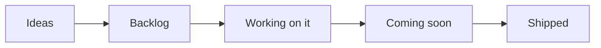
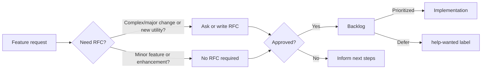

## Overview

Our public roadmap outlines the high level direction we are working towards. We update this document when our priorities change: security and stability are our top priority.

### Key areas

Security and operational excellence take precedence above all else. This means bug fixing, stability, customer's support, and internal compliance may delay one or more key areas below.

!!! info "We may choose to re-prioritize or defer items based on customer feedback, security, and operational impacts, and business value."

#### Release Security (p0)

Our top priority is to establish the processes and infrastructure needed for a fully automated and secure end-to-end release process of new versions to Maven Central.

- [x] [Implement GitHub workflows](https://github.com/aws-powertools/powertools-lambda-java/issues/1231){target="\_blank"} and create infrastructure to release to Maven Central
- [x] [Implement end-to-end tests](https://github.com/aws-powertools/powertools-lambda-java/issues/1815){target="\_blank"}
- [x] Implement [OpenSSF Scorecard](https://openssf.org/projects/scorecard/){target="\_blank"}

#### `v2` Release: Consistency and Ecosystem (p1)

As part of a new major version `v2` release, we prioritize the Java project's consistency of core utilities (Logging, Metrics, Tracing) with the other runtimes (Python, TypeScript, .NET). Additionally, we will focus on integrating the library with popular technologies and frameworks from the Java and AWS ecosystem. Particularly, we aim at leveraging new techniques to allow customers to reduce Lambda cold-start time. The `v2` release will also drop support for Java 8 moving to Java 11 as the baseline.

##### Core Utilities

- [x] [Review public interfaces and reduce public API surface area](https://github.com/aws-powertools/powertools-lambda-java/issues/1283){target="\_blank"}
- [x] [Release Logging `v2` module](https://github.com/aws-powertools/powertools-lambda-java/issues/965){target="\_blank"} allowing customers to choose the logging framework and adding support for logging deeply nested objects as JSON
- [x] [Support high resolution metrics](https://github.com/aws-powertools/powertools-lambda-java/issues/1041){target="\_blank"}
- [x] [Improve modularity of metrics module](https://github.com/aws-powertools/powertools-lambda-java/issues/1848){target="\_blank"} to remove coupling with EMF library and to be able to support additional metrics providers / backends in the future

##### Ecosystem

- [x] [Add GraalVM support for core utilities](https://github.com/aws-powertools/powertools-lambda-java/issues/764){target="\_blank"}
- [ ] [Implement priming using CRaC to improve AWS Snapstart support](https://github.com/aws-powertools/powertools-lambda-java/issues/1588){target="\_blank"}
- [ ] [Evaluate integration with popular Java frameworks such as Micronaut, Spring Cloud Function, or Quarkus](https://github.com/aws-powertools/powertools-lambda-java/issues/1701){target="\_blank"}

##### Other

- [x] [Validation module integration with HTTP requests](https://github.com/aws-powertools/powertools-lambda-java/issues/1298){target="\_blank"}
- [x] [Support validation module from within the batch module](https://github.com/aws-powertools/powertools-lambda-java/issues/1496){target="\_blank"}
- [x] [Add support for parallel processing in Batch Processing utility](https://github.com/aws-powertools/powertools-lambda-java/issues/1540){target="\_blank"}
- [ ] [Documentation: Review and improve documentation to be consistent with other runtimes](https://github.com/aws-powertools/powertools-lambda-java/issues/1352){target="\_blank"}

#### Feature Parity (p2)

If priorities `p0` and `p1` are addressed, we will also focus on feature parity of non-core utilities. This allows customers to achieve better standardization of their development processes across different Powertools runtimes.

- [ ] [Re-evaluate if there is a need for adding a lightweight customer Powertools event handler](https://github.com/aws-powertools/powertools-lambda-java/issues/1103){target="\_blank"}
- [ ] [Add comprehensive GraalVM support for all utilities](){target="\_blank"}
- [ ] [Add Feature Flags module](https://github.com/aws-powertools/powertools-lambda-java/issues/1086){target="\_blank"}
- [ ] [Add S3 Streaming module](https://github.com/aws-powertools/powertools-lambda-java/issues/1085){target="\_blank"}
- [ ] Add support for Data Masking during JSON serialization

### Missing something?

You can help us prioritize by [upvoting existing feature requests](https://github.com/aws-powertools/powertools-lambda-java/issues?q=is%3Aissue%20state%3Aopen%20label%3Aenhancement){target="\_blank"},
leaving a comment on what use cases it could unblock for you, and by joining our discussions on Discord.

{target="\_blank"}

### Roadmap status definition

<i>Visual representation</i>

Within our [public board](https://github.com/orgs/aws-powertools/projects/4/){target="\_blank"}, you'll see the following values in the `Status` column:

- **Ideas**. Incoming and existing feature requests that are not being actively considered yet. These will be reviewed
  when bandwidth permits.
- **Backlog**. Accepted feature requests or enhancements that we want to work on.
- **Working on it**. Features or enhancements we're currently either researching or implementing it.
- **Coming soon**. Any feature, enhancement, or bug fixes that have been merged and are coming in the next release.
- **Shipped**. Features or enhancements that are now available in the most recent release.

> Tasks or issues with empty `Status` will be categorized in upcoming review cycles.

### Process

<i>Visual representation</i>

Our end-to-end mechanism follows four major steps:

- **Feature Request**. Ideas start with a [feature request](https://github.com/aws-powertools/powertools-lambda-java/issues/new?template=feature_request.md){target="\_blank"} to outline their use case at a high level. For complex use cases, maintainers might ask for/write a
  RFC.
  - Maintainers review requests based on [project tenets](index.md#tenets){target="\_blank"}, customers reaction (👍),
    and use cases.
- **Request-for-comments (RFC)**. Design proposals use
  our [RFC template](https://github.com/aws-powertools/powertools-lambda-java/issues/new?q=is%3Aissue+state%3Aopen+label%3Aenhancement&template=rfc.md){target="\_blank"} to describe its implementation, challenges, developer experience, dependencies, and alternative solutions.
  - This helps refine the initial idea with community feedback before a decision is made.
- **Decision**. After carefully reviewing and discussing them, maintainers make a final decision on whether to start
  implementation, defer or reject it, and update everyone with the next steps.
- **Implementation**. For approved features, maintainers give priority to the original authors for implementation unless
  it is a sensitive task that is best handled by maintainers.

!!! info "See [Maintainers](./processes/maintainers.md){target="\_blank"} document to understand how we triage issues and pull requests, labels and governance."

### Disclaimer

The Powertools for AWS Lambda (Java) team values feedback and guidance from its community of users, although final
decisions on inclusion into the project will be made by AWS.

We determine the high-level direction for our open roadmap based on customer feedback and popularity (👍🏽 and comments),
security and operational impacts, and business value. Where features don’t meet our goals and longer-term strategy, we
will communicate that clearly and openly as quickly as possible with an explanation of why the decision was made.

### FAQs

**Q: Why did you build this?**

A: We know that our customers are making decisions and plans based on what we are developing, and we want to provide our
customers the insights they need to plan.

**Q: Why are there no dates on your roadmap?**

A: Because job zero is security and operational stability, we can't provide specific target dates for features. The
roadmap is subject to change at any time, and roadmap issues in this repository do not guarantee a feature will be
launched as proposed.

**Q: How can I provide feedback or ask for more information?**

A: For existing features, you can directly comment on issues. For anything else, please open an issue.
