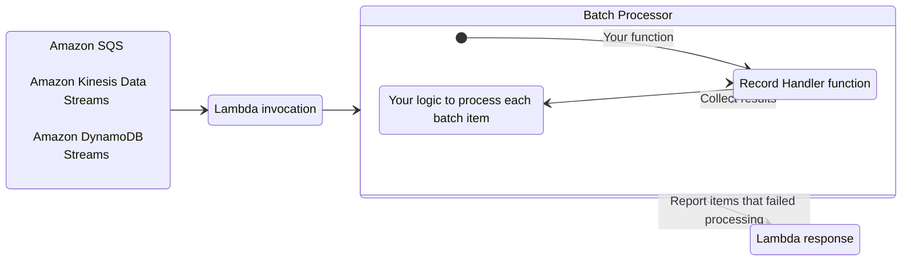
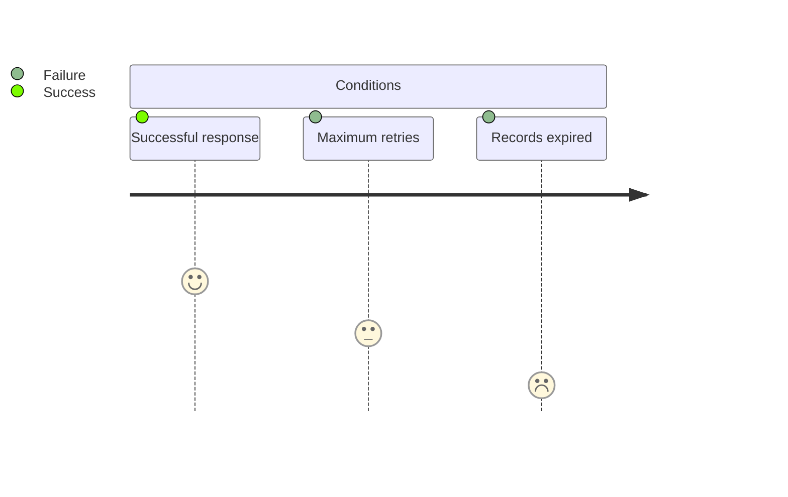

The batch processing utility provides a way to handle partial failures when processing batches of messages from SQS queues,
SQS FIFO queues, Kinesis Streams, or DynamoDB Streams.



**Key Features**

* Reports batch item failures to reduce number of retries for a record upon errors
* Simple interface to process each batch record
* Integrates with Java Events library and the deserialization module 
* Build your own batch processor by extending primitives

**Background**

When using SQS, Kinesis Data Streams, or DynamoDB Streams as a Lambda event source, your Lambda functions are 
triggered with a batch of messages.
If your function fails to process any message from the batch, the entire batch returns to your queue or stream.
This same batch is then retried until either condition happens first:
**a)** your Lambda function returns a successful response, 
**b)** record reaches maximum retry attempts, or 
**c)** records expire.



This behavior changes when you enable Report Batch Item Failures feature in your Lambda function event source configuration:

<!-- markdownlint-disable MD013 -->
* [**SQS queues**](#sqs-standard). Only messages reported as failure will return to the queue for a retry, while successful ones will be deleted.
* [**Kinesis data streams**](#kinesis-and-dynamodb-streams) and [**DynamoDB streams**](#kinesis-and-dynamodb-streams).
Single reported failure will use its sequence number as the stream checkpoint. 
Multiple reported failures will use the lowest sequence number as checkpoint.

With this utility, batch records are processed individually – only messages that failed to be processed 
return to the queue or stream for a further retry. You simply build a `BatchProcessor` in your handler,
and return its response from the handler's `processMessage` implementation. Exceptions are handled 
internally and an appropriate partial response for the message source is returned to Lambda for you.

!!! warning
    While this utility lowers the chance of processing messages more than once, but it is not guaranteed. 
    We recommend implementing processing logic in an idempotent manner wherever possible, for instance,
    by taking advantage of [the idempotency module](idempotency.md).
    More details on how Lambda works with SQS can be found in the [AWS documentation](https://docs.aws.amazon.com/lambda/latest/dg/with-sqs.html)

## Install

We simply add `powertools-batch` to our build dependencies. Note - if you are using other Powertools
modules that require code-weaving, such as `powertools-core`, you will need to configure that also.

=== "Maven"

    ```xml
    <dependencies>
        ...
        <dependency>
            <groupId>software.amazon.lambda</groupId>
            <artifactId>powertools-batch</artifactId>
            <version>{{ powertools.version }}</version>
        </dependency>
        ...
    </dependencies>
    ```

=== "Gradle"

    ```groovy
        
        repositories {
            mavenCentral()
        }
        
        dependencies {
            implementation 'software.amazon.lambda:powertools-batch:{{ powertools.version }}'
        }
    ```
## Getting Started

For this feature to work, you need to **(1)** configure your Lambda function event source to use `ReportBatchItemFailures`,
and **(2)** return a specific response to report which records failed to be processed. 

You can use your preferred deployment framework to set the correct configuration while this utility,
while the `powertools-batch` module handles generating the response, which simply needs to be returned as the result of
your Lambda handler.

A complete [Serverless Application Model](https://aws.amazon.com/serverless/sam/) example can be found
[here](https://github.com/aws-powertools/powertools-lambda-java/tree/main/examples/powertools-examples-batch) covering
all of the batch sources.

For more information on configuring `ReportBatchItemFailures`, 
see the details for [SQS](https://docs.aws.amazon.com/lambda/latest/dg/with-sqs.html#services-sqs-batchfailurereporting), 
[Kinesis](https://docs.aws.amazon.com/lambda/latest/dg/with-kinesis.html#services-kinesis-batchfailurereporting),and
[DynamoDB Streams](https://docs.aws.amazon.com/lambda/latest/dg/with-ddb.html#services-ddb-batchfailurereporting). 


!!! note "You do not need any additional IAM permissions to use this utility, except for what each event source requires."

## Processing messages from SQS

=== "App.java" 
    
    ```java hl_lines="10 13-15 20 25"
    import com.amazonaws.services.lambda.runtime.Context;
    import com.amazonaws.services.lambda.runtime.RequestHandler;
    import com.amazonaws.services.lambda.runtime.events.SQSBatchResponse;
    import com.amazonaws.services.lambda.runtime.events.SQSEvent;
    import software.amazon.lambda.powertools.batch.BatchMessageHandlerBuilder;
    import software.amazon.lambda.powertools.batch.handler.BatchMessageHandler;
    
    public class SqsBatchHandler implements RequestHandler<SQSEvent, SQSBatchResponse> {

        private final BatchMessageHandler<SQSEvent, SQSBatchResponse> handler;
    
        public SqsBatchHandler() {
            handler = new BatchMessageHandlerBuilder()
                    .withSqsBatchHandler()
                    .buildWithMessageHandler(this::processMessage, Product.class);
        }
    
        @Override
        public SQSBatchResponse handleRequest(SQSEvent sqsEvent, Context context) {
            return handler.processBatch(sqsEvent, context);
        }
    
    
        private void processMessage(Product p, Context c) {
            // Process the product
        }
    
    }
    ```

=== "Product.java"
    
    ```java
    public class Product {
        private long id;
    
        private String name;
    
        private double price;
    
        public Product() {
        }
    
        public Product(long id, String name, double price) {
            this.id = id;
            this.name = name;
            this.price = price;
        }
    
        public long getId() {
            return id;
        }
    
        public void setId(long id) {
            this.id = id;
        }
    
        public String getName() {
            return name;
        }
    
        public void setName(String name) {
            this.name = name;
        }
    
        public double getPrice() {
            return price;
        }
    
        public void setPrice(double price) {
            this.price = price;
        }
    }
    ``` 

=== "Example Event"

    ```json
        {
            "Records": [
            {
                "messageId": "d9144555-9a4f-4ec3-99a0-34ce359b4b54",
                "receiptHandle": "13e7f7851d2eaa5c01f208ebadbf1e72==",
                "body": "{\n  \"id\": 1234,\n  \"name\": \"product\",\n  \"price\": 42\n}",
                "attributes": {
                    "ApproximateReceiveCount": "1",
                    "SentTimestamp": "1601975706495",
                    "SenderId": "AROAIFU437PVZ5L2J53F5",
                    "ApproximateFirstReceiveTimestamp": "1601975706499"
                },
                "messageAttributes": {
                },
                "md5OfBody": "13e7f7851d2eaa5c01f208ebadbf1e72",
                "eventSource": "aws:sqs",
                "eventSourceARN": "arn:aws:sqs:eu-central-1:123456789012:TestLambda",
                "awsRegion": "eu-central-1"
            },
            {
                "messageId": "e9144555-9a4f-4ec3-99a0-34ce359b4b54",
                "receiptHandle": "13e7f7851d2eaa5c01f208ebadbf1e72==",
                "body": "{\n  \"id\": 12345,\n  \"name\": \"product5\",\n  \"price\": 45\n}",
                "attributes": {
                    "ApproximateReceiveCount": "1",
                    "SentTimestamp": "1601975706495",
                    "SenderId": "AROAIFU437PVZ5L2J53F5",
                    "ApproximateFirstReceiveTimestamp": "1601975706499"
                },
                "messageAttributes": {
                },
                "md5OfBody": "13e7f7851d2eaa5c01f208ebadbf1e72",
                "eventSource": "aws:sqs",
                "eventSourceARN": "arn:aws:sqs:eu-central-1:123456789012:TestLambda",
                "awsRegion": "eu-central-1"
            }]
        }
    ```

## Processing messages from Kinesis Streams

=== "App.java"
    
    ```java  hl_lines="10 13-15 20 24"
    import com.amazonaws.services.lambda.runtime.Context;
    import com.amazonaws.services.lambda.runtime.RequestHandler;
    import com.amazonaws.services.lambda.runtime.events.KinesisEvent;
    import com.amazonaws.services.lambda.runtime.events.StreamsEventResponse;
    import software.amazon.lambda.powertools.batch.BatchMessageHandlerBuilder;
    import software.amazon.lambda.powertools.batch.handler.BatchMessageHandler;
    
    public class KinesisBatchHandler implements RequestHandler<KinesisEvent, StreamsEventResponse> {
    
        private final BatchMessageHandler<KinesisEvent, StreamsEventResponse> handler;
    
        public KinesisBatchHandler() {
            handler = new BatchMessageHandlerBuilder()
                    .withKinesisBatchHandler()
                    .buildWithMessageHandler(this::processMessage, Product.class);
        }
    
        @Override
        public StreamsEventResponse handleRequest(KinesisEvent kinesisEvent, Context context) {
            return handler.processBatch(kinesisEvent, context);
        }
    
        private void processMessage(Product p, Context c) {
            // process the product
        }
    
    }
    ```

=== "Product.java"
    
    ```java
    public class Product {
        private long id;
    
        private String name;
    
        private double price;
    
        public Product() {
        }
    
        public Product(long id, String name, double price) {
            this.id = id;
            this.name = name;
            this.price = price;
        }
    
        public long getId() {
            return id;
        }
    
        public void setId(long id) {
            this.id = id;
        }
    
        public String getName() {
            return name;
        }
    
        public void setName(String name) {
            this.name = name;
        }
    
        public double getPrice() {
            return price;
        }
    
        public void setPrice(double price) {
            this.price = price;
        }
    }
    ``` 

=== "Example Event"

    ```json 
        {
          "Records": [
            {
              "kinesis": {
                "partitionKey": "partitionKey-03",
                "kinesisSchemaVersion": "1.0",
                "data": "eyJpZCI6MTIzNCwgIm5hbWUiOiJwcm9kdWN0IiwgInByaWNlIjo0Mn0=",
                "sequenceNumber": "49545115243490985018280067714973144582180062593244200961",
                "approximateArrivalTimestamp": 1428537600,
                "encryptionType": "NONE"
              },
              "eventSource": "aws:kinesis",
              "eventID": "shardId-000000000000:49545115243490985018280067714973144582180062593244200961",
              "invokeIdentityArn": "arn:aws:iam::EXAMPLE",
              "eventVersion": "1.0",
              "eventName": "aws:kinesis:record",
              "eventSourceARN": "arn:aws:kinesis:EXAMPLE",
              "awsRegion": "eu-central-1"
            },
            {
              "kinesis": {
                "partitionKey": "partitionKey-03",
                "kinesisSchemaVersion": "1.0",
                "data": "eyJpZCI6MTIzNDUsICJuYW1lIjoicHJvZHVjdDUiLCAicHJpY2UiOjQ1fQ==",
                "sequenceNumber": "49545115243490985018280067714973144582180062593244200962",
                "approximateArrivalTimestamp": 1428537600,
                "encryptionType": "NONE"
              },
              "eventSource": "aws:kinesis",
              "eventID": "shardId-000000000000:49545115243490985018280067714973144582180062593244200961",
              "invokeIdentityArn": "arn:aws:iam::EXAMPLE",
              "eventVersion": "1.0",
              "eventName": "aws:kinesis:record",
              "eventSourceARN": "arn:aws:kinesis:EXAMPLE",
              "awsRegion": "eu-central-1"
            }
          ]
        }
    ```
## Processing messages from DynamoDB Streams

=== "App.java"
    
    ```java  hl_lines="10 13-15 20 24"
    import com.amazonaws.services.lambda.runtime.Context;
    import com.amazonaws.services.lambda.runtime.RequestHandler;
    import com.amazonaws.services.lambda.runtime.events.DynamodbEvent;
    import com.amazonaws.services.lambda.runtime.events.StreamsEventResponse;
    import software.amazon.lambda.powertools.batch.BatchMessageHandlerBuilder;
    import software.amazon.lambda.powertools.batch.handler.BatchMessageHandler;
    
    public class DynamoDBStreamBatchHandler implements RequestHandler<DynamodbEvent, StreamsEventResponse> {
    
        private final BatchMessageHandler<DynamodbEvent, StreamsEventResponse> handler;
    
        public DynamoDBStreamBatchHandler() {
            handler = new BatchMessageHandlerBuilder()
                    .withDynamoDbBatchHandler()
                    .buildWithRawMessageHandler(this::processMessage);
        }
        
        @Override
        public StreamsEventResponse handleRequest(DynamodbEvent ddbEvent, Context context) {
            return handler.processBatch(ddbEvent, context);
        }

        private void processMessage(DynamodbEvent.DynamodbStreamRecord dynamodbStreamRecord, Context context) {
            // Process the change record
        }
    }
    ```

=== "Example Event"

    ```json 
        {
          "Records": [
            {
              "eventID": "c4ca4238a0b923820dcc509a6f75849b",
              "eventName": "INSERT",
              "eventVersion": "1.1",
              "eventSource": "aws:dynamodb",
              "awsRegion": "eu-central-1",
              "dynamodb": {
                "Keys": {
                  "Id": {
                    "N": "101"
                  }
                },
                "NewImage": {
                  "Message": {
                    "S": "New item!"
                  },
                  "Id": {
                    "N": "101"
                  }
                },
                "ApproximateCreationDateTime": 1428537600,
                "SequenceNumber": "4421584500000000017450439091",
                "SizeBytes": 26,
                "StreamViewType": "NEW_AND_OLD_IMAGES"
              },
              "eventSourceARN": "arn:aws:dynamodb:eu-central-1:123456789012:table/ExampleTableWithStream/stream/2015-06-27T00:48:05.899",
              "userIdentity": {
                "principalId": "dynamodb.amazonaws.com",
                "type": "Service"
              }
            },
            {
              "eventID": "c81e728d9d4c2f636f067f89cc14862c",
              "eventName": "MODIFY",
              "eventVersion": "1.1",
              "eventSource": "aws:dynamodb",
              "awsRegion": "eu-central-1",
              "dynamodb": {
                "Keys": {
                  "Id": {
                    "N": "101"
                  }
                },
                "NewImage": {
                  "Message": {
                    "S": "This item has changed"
                  },
                  "Id": {
                    "N": "101"
                  }
                },
                "OldImage": {
                  "Message": {
                    "S": "New item!"
                  },
                  "Id": {
                    "N": "101"
                  }
                },
                "ApproximateCreationDateTime": 1428537600,
                "SequenceNumber": "4421584500000000017450439092",
                "SizeBytes": 59,
                "StreamViewType": "NEW_AND_OLD_IMAGES"
              },
              "eventSourceARN": "arn:aws:dynamodb:eu-central-1:123456789012:table/ExampleTableWithStream/stream/2015-06-27T00:48:05.899"
            }
          ]
        }
    ```