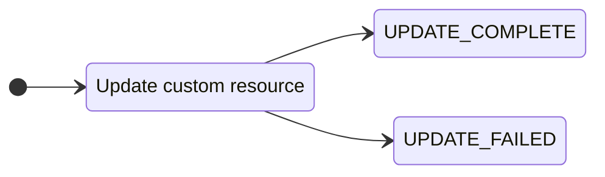
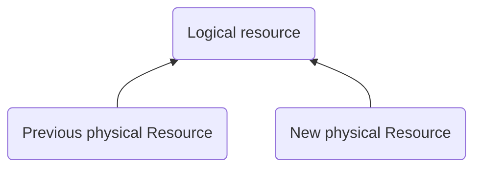
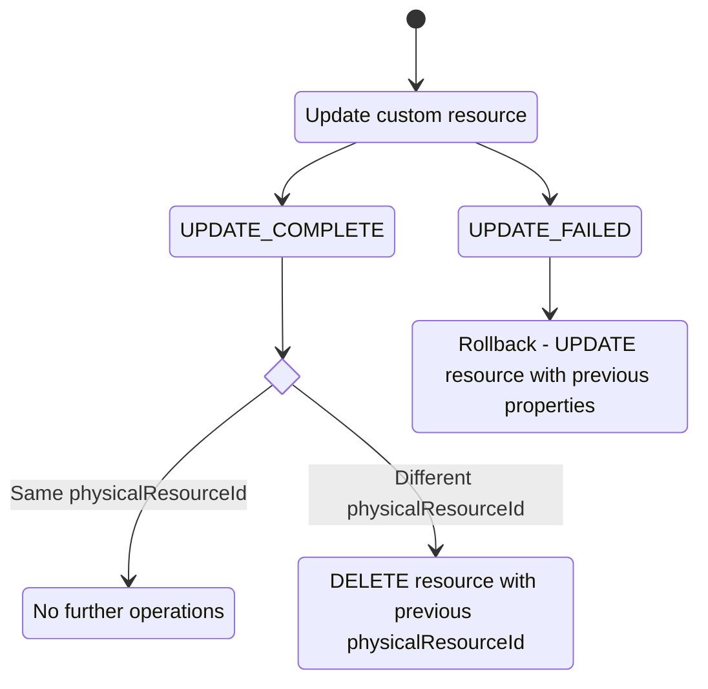
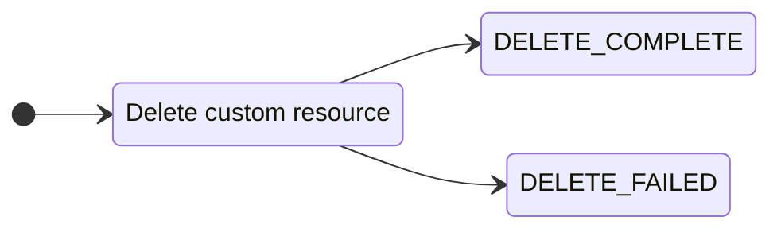

[CloudFormation Custom resources](https://docs.aws.amazon.com/AWSCloudFormation/latest/UserGuide/template-custom-resources.html)
provide a way for [AWS Lambda functions](
https://docs.aws.amazon.com/AWSCloudFormation/latest/UserGuide/template-custom-resources-lambda.html) to execute
provisioning logic whenever CloudFormation stacks are created, updated, or deleted. 

Powertools-cloudformation makes it easy to write Lambda functions in Java that are used as CloudFormation custom resources.    
The utility reads incoming CloudFormation events, calls your custom code depending on the operation (CREATE, UPDATE or DELETE) and sends responses back to CloudFormation.  
By using this library you do not need to write code to integrate with CloudFormation, and you only focus on writing the custom provisioning logic inside the Lambda function.

## Install

To install this utility, add the following dependency to your project.

=== "Maven"

    ```xml
    <dependency>
        <groupId>software.amazon.lambda</groupId>
        <artifactId>powertools-cloudformation</artifactId>
        <version>{{ powertools.version }}</version>
    </dependency>
    ```

=== "Gradle"

    ```groovy
     dependencies {
        ...
        implementation 'software.amazon.lambda:powertools-cloudformation:{{ powertools.version }}'
    }
    ```

## Usage

To utilise the feature, extend the `AbstractCustomResourceHandler` class in your Lambda handler class.  
Next, implement and override the following 3 methods: `create`, `update` and `delete`. The `AbstractCustomResourceHandler` invokes the right method according to the CloudFormation [custom resource request event](
https://docs.aws.amazon.com/AWSCloudFormation/latest/UserGuide/crpg-ref-requests.html) it receives.  
Inside the methods, implement your custom provisioning logic, and return a `Response`. The `AbstractCustomResourceHandler` takes your `Response`, builds a
[custom resource responses](https://docs.aws.amazon.com/AWSCloudFormation/latest/UserGuide/crpg-ref-responses.html) and sends it to CloudFormation automatically.  

Custom resources notify cloudformation either of `SUCCESS` or `FAILED` status. You have 2 utility methods to represent these responses: `Response.success(physicalResourceId)` and `Response.failed(physicalResourceId)`.  
The `physicalResourceId` is an identifier that is used during the lifecycle operations of the Custom Resource.  
You should generate a `physicalResourceId` during the `CREATE` operation, CloudFormation stores the `physicalResourceId` and includes it in `UPDATE` and `DELETE` events.

Here an example of how to implement a Custom Resource using the powertools-cloudformation library:

```java hl_lines="10-16 21-27 32-38"
import com.amazonaws.services.lambda.runtime.Context;
import com.amazonaws.services.lambda.runtime.events.CloudFormationCustomResourceEvent;
import software.amazon.lambda.powertools.cloudformation.AbstractCustomResourceHandler;
import software.amazon.lambda.powertools.cloudformation.Response;

public class MyCustomResourceHandler extends AbstractCustomResourceHandler {

    @Override
    protected Response create(CloudFormationCustomResourceEvent createEvent, Context context) {
        String physicalResourceId = "sample-resource-id-" + UUID.randomUUID(); //Create a unique ID for your resource
        ProvisioningResult provisioningResult = doProvisioning(physicalResourceId);
        if(provisioningResult.isSuccessful()){ //check if the provisioning was successful
            return Response.success(physicalResourceId);
        }else{
            return Response.failed(physicalResourceId);
        }
    }

    @Override
    protected Response update(CloudFormationCustomResourceEvent updateEvent, Context context) {
        String physicalResourceId = updateEvent.getPhysicalResourceId(); //Get the PhysicalResourceId from CloudFormation
        UpdateResult updateResult = doUpdates(physicalResourceId);
        if(updateResult.isSuccessful()){ //check if the update operations were successful
            return Response.success(physicalResourceId);
        }else{
            return Response.failed(physicalResourceId);
        }
    }

    @Override
    protected Response delete(CloudFormationCustomResourceEvent deleteEvent, Context context) {
        String physicalResourceId = deleteEvent.getPhysicalResourceId(); //Get the PhysicalResourceId from CloudFormation
        DeleteResult deleteResult = doDeletes(physicalResourceId);
        if(deleteResult.isSuccessful()){ //check if the delete operations were successful
            return Response.success(physicalResourceId);
        }else{
            return Response.failed(physicalResourceId);
        }
    }
}
```

### Missing `Response` and exception handling

If a `Response` is not returned by your code, `AbstractCustomResourceHandler` defaults the response to `SUCCESS`.  
If your code raises an exception (which is not handled), the `AbstractCustomResourceHandler` defaults the response to `FAILED`.

In both of the scenarios, powertools-java will return the `physicalResourceId` to CloudFormation based on the following logic:
- For CREATE operations, the `LogStreamName` from the Lambda context is used. 
- For UPDATE and DELETE operations, the `physicalResourceId` provided in the `CloudFormationCustomResourceEvent` is used. 

#### Why do you need a physicalResourceId?

It is recommended that you always explicitly provide a `physicalResourceId` in your response rather than letting Powertools for AWS Lambda (Java) generate if for you because `physicalResourceId` has a crucial role in the lifecycle of a CloudFormation custom resource.
If the `physicalResourceId` changes between calls from Cloudformation, for instance in response to an `Update` event, Cloudformation [treats the resource update as a replacement](https://docs.aws.amazon.com/AWSCloudFormation/latest/UserGuide/aws-resource-cfn-customresource.html).

### Customising a response

As well as the `Response.success(physicalResourceId)` and `Response.failed(physicalResourceId)`, you can customise the `Response` by using the `Response.builder()`.
You customise the responses when you need additional attributes to be shared with other parts of the CloudFormation stack.

In the example below, the Lambda function creates a [Chime AppInstance](https://docs.aws.amazon.com/chime/latest/dg/create-app-instance.html)
and maps the returned ARN to a "ChimeAppInstanceArn" attribute.

```java hl_lines="12-17"
public class ChimeAppInstanceHandler extends AbstractCustomResourceHandler {
    @Override
    protected Response create(CloudFormationCustomResourceEvent createEvent, Context context) {
        String physicalResourceId = "my-app-name-" + UUID.randomUUID(); //Create a unique ID 
        CreateAppInstanceRequest chimeRequest = CreateAppInstanceRequest.builder()
                .name(physicalResourceId)
                .build();
        CreateAppInstanceResponse chimeResponse = ChimeClient.builder()
                .region("us-east-1")
                .createAppInstance(chimeRequest);

        Map<String, String> chimeAtts = Map.of("ChimeAppInstanceArn", chimeResponse.appInstanceArn());
        return Response.builder()
                .value(chimeAtts)
                .status(Response.Status.SUCCESS)
                .physicalResourceId(physicalResourceId)
                .build();
    }
}
```

For the example above the following response payload will be sent.

```json
{
  "Status": "SUCCESS",
  "PhysicalResourceId": "2021/10/01/e3a37e552eff4718a5675c1e31f0649e",
  "StackId": "arn:aws:cloudformation:us-east-1:123456789000:stack/Custom-stack/59e4d2d0-2fe2-10ec-b00e-124d7c1c5f15",
  "RequestId": "7cae0346-0359-4dff-b80a-a82f247467b6",
  "LogicalResourceId:": "ChimeTriggerResource",
  "PhysicalResourceId:": "my-app-name-db4a47b9-0cac-45ba-8cc4-a480490c5779",
  "NoEcho": false,
  "Data": {
    "ChimeAppInstanceArn": "arn:aws:chime:us-east-1:123456789000:app-instance/150972c2-5490-49a9-8ba7-e7da4257c16a"
  }
}
```

Once the custom resource receives this response, its "ChimeAppInstanceArn" attribute is set and the
[Fn::GetAtt function](
https://docs.aws.amazon.com/AWSCloudFormation/latest/UserGuide/intrinsic-function-reference-getatt.html) may be used to
retrieve the attribute value and make it available to other resources in the stack.

#### Sensitive Response Data

If any attributes are sensitive, enable the "noEcho" flag to mask the output of the custom resource when it's retrieved
with the Fn::GetAtt function.

```java hl_lines="9"
public class SensitiveDataHandler extends AbstractResourceHandler {
    @Override
    protected Response create(CloudFormationCustomResourceEvent createEvent, Context context) {
        String physicalResourceId = "my-sensitive-resource-" + UUID.randomUUID(); //Create a unique ID 
        return Response.builder()
                .status(Response.Status.SUCCESS)
                .physicalResourceId(physicalResourceId)
                .value(Map.of("SomeSecret", sensitiveValue))
                .noEcho(true)
                .build();
    }
}
```

#### Customizing Serialization

Although using a `Map` as the Response's value is the most straightforward way to provide attribute name/value pairs,
any arbitrary `java.lang.Object` may be used. By default, these objects are serialized with an internal Jackson
`ObjectMapper`. If the object requires special serialization logic, a custom `ObjectMapper` can be specified.

```java hl_lines="14-16 26"
public class CustomSerializationHandler extends AbstractResourceHandler {
    /**
     * Type representing the custom response Data. 
     */
    static class Policy {
        public ZonedDateTime getExpires() {
            return ZonedDateTime.now().plusDays(10);
        }
    }

    /**
     * Mapper for serializing Policy instances.
     */
    private final ObjectMapper policyMapper = new ObjectMapper()
            .registerModule(new JavaTimeModule())
            .disable(SerializationFeature.WRITE_DATES_AS_TIMESTAMPS);

    @Override
    protected Response create(CloudFormationCustomResourceEvent createEvent, Context context) {
        String physicalResourceId = "my-policy-name-" + UUID.randomUUID(); //Create a unique ID 
        Policy policy = new Policy();
        return Response.builder()
                .status(Response.Status.SUCCESS)
                .physicalResourceId(physicalResourceId)
                .value(policy)
                .objectMapper(policyMapper) // customize serialization
                .build();
    }
}
```

## Advanced

### Understanding the CloudFormation custom resource lifecycle

While the library provides an easy-to-use interface, we recommend that you understand the lifecycle of CloudFormation custom resources before using them in production.

#### Creating a custom resource
When CloudFormation issues a CREATE on a custom resource, there are 2 possible states: `CREATE_COMPLETE` and `CREATE_FAILED`


If the resource is created successfully, the `physicalResourceId` is stored by CloudFormation for future operations.  
If the resource failed to create, CloudFormation triggers a rollback operation by default (rollback can be disabled, see [stack failure options](https://docs.aws.amazon.com/AWSCloudFormation/latest/UserGuide/stack-failure-options.html))

#### Updating a custom resource
CloudFormation issues an UPDATE operation on a custom resource only when one or more custom resource properties change.
During the update, the custom resource may update successfully, or may fail the update.


In both of these scenarios, the custom resource can return the same `physicalResourceId` it received in the CloudFormation event, or a different `physicalResourceId`.  
Semantically an `UPDATE_COMPLETE` that returns the same `physicalResourceId` it received indicates that the existing resource was updated successfully.  
Instead, an `UPDATE_COMPLETE` with a different `physicalResourceId` means that a new physical resource was created successfully. 

Therefore, after the custom resource update completed or failed, there may be other cleanup operations by Cloudformation during the rollback, as described in the diagram below:


#### Deleting a custom resource

CloudFormation issues a DELETE on a custom resource when:  
- the CloudFormation stack is being deleted  
- a new `physicalResourceId` was received during an update, and CloudFormation proceeds to rollback(DELETE) the custom resource with the previous `physicalResourceId`.

