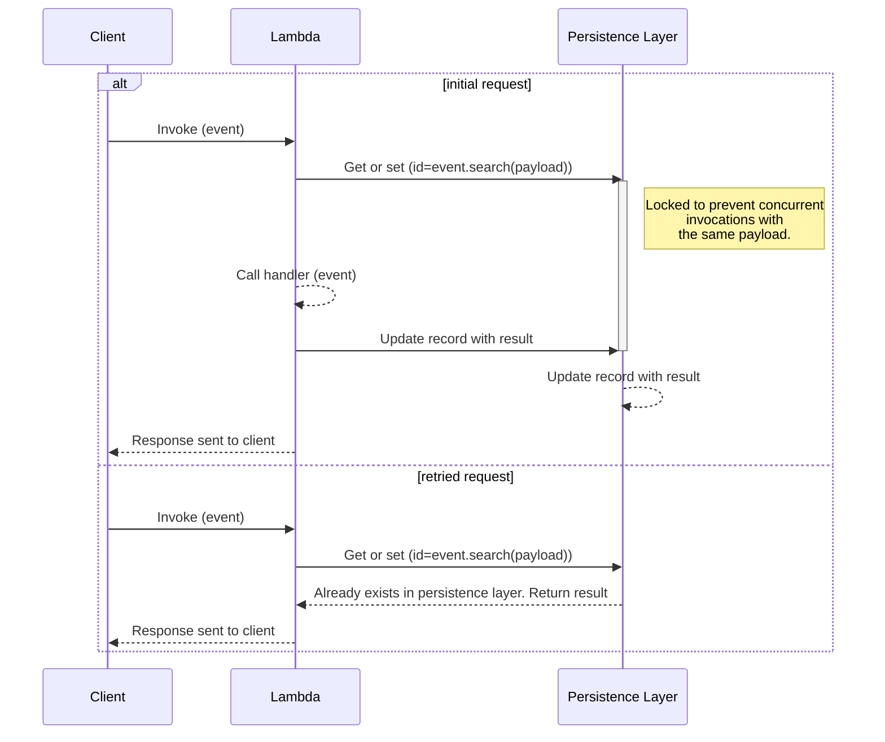
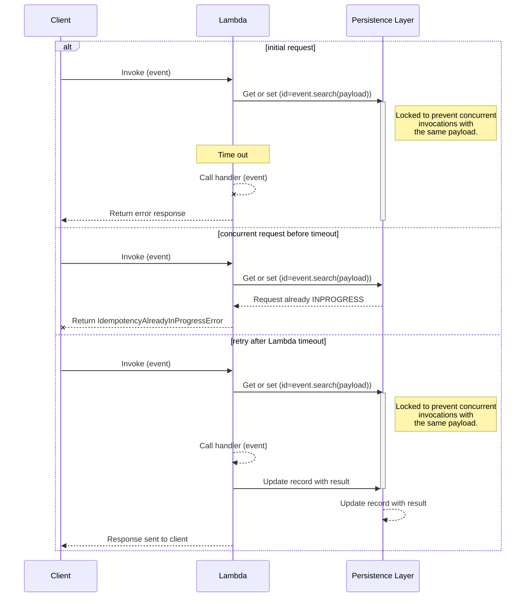
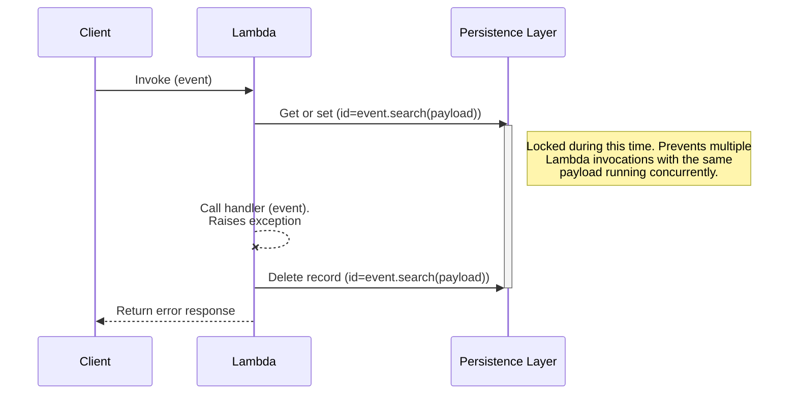

The idempotency utility provides a simple solution to convert your Lambda functions into idempotent operations which
are safe to retry.

## Terminology

The property of idempotency means that an operation does not cause additional side effects if it is called more than
once with the same input parameters.

**Idempotent operations will return the same result when they are called multiple
times with the same parameters**. This makes idempotent operations safe to retry. [Read more](https://aws.amazon.com/builders-library/making-retries-safe-with-idempotent-APIs/) about idempotency.

**Idempotency key** is a hash representation of either the entire event or a specific configured subset of the event, and invocation results are **JSON serialized** and stored in your persistence storage layer.

## Key features

* Prevent Lambda handler function from executing more than once on the same event payload during a time window
* Ensure Lambda handler returns the same result when called with the same payload
* Select a subset of the event as the idempotency key using JMESPath expressions
* Set a time window in which records with the same payload should be considered duplicates

## Getting started

### Installation

=== "Maven"

    ```xml hl_lines="3-7 16 18 24-27"
    <dependencies>
        ...
        <dependency>
            <groupId>software.amazon.lambda</groupId>
            <artifactId>powertools-idempotency-dynamodb</artifactId>
            <version>{{ powertools.version }}</version>
        </dependency>
        ...
    </dependencies>
    ...
    <!-- configure the aspectj-maven-plugin to compile-time weave (CTW) the aws-lambda-powertools-java aspects into your project -->
    <build>
        <plugins>
            ...
            <plugin>
                 <groupId>dev.aspectj</groupId>
                 <artifactId>aspectj-maven-plugin</artifactId>
                 <version>1.14</version>
                 <configuration>
                     <source>11</source> <!-- or higher -->
                     <target>11</target> <!-- or higher -->
                     <complianceLevel>11</complianceLevel> <!-- or higher -->
                     <aspectLibraries>
                         <aspectLibrary>
                             <groupId>software.amazon.lambda</groupId>
                             <artifactId>powertools-idempotency-core</artifactId>
                         </aspectLibrary>
                     </aspectLibraries>
                 </configuration>
                <dependencies>
                    <dependency>
                        <groupId>org.aspectj</groupId>
                        <artifactId>aspectjtools</artifactId>
                        <!-- AspectJ compiler version, in sync with runtime -->
                        <version>1.9.22</version>
                    </dependency>
                </dependencies>
                 <executions>
                     <execution>
                         <goals>
                             <goal>compile</goal>
                         </goals>
                     </execution>
                 </executions>
            </plugin>
            ...
        </plugins>
    </build>
    ```

=== "Gradle"

    ```groovy hl_lines="3 11"
        plugins {
            id 'java'
            id 'io.freefair.aspectj.post-compile-weaving' version '8.1.0'
        }
        
        repositories {
            mavenCentral()
        }
        
        dependencies {
            aspect 'software.amazon.lambda:powertools-idempotency-dynamodb:{{ powertools.version }}'
        }
        
        sourceCompatibility = 11 // or higher
        targetCompatibility = 11 // or higher
    ```

### Required resources

Before getting started, you need to create a persistent storage layer where the idempotency utility can store its state - your Lambda functions will need read and write access to it.

As of now, Amazon DynamoDB is the only supported persistent storage layer, so you'll need to create a table first.

**Default table configuration**

If you're not [changing the default configuration for the DynamoDB persistence layer](#dynamodbpersistencestore), this is the expected default configuration:

| Configuration      | Value        | Notes                                                                               |
|--------------------|--------------|-------------------------------------------------------------------------------------|
| Partition key      | `id`         |                                                                                     |
| TTL attribute name | `expiration` | This can only be configured after your table is created if you're using AWS Console |

!!! Tip "Tip: You can share a single state table for all functions"
    You can reuse the same DynamoDB table to store idempotency state. We add your function name in addition to the idempotency key as a hash key.

```yaml hl_lines="5-13 21-23 26" title="AWS Serverless Application Model (SAM) example"
Resources:
  IdempotencyTable:
    Type: AWS::DynamoDB::Table
    Properties:
      AttributeDefinitions:
        - AttributeName: id
          AttributeType: S
      KeySchema:
        - AttributeName: id
          KeyType: HASH
      TimeToLiveSpecification:
        AttributeName: expiration
        Enabled: true
      BillingMode: PAY_PER_REQUEST

  IdempotencyFunction:
    Type: AWS::Serverless::Function
    Properties:
      CodeUri: Function
      Handler: helloworld.App::handleRequest
      Policies:
        - DynamoDBCrudPolicy:
            TableName: !Ref IdempotencyTable
      Environment:
        Variables:
          TABLE_NAME: !Ref IdempotencyTable
```

!!! warning "Warning: Large responses with DynamoDB persistence layer"
    When using this utility with DynamoDB, your function's responses must be [smaller than 400KB](https://docs.aws.amazon.com/amazondynamodb/latest/developerguide/Limits.html#limits-items).
    Larger items cannot be written to DynamoDB and will cause exceptions.

!!! info "Info: DynamoDB"
    Each function invocation will generally make 2 requests to DynamoDB. If the
    result returned by your Lambda is less than 1kb, you can expect 2 WCUs per invocation. For retried invocations, you will
    see 1WCU and 1RCU. Review the [DynamoDB pricing documentation](https://aws.amazon.com/dynamodb/pricing/) to
    estimate the cost.

### Idempotent annotation

You can quickly start by initializing the `DynamoDBPersistenceStore` and using it with the `@Idempotent` annotation on your Lambda handler.

!!! warning "Important"
    Initialization and configuration of the `DynamoDBPersistenceStore` must be performed outside the handler, preferably in the constructor.

=== "App.java"

    ```java hl_lines="5-9 12 19"
    public class App implements RequestHandler<Subscription, SubscriptionResult> {

      public App() {
        // we need to initialize idempotency store before the handleRequest method is called
        Idempotency.config().withPersistenceStore(
          DynamoDBPersistenceStore.builder()
            .withTableName(System.getenv("TABLE_NAME"))
            .build()
          ).configure();
      }

      @Idempotent
      public SubscriptionResult handleRequest(final Subscription event, final Context context) {
        SubscriptionPayment payment = createSubscriptionPayment(
          event.getUsername(),
          event.getProductId()
        );
        
        return new SubscriptionResult(payment.getId(), "success", 200);
      }
    }

    ```

=== "Example event"

    ```json
    {
      "username": "xyz",
      "product_id": "123456789"
    }
    ```

#### Idempotent annotation on another method

You can use the `@Idempotent` annotation for any synchronous Java function, not only the `handleRequest` one.

When using `@Idempotent` annotation on another method, you must tell which parameter in the method signature has the data we should use:

 - If the method only has one parameter, it will be used by default. 
 - If there are 2 or more parameters, you must set the `@IdempotencyKey` on the parameter to use.

!!! info "The parameter must be serializable in JSON. We use Jackson internally to (de)serialize objects"

=== "AppSqsEvent.java"

    This example also demonstrates how you can integrate with [Batch utility](batch.md), so you can process each record in an idempotent manner.

    ```java hl_lines="19 23-25 30-31"
    public class AppSqsEvent implements RequestHandler<SQSEvent, String> {
    
      public AppSqsEvent() {
        Idempotency.config()
          .withPersistenceStore(
              DynamoDBPersistenceStore.builder()
                .withTableName(System.getenv("TABLE_NAME"))
                .build()
          ).withConfig(
               IdempotencyConfig.builder()
                 .withEventKeyJMESPath("messageId") // see Choosing a payload subset section
                 .build()
          ).configure();
        }
    
      @Override
      @SqsBatch(SampleMessageHandler.class)
      public String handleRequest(SQSEvent input, Context context) {
        dummy("hello", "world");
        return "{\"statusCode\": 200}";
      }

      @Idempotent
      private String dummy(String argOne, @IdempotencyKey String argTwo) {
        return "something";
      }
    
      public static class SampleMessageHandler implements SqsMessageHandler<Object> {
        @Override
        @Idempotent
        // no need to use @IdempotencyKey as there is only one parameter
        public String process(SQSMessage message) {
          String returnVal = doSomething(message.getBody());
          return returnVal;
        }
      }
    }
    ```

=== "Batch event"

    ```json hl_lines="4"
    {
        "Records": [
            {
                "messageId": "059f36b4-87a3-44ab-83d2-661975830a7d",
                "receiptHandle": "AQEBwJnKyrHigUMZj6rYigCgxlaS3SLy0a...",
                "body": "Test message.",
                "attributes": {
                    "ApproximateReceiveCount": "1",
                    "SentTimestamp": "1545082649183",
                    "SenderId": "AIDAIENQZJOLO23YVJ4VO",
                    "ApproximateFirstReceiveTimestamp": "1545082649185"
                },
                "messageAttributes": {
                    "testAttr": {
                    "stringValue": "100",
                    "binaryValue": "base64Str",
                    "dataType": "Number"
                    }
                },
                "md5OfBody": "e4e68fb7bd0e697a0ae8f1bb342846b3",
                "eventSource": "aws:sqs",
                "eventSourceARN": "arn:aws:sqs:us-east-2:123456789012:my-queue",
                "awsRegion": "us-east-2"
            }
        ]
    }
    ```

### Choosing a payload subset for idempotency

!!! tip "Tip: Dealing with always changing payloads"
    When dealing with an elaborate payload (API Gateway request for example), where parts of the payload always change, you should configure the **`EventKeyJMESPath`**.

Use [`IdempotencyConfig`](#customizing-the-default-behavior) to instruct the Idempotent annotation to only use a portion of your payload to verify whether a request is idempotent, and therefore it should not be retried.

> **Payment scenario**

In this example, we have a Lambda handler that creates a payment for a user subscribing to a product. We want to ensure that we don't accidentally charge our customer by subscribing them more than once.

Imagine the function executes successfully, but the client never receives the response due to a connection issue. It is safe to retry in this instance, as the idempotent decorator will return a previously saved response.

!!! warning "Warning: Idempotency for JSON payloads"
    The payload extracted by the `EventKeyJMESPath` is treated as a string by default, so will be sensitive to differences in whitespace even when the JSON payload itself is identical.

    To alter this behaviour, you can use the [JMESPath built-in function](serialization.md#jmespath-functions) `powertools_json()` to treat the payload as a JSON object rather than a string.

=== "PaymentFunction.java"

    ```java hl_lines="5-7 16 29-31"
    public class PaymentFunction implements RequestHandler<APIGatewayProxyRequestEvent, APIGatewayProxyResponseEvent> {

      public PaymentFunction() {
        Idempotency.config()
        .withConfig(
            IdempotencyConfig.builder()
              .withEventKeyJMESPath("powertools_json(body)")
              .build())
        .withPersistenceStore(
            DynamoDBPersistenceStore.builder()
              .withTableName(System.getenv("TABLE_NAME"))
              .build())
        .configure();
    }

    @Idempotent
    public APIGatewayProxyResponseEvent handleRequest(final APIGatewayProxyRequestEvent event, final Context context) {
      APIGatewayProxyResponseEvent response = new APIGatewayProxyResponseEvent();

      try {
        Subscription subscription = JsonConfig.get().getObjectMapper().readValue(event.getBody(), Subscription.class);

        SubscriptionPayment payment = createSubscriptionPayment(
             subscription.getUsername(),
             subscription.getProductId()
        );

        return response
                 .withStatusCode(200)
                 .withBody(String.format("{\"paymentId\":\"%s\"}", payment.getId()));

      } catch (JsonProcessingException e) {
        return response.withStatusCode(500);
      }
    }
    ```

=== "Example event"

    ```json hl_lines="3"
    {
      "version":"2.0",
      "body":"{\"username\":\"xyz\",\"productId\":\"123456789\"}",
      "routeKey":"ANY /createpayment",
      "rawPath":"/createpayment",
      "rawQueryString":"",
      "headers": {
        "Header1": "value1",
        "Header2": "value2"
      },
      "requestContext":{
        "accountId":"123456789012",
        "apiId":"api-id",
        "domainName":"id.execute-api.us-east-1.amazonaws.com",
        "domainPrefix":"id",
        "http":{
          "method":"POST",
          "path":"/createpayment",
          "protocol":"HTTP/1.1",
          "sourceIp":"ip",
          "userAgent":"agent"
        },
        "requestId":"id",
        "routeKey":"ANY /createpayment",
        "stage":"$default",
        "time":"10/Feb/2021:13:40:43 +0000",
        "timeEpoch":1612964443723
      },
      "isBase64Encoded":false
    }
    ```


### Idempotency request flow

This sequence diagram shows an example flow of what happens in the payment scenario:

<center>

<i>Idempotent sequence</i>
</center>

The client was successful in receiving the result after the retry. Since the Lambda handler was only executed once, our customer hasn't been charged twice.

!!! note
    Bear in mind that the entire Lambda handler is treated as a single idempotent operation. If your Lambda handler can cause multiple side effects, consider splitting it into separate functions.

#### Lambda timeouts

This is automatically done when you annotate your Lambda handler with [@Idempotent annotation](#idempotent-annotation).

To prevent against extended failed retries when a [Lambda function times out](https://aws.amazon.com/premiumsupport/knowledge-center/lambda-verify-invocation-timeouts/), Powertools for AWS Lambda (Java) calculates and includes the remaining invocation available time as part of the idempotency record.

!!! example
    If a second invocation happens **after** this timestamp, and the record is marked as `INPROGRESS`, we will execute the invocation again as if it was in the `EXPIRED` state.
    This means that if an invocation expired during execution, it will be quickly executed again on the next retry.

!!! important
    If you are using the [@Idempotent annotation on another method](#idempotent-annotation-on-another-method) to guard isolated parts of your code, you must use `registerLambdaContext` method available in the `Idempotency` object to benefit from this protection.

    Here is an example on how you register the Lambda context in your handler:
    
    ```java hl_lines="13-19" title="Registering the Lambda context"
    public class PaymentHandler implements RequestHandler<SQSEvent, List<String>> {
    
        public PaymentHandler() {
            Idempotency.config()
                    .withPersistenceStore(
                            DynamoDBPersistenceStore.builder()
                                    .withTableName(System.getenv("TABLE_NAME"))
                                    .build())
                    .configure();
        }
        
        @Override
        public List<String> handleRequest(SQSEvent sqsEvent, Context context) {
            Idempotency.registerLambdaContext(context);
            return sqsEvent.getRecords().stream().map(record -> process(record.getMessageId(), record.getBody())).collect(Collectors.toList());
        }
    
        @Idempotent
        private String process(String messageId, @IdempotencyKey String messageBody) {
            logger.info("Processing messageId: {}", messageId);
            PaymentRequest request = extractDataFrom(messageBody).as(PaymentRequest.class);
            return paymentService.process(request);
        }
    
    }
    ```

#### Lambda timeout sequence diagram

This sequence diagram shows an example flow of what happens if a Lambda function times out:

<center>

<i>Idempotent sequence for Lambda timeouts</i>
</center>

### Handling exceptions

If you are using the `@Idempotent` annotation on your Lambda handler or any other method, any unhandled exceptions that are thrown during the code execution will cause **the record in the persistence layer to be deleted**.
This means that new invocations will execute your code again despite having the same payload. If you don't want the record to be deleted, you need to catch exceptions within the idempotent function and return a successful response.

<center>

<i>Idempotent sequence exception</i>
</center>

If an Exception is raised _outside_ the scope of a decorated method and after your method has been called, the persistent record will not be affected. In this case, idempotency will be maintained for your decorated function. Example:

```java hl_lines="2-4 8-10" title="Exception not affecting idempotency record sample"
  public SubscriptionResult handleRequest(final Subscription event, final Context context) {
    // If an exception is thrown here, no idempotent record will ever get created as the
    // idempotent function does not get called 
    doSomeStuff();
    
    result = idempotentMethod(event);
    
    // This exception will not cause the idempotent record to be deleted, since it
    // happens after the decorated function has been successfully called    
    throw new Exception();
  }
  
  @Idempotent
  private String idempotentMethod(final Subscription subscription) {
    // perform some operation with no exception thrown
  }
```

!!! warning
    **We will throw an `IdempotencyPersistenceLayerException`** if any of the calls to the persistence layer fail unexpectedly.

    As this happens outside the scope of your decorated function, you are not able to catch it.

### Persistence stores

#### DynamoDBPersistenceStore

This persistence store is built-in, and you can either use an existing DynamoDB table or create a new one dedicated for idempotency state (recommended).

Use the builder to customize the table structure:
```java hl_lines="3-7" title="Customizing DynamoDBPersistenceStore to suit your table structure"
DynamoDBPersistenceStore.builder()
                        .withTableName(System.getenv("TABLE_NAME"))
                        .withKeyAttr("idempotency_key")
                        .withExpiryAttr("expires_at")
                        .withStatusAttr("current_status")
                        .withDataAttr("result_data")
                        .withValidationAttr("validation_key")
                        .build()
```

When using DynamoDB as a persistence layer, you can alter the attribute names by passing these parameters when initializing the persistence layer:

| Parameter          | Required | Default                              | Description                                                                                            |
|--------------------|----------|--------------------------------------|--------------------------------------------------------------------------------------------------------|
| **TableName**      | Y        |                                      | Table name to store state                                                                              |
| **KeyAttr**        |          | `id`                                 | Partition key of the table. Hashed representation of the payload (unless **SortKeyAttr** is specified) |
| **ExpiryAttr**     |          | `expiration`                         | Unix timestamp of when record expires                                                                  |
| **StatusAttr**     |          | `status`                             | Stores status of the Lambda execution during and after invocation                                      |
| **DataAttr**       |          | `data`                               | Stores results of successfully idempotent methods                                                      |
| **ValidationAttr** |          | `validation`                         | Hashed representation of the parts of the event used for validation                                    |
| **SortKeyAttr**    |          |                                      | Sort key of the table (if table is configured with a sort key).                                        |
| **StaticPkValue**  |          | `idempotency#{LAMBDA_FUNCTION_NAME}` | Static value to use as the partition key. Only used when **SortKeyAttr** is set.                       |

## Advanced

### Customizing the default behavior

Idempotency behavior can be further configured with **`IdempotencyConfig`** using a builder:

```java hl_lines="2-8" title="Customizing IdempotencyConfig"
IdempotencyConfig.builder()
                .withEventKeyJMESPath("id")
                .withPayloadValidationJMESPath("paymentId")
                .withThrowOnNoIdempotencyKey(true)
                .withExpiration(Duration.of(5, ChronoUnit.MINUTES))
                .withUseLocalCache(true)
                .withLocalCacheMaxItems(432)
                .withHashFunction("SHA-256")
                .withResponseHook((responseData, dataRecord) -> responseData)
                .build()
```

These are the available options for further configuration:

| Parameter                                         | Default | Description                                                                                                                      |
|---------------------------------------------------|---------|----------------------------------------------------------------------------------------------------------------------------------|
| **EventKeyJMESPath**                              | `""`    | JMESPath expression to extract the idempotency key from the event record. See available [built-in functions](serialization)      |
| **PayloadValidationJMESPath**                     | `""`    | JMESPath expression to validate whether certain parameters have changed in the event                                             |
| **ThrowOnNoIdempotencyKey**                       | `false` | Throw exception if no idempotency key was found in the request                                                                   |
| **ExpirationInSeconds**                           | 3600    | The number of seconds to wait before a record is expired                                                                         |
| **UseLocalCache**                                 | `false` | Whether to locally cache idempotency results (LRU cache)                                                                         |
| **LocalCacheMaxItems**                            | 256     | Max number of items to store in local cache                                                                                      |
| **HashFunction**                                  | `MD5`   | Algorithm to use for calculating hashes, as supported by `java.security.MessageDigest` (eg. SHA-1, SHA-256, ...)                 |
| **ResponseHook**                                  | `null`  | Response hook to apply modifications to idempotent responses                                                                     |

These features are detailed below.

### Handling concurrent executions with the same payload

This utility will throw an **`IdempotencyAlreadyInProgressException`** if we receive **multiple invocations with the same payload while the first invocation hasn't completed yet**.

!!! info
    If you receive `IdempotencyAlreadyInProgressException`, you can safely retry the operation.

This is a locking mechanism for correctness. Since we don't know the result from the first invocation yet, we can't safely allow another concurrent execution.

### Using in-memory cache

**By default, in-memory local caching is disabled**, to avoid using memory in an unpredictable way. 

!!! warning Memory configuration of your function
    Be sure to configure the Lambda memory according to the number of records and the potential size of each record.

You can enable it as seen before with:
```java title="Enable local cache"
    IdempotencyConfig.builder()
        .withUseLocalCache(true)
        .build()
```
When enabled, we cache a maximum of 256 records in each Lambda execution environment - You can change it with the **`LocalCacheMaxItems`** parameter.

!!! note "Note: This in-memory cache is local to each Lambda execution environment"
    This means it will be effective in cases where your function's concurrency is low in comparison to the number of "retry" invocations with the same payload, because cache might be empty.


### Expiring idempotency records

!!! note
    By default, we expire idempotency records after **an hour** (3600 seconds).

In most cases, it is not desirable to store the idempotency records forever. Rather, you want to guarantee that the same payload won't be executed within a period of time.

You can change this window with the **`ExpirationInSeconds`** parameter:
```java title="Customizing expiration time"
IdempotencyConfig.builder()
    .withExpiration(Duration.of(5, ChronoUnit.MINUTES))
    .build()
```

Records older than 5 minutes will be marked as expired, and the Lambda handler will be executed normally even if it is invoked with a matching payload.

!!! note "Note: DynamoDB time-to-live field"
    This utility uses **`expiration`** as the TTL field in DynamoDB, as [demonstrated in the SAM example earlier](#required-resources).

### Payload validation

!!! question "Question: What if your function is invoked with the same payload except some outer parameters have changed?"
    Example: A payment transaction for a given productID was requested twice for the same customer, **however the amount to be paid has changed in the second transaction**.

By default, we will return the same result as it returned before, however in this instance it may be misleading; we provide a fail fast payload validation to address this edge case.

With **`PayloadValidationJMESPath`**, you can provide an additional JMESPath expression to specify which part of the event body should be validated against previous idempotent invocations

=== "App.java"

    ```java hl_lines="8 13 20 26"
    public App() {
      Idempotency.config()
        .withPersistenceStore(DynamoDBPersistenceStore.builder()
            .withTableName(System.getenv("TABLE_NAME"))
            .build())
        .withConfig(IdempotencyConfig.builder()
            .withEventKeyJMESPath("[userDetail, productId]")
            .withPayloadValidationJMESPath("amount")
            .build())
        .configure();
    }

    @Idempotent
    public SubscriptionResult handleRequest(final Subscription input, final Context context) {
        // Creating a subscription payment is a side
        // effect of calling this function!
        SubscriptionPayment payment = createSubscriptionPayment(
          input.getUserDetail().getUsername(),
          input.getProductId(),
          input.getAmount()
        )
        // ...
        return new SubscriptionResult(
            "success", 200,
            payment.getId(),
            payment.getAmount()
        );
    }
    ```

=== "Example Event 1"

    ```json hl_lines="8"
    {
        "userDetail": {
            "username": "User1",
            "user_email": "user@example.com"
        },
        "productId": 1500,
        "charge_type": "subscription",
        "amount": 500
    }
    ```

=== "Example Event 2"

    ```json hl_lines="8"
    {
        "userDetail": {
            "username": "User1",
            "user_email": "user@example.com"
        },
        "productId": 1500,
        "charge_type": "subscription",
        "amount": 1
    }
    ```

In this example, the **`userDetail`** and **`productId`** keys are used as the payload to generate the idempotency key, as per **`EventKeyJMESPath`** parameter.

!!! note
    If we try to send the same request but with a different amount, we will raise **`IdempotencyValidationException`**.

Without payload validation, we would have returned the same result as we did for the initial request. Since we're also returning an amount in the response, this could be quite confusing for the client.

By using **`withPayloadValidationJMESPath("amount")`**, we prevent this potentially confusing behavior and instead throw an Exception.

### Making idempotency key required

If you want to enforce that an idempotency key is required, you can set **`ThrowOnNoIdempotencyKey`** to `true`.

This means that we will throw **`IdempotencyKeyException`** if the evaluation of **`EventKeyJMESPath`** is `null`.

When set to `false` (the default), if the idempotency key is null, then the data is not persisted in the store.

=== "App.java"

    ```java hl_lines="9-10 13"
    public App() {
      Idempotency.config()
        .withPersistenceStore(DynamoDBPersistenceStore.builder()
            .withTableName(System.getenv("TABLE_NAME"))
            .build())
        .withConfig(IdempotencyConfig.builder()
            // Requires "user"."uid" and "orderId" to be present
            .withEventKeyJMESPath("[user.uid, orderId]")
            .withThrowOnNoIdempotencyKey(true)
            .build())
        .configure();
    }

    @Idempotent
    public OrderResult handleRequest(final Order input, final Context context) {
      // ...
    }
    ```

=== "Success Event"

    ```json hl_lines="3 6"
    {
        "user": {
            "uid": "BB0D045C-8878-40C8-889E-38B3CB0A61B1",
            "name": "Foo"
        },
        "orderId": 10000
    }
    ```

=== "Failure Event"

    Notice that `orderId` is now accidentally within `user` key

    ```json hl_lines="3 5"
    {
        "user": {
            "uid": "DE0D000E-1234-10D1-991E-EAC1DD1D52C8",
            "name": "Joe Bloggs",
            "orderId": 10000
        },
    }
    ```

### Customizing DynamoDB configuration

When creating the `DynamoDBPersistenceStore`, you can set a custom [`DynamoDbClient`](https://sdk.amazonaws.com/java/api/latest/software/amazon/awssdk/services/dynamodb/DynamoDbClient.html) if you need to customize the configuration:

=== "Custom DynamoDbClient with X-Ray interceptor"

    ```java hl_lines="2-8 13"
    public App() {
        DynamoDbClient customClient = DynamoDbClient.builder()
            .region(Region.US_WEST_2)
            .overrideConfiguration(ClientOverrideConfiguration.builder()
                .addExecutionInterceptor(new TracingInterceptor())
                .build()
            )
            .build();
      
        Idempotency.config().withPersistenceStore(
          DynamoDBPersistenceStore.builder()
                .withTableName(System.getenv("TABLE_NAME"))
                .withDynamoDbClient(customClient)
                .build()
      ).configure();
    }
    ```

!!! info "Default configuration is the following:"

    ```java
    DynamoDbClient.builder()
        .credentialsProvider(EnvironmentVariableCredentialsProvider.create())
        .httpClient(UrlConnectionHttpClient.builder().build())
        .region(Region.of(System.getenv(AWS_REGION_ENV)))
        .build();
    ```

### Using a DynamoDB table with a composite primary key

When using a composite primary key table (hash+range key), use `SortKeyAttr` parameter when initializing your persistence store.

With this setting, we will save the idempotency key in the sort key instead of the primary key. By default, the primary key will now be set to `idempotency#{LAMBDA_FUNCTION_NAME}`.

You can optionally set a static value for the partition key using the `StaticPkValue` parameter.

```java hl_lines="5" title="Reusing a DynamoDB table that uses a composite primary key"
Idempotency.config().withPersistenceStore(
     DynamoDBPersistenceStore.builder()
       .withTableName(System.getenv("TABLE_NAME"))
       .withSortKeyAttr("sort_key")
       .build())
   .configure();
```

Data would then be stored in DynamoDB like this:

| id                           | sort_key                         | expiration | status      | data                                 |
|------------------------------|----------------------------------|------------|-------------|--------------------------------------|
| idempotency#MyLambdaFunction | 1e956ef7da78d0cb890be999aecc0c9e | 1636549553 | COMPLETED   | {"id": 12391, "message": "success"}  |
| idempotency#MyLambdaFunction | 2b2cdb5f86361e97b4383087c1ffdf27 | 1636549571 | COMPLETED   | {"id": 527212, "message": "success"} |
| idempotency#MyLambdaFunction | f091d2527ad1c78f05d54cc3f363be80 | 1636549585 | IN_PROGRESS |                                      |

### Bring your own persistent store

This utility provides an abstract base class, so that you can implement your choice of persistent storage layer.

You can extend the `BasePersistenceStore` class and implement the abstract methods `getRecord`, `putRecord`,
`updateRecord` and `deleteRecord`. You can have a look at [`DynamoDBPersistenceStore`](https://github.com/aws-powertools/powertools-lambda-java/blob/master/powertools-idempotency/src/main/java/software/amazon/lambda/powertools/idempotency/persistence/DynamoDBPersistenceStore.java) as an implementation reference.

!!! danger
    Pay attention to the documentation for each method - you may need to perform additional checks inside these methods to ensure the idempotency guarantees remain intact.

    For example, the `putRecord` method needs to throw an exception if a non-expired record already exists in the data store with a matching key.

### Manipulating the Idempotent Response

You can set up a response hook in the Idempotency configuration to manipulate the returned data when an operation is idempotent. The hook function will be called with the current de-serialized response `Object` and the Idempotency `DataRecord`.

The example below shows how to append an HTTP header to an `APIGatewayProxyResponseEvent`.

=== "Using an Idempotent Response Hook"

    ```java hl_lines="3-20"
    Idempotency.config().withConfig(
            IdempotencyConfig.builder()
                    .withResponseHook((responseData, dataRecord) -> {
                        if (responseData instanceof APIGatewayProxyResponseEvent) {
                            APIGatewayProxyResponseEvent proxyResponse = 
                                (APIGatewayProxyResponseEvent) responseData;
                            final Map<String, String> headers = new HashMap<>();
                            headers.putAll(proxyResponse.getHeaders());
                            // Append idempotency headers
                            headers.put("x-idempotency-response", "true");
                            headers.put("x-idempotency-expiration",
                                    String.valueOf(dataRecord.getExpiryTimestamp()));

                            proxyResponse.setHeaders(headers);

                            return proxyResponse;
                        }

                        return responseData;
                    })
                    .build())
            .withPersistenceStore(
                    DynamoDBPersistenceStore.builder()
                            .withTableName(System.getenv("TABLE_NAME"))
                            .build())
            .configure();
    ```

???+ info "Info: Using custom de-serialization?"

    The response hook is called after de-serialization so the payload you process will be the de-serialized Java object.

#### Being a good citizen

When using response hooks to manipulate returned data from idempotent operations, it's important to follow best practices to avoid introducing complexity or issues. Keep these guidelines in mind:

1. **Response hook works exclusively when operations are idempotent.** The hook will not be called when an operation is not idempotent, or when the idempotent logic fails.

2. **Catch and Handle Exceptions.** Your response hook code should catch and handle any exceptions that may arise from your logic. Unhandled exceptions will cause the Lambda function to fail unexpectedly.

3. **Keep Hook Logic Simple** Response hooks should consist of minimal and straightforward logic for manipulating response data. Avoid complex conditional branching and aim for hooks that are easy to reason about.


## Compatibility with other utilities

### Validation utility

The idempotency utility can be used with the `@Validation` annotation from the [validation module](validation.md). Ensure that idempotency is the innermost annotation.

```java hl_lines="1 2" title="Using Idempotency with JSONSchema Validation utility"
@Validation(inboundSchema = "classpath:/schema_in.json")
@Idempotent
public APIGatewayProxyResponseEvent handleRequest(APIGatewayProxyRequestEvent input, Context context) {
  // ...
}
```

!!! tip "Tip: JMESPath Powertools for AWS Lambda (Java) functions are also available"
    Built-in functions like `powertools_json`, `powertools_base64`, `powertools_base64_gzip` are also available to use in this utility. See [JMESPath Powertools for AWS Lambda (Java) functions](serialization.md)


## Testing your code

The idempotency utility provides several routes to test your code.

### Disabling the idempotency utility
When testing your code, you may wish to disable the idempotency logic altogether and focus on testing your business logic. To do this, you can set the environment variable `POWERTOOLS_IDEMPOTENCY_DISABLED` to true. 
If you prefer setting this for specific tests, and are using JUnit 5, you can use [junit-pioneer](https://junit-pioneer.org/docs/environment-variables/) library:

=== "MyFunctionTest.java"

    ```java hl_lines="2"
    @Test
    @SetEnvironmentVariable(key = Constants.IDEMPOTENCY_DISABLED_ENV, value = "true")
    public void testIdempotencyDisabled_shouldJustRunTheFunction() {
        MyFunction func = new MyFunction();
        func.handleRequest(someInput, mockedContext);
    }
    ```

You can also disable the idempotency for all tests using `maven-surefire-plugin` and adding the environment variable:

=== "pom.xml"
```xml hl_lines="5-7"
<plugin>
    <groupId>org.apache.maven.plugins</groupId>
    <artifactId>maven-surefire-plugin</artifactId>
    <configuration>
        <environmentVariables>
            <POWERTOOLS_IDEMPOTENCY_DISABLED>true</POWERTOOLS_IDEMPOTENCY_DISABLED>
        </environmentVariables>
    </configuration>
</plugin>
```

### Testing with DynamoDB Local

#### Unit tests

To unit test your function with DynamoDB Local, you can refer to this guide to [setup with Maven](https://docs.aws.amazon.com/amazondynamodb/latest/developerguide/DynamoDBLocal.DownloadingAndRunning.html#apache-maven).

=== "pom.xml"

    ```xml hl_lines="4-6 24-26 28-31 42 45-47"
    <dependencies>
        <!-- maven dependency for DynamoDB local -->
        <dependency>
           <groupId>com.amazonaws</groupId>
           <artifactId>DynamoDBLocal</artifactId>
           <version>[1.12,2.0)</version>
            <scope>test</scope>
        </dependency>
        <!-- Needed when building locally on M1 Mac -->
        <dependency>
            <groupId>io.github.ganadist.sqlite4java</groupId>
            <artifactId>libsqlite4java-osx-aarch64</artifactId>
            <version>1.0.392</version>
            <scope>test</scope>
            <type>dylib</type>
        </dependency>
    </dependencies>
    <repositories>
        <!-- custom repository to get the dependency -->
        <!-- see https://docs.aws.amazon.com/amazondynamodb/latest/developerguide/DynamoDBLocal.DownloadingAndRunning.html#apache-maven -->
        <repository>
           <id>dynamodb-local-oregon</id>
           <name>DynamoDB Local Release Repository</name>
           <url>https://s3-us-west-2.amazonaws.com/dynamodb-local/release</url>
        </repository>
    </repositories>
    <plugins>
        <plugin>
            <groupId>org.apache.maven.plugins</groupId>
            <artifactId>maven-surefire-plugin</artifactId>
            <version>3.0.0-M5</version>
            <configuration>
                <!-- need sqlite native libs -->
                <systemPropertyVariables>
                    <sqlite4java.library.path>${project.build.directory}/native-libs</sqlite4java.library.path>
                </systemPropertyVariables>
                <!-- environment variables for the tests -->
                <environmentVariables>
                    <TABLE_NAME>idempotency</TABLE_NAME>
                    <AWS_REGION>eu-central-1</AWS_REGION>
                </environmentVariables>
            </configuration>
        </plugin>
        <plugin>
            <groupId>org.apache.maven.plugins</groupId>
            <artifactId>maven-dependency-plugin</artifactId>
            <executions>
                <execution>
                    <id>copy</id>
                    <phase>test-compile</phase>
                    <goals>
                        <goal>copy-dependencies</goal>
                    </goals>
                    <configuration>
                        <includeScope>test</includeScope>
                        <includeTypes>so,dll,dylib</includeTypes>
                        <outputDirectory>${project.build.directory}/native-libs</outputDirectory>
                    </configuration>
                </execution>
            </executions>
        </plugin>
    </plugins>
    ```

=== "AppTest.java"

    ```java hl_lines="13-18 24-30 34"
    public class AppTest {
        @Mock
        private Context context;
        private App app;
        private static DynamoDbClient client;
    
        @BeforeAll
        public static void setupDynamoLocal() {
            int port = getFreePort();

            // Initialize DynamoDBLocal
            try {
                DynamoDBProxyServer dynamoProxy = ServerRunner.createServerFromCommandLineArgs(new String[]{
                        "-inMemory",
                        "-port",
                        Integer.toString(port)
                });
                dynamoProxy.start();
            } catch (Exception e) {
                throw new RuntimeException();
            }
    
            // Initialize DynamoDBClient
            client = DynamoDbClient.builder()
                    .httpClient(UrlConnectionHttpClient.builder().build())
                    .region(Region.EU_WEST_1)
                    .endpointOverride(URI.create("http://localhost:" + port))
                    .credentialsProvider(StaticCredentialsProvider.create(
                            AwsBasicCredentials.create("FAKE", "FAKE")))
                    .build();
    
            // create the table (use same table name as in pom.xml)
            client.createTable(CreateTableRequest.builder()
                    .tableName("idempotency")
                    .keySchema(KeySchemaElement.builder().keyType(KeyType.HASH).attributeName("id").build())
                    .attributeDefinitions(
                            AttributeDefinition.builder().attributeName("id").attributeType(ScalarAttributeType.S).build()
                    )
                    .billingMode(BillingMode.PAY_PER_REQUEST)
                    .build());
        }
    
        private static int getFreePort() {
            try {
                ServerSocket socket = new ServerSocket(0);
                int port = socket.getLocalPort();
                socket.close();
                return port;
            } catch (IOException ioe) {
                throw new RuntimeException(ioe);
            }
        }
    
        @BeforeEach
        void setUp() {
            MockitoAnnotations.openMocks(this);
            app = new App(client);
        }
    
        @Test
        public void testApp() {
            app.handleRequest(..., context);
            // ... assert
        }
    }
    ```

=== "App.java"

    ```java
    public class App implements RequestHandler<Subscription, SubscriptionResult> {

    public App(DynamoDbClient ddbClient) {
        Idempotency.config().withPersistenceStore(
                DynamoDBPersistenceStore.builder()
                        .withTableName(System.getenv("TABLE_NAME"))
                        .withDynamoDbClient(ddbClient)
                        .build()
        ).configure();
    }

    public App() {
        this(null);
    }

    @Idempotent
    public SubscriptionResult handleRequest(final Subscription event, final Context context) {
        // ...
    }
    ```


#### SAM Local

=== "App.java"

    ```java hl_lines="8 9 16"
    public class App implements RequestHandler<Subscription, SubscriptionResult> {

      public App() {
        DynamoDbClientBuilder ddbBuilder = DynamoDbClient.builder()
           .credentialsProvider(EnvironmentVariableCredentialsProvider.create())
           .httpClient(UrlConnectionHttpClient.builder().build());
    
        if (System.getenv("AWS_SAM_LOCAL") != null) {
          ddbBuilder.endpointOverride(URI.create("http://dynamo:8000"));
        } else {
          ddbBuilder.region(Region.of(System.getenv("AWS_REGION")));
        }
    
        Idempotency.config().withPersistenceStore(
           DynamoDBPersistenceStore.builder()
              .withTableName(System.getenv("TABLE_NAME"))
              .withDynamoDbClient(ddbBuilder.build())
              .build()
        ).configure();
      }
    
      @Idempotent
      public SubscriptionResult handleRequest(final Subscription event, final Context context) {
        // ...
      }
    }
    ```

=== "shell"

    ```shell hl_lines="2 6 7 12 16 21 22"
    # use or create a docker network 
    docker network inspect sam-local || docker network create sam-local

    # start dynamodb-local with docker
    docker run -d --rm -p 8000:8000 \
        --network sam-local \
        --name dynamo \
        amazon/dynamodb-local

    # create the idempotency table
    aws dynamodb create-table 
        --table-name idempotency \
        --attribute-definitions AttributeName=id,AttributeType=S \
        --key-schema AttributeName=id,KeyType=HASH \
        --billing-mode PAY_PER_REQUEST \
        --endpoint-url http://localhost:8000

    # invoke the function locally
    sam local invoke IdempotentFunction \
        --event event.json \
        --env-vars env.json \
        --docker-network sam-local
    ```

=== "env.json"

    ```json hl_lines="3"
    {
        "IdempotentFunction": {
            "TABLE_NAME": "idempotency"
        }
    }
    ```

## Extra resources

If you're interested in a deep dive on how Amazon uses idempotency when building our APIs, check out
[this article](https://aws.amazon.com/builders-library/making-retries-safe-with-idempotent-APIs/).
