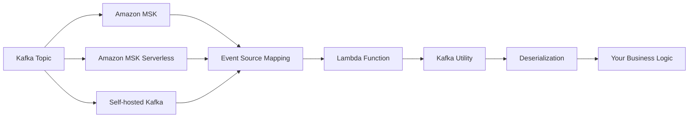
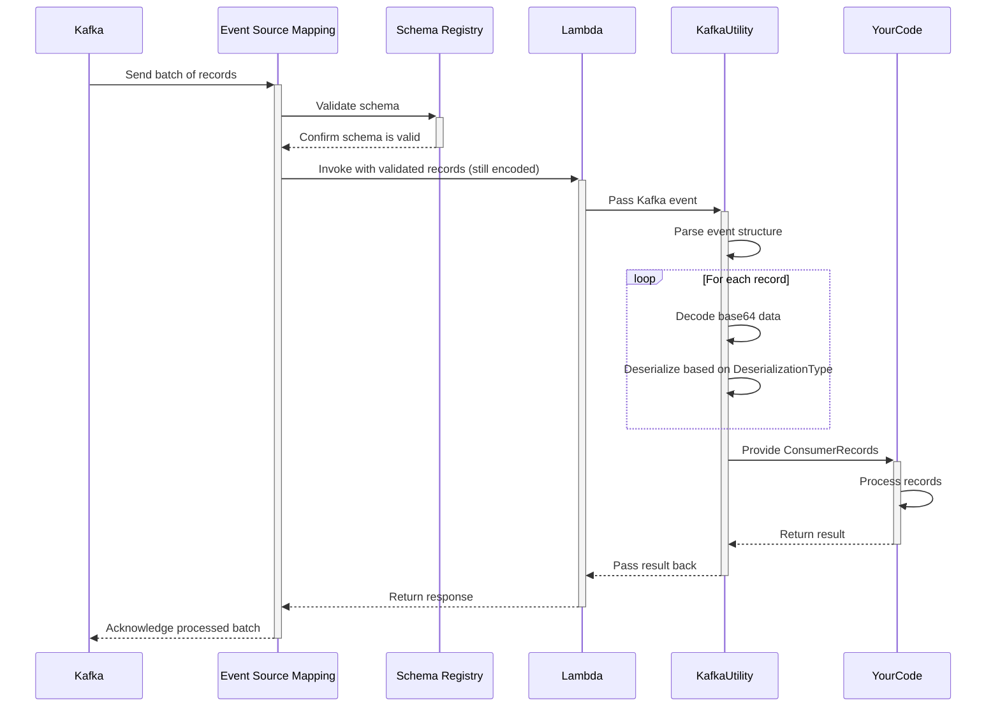
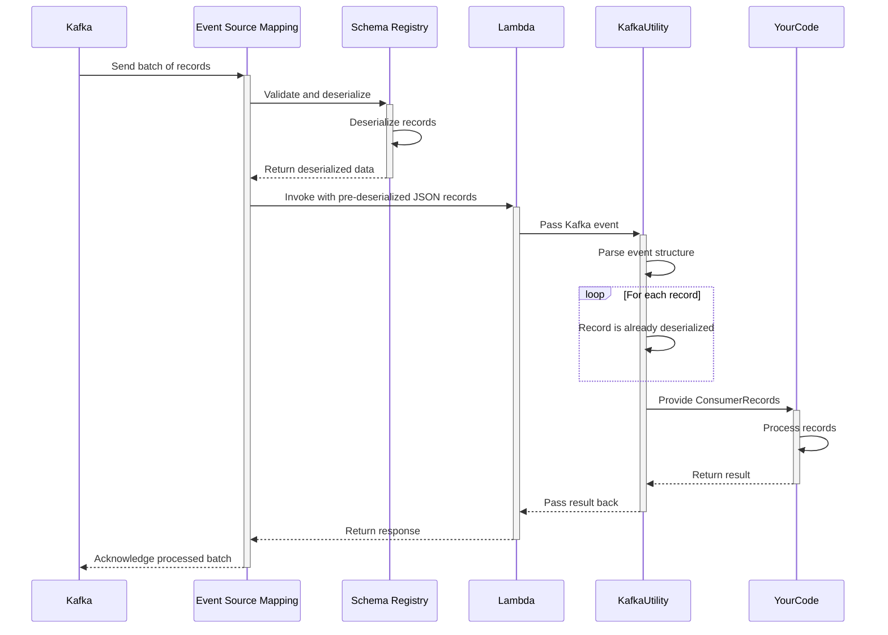
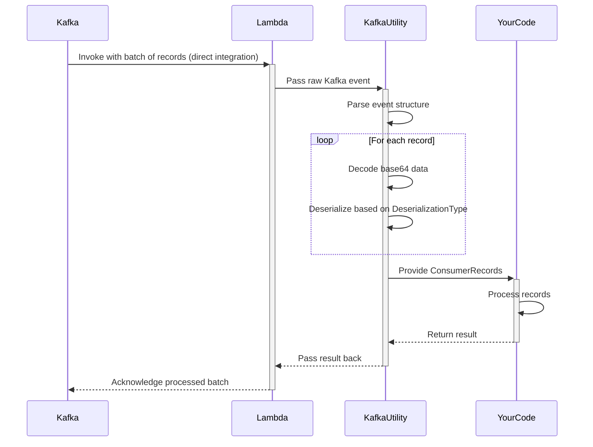

<!-- markdownlint-disable MD043 -->

The Kafka utility transparently handles message deserialization, provides an intuitive developer experience, and integrates seamlessly with the rest of the Powertools for AWS Lambda ecosystem.



## Key features

- Automatic deserialization of Kafka messages (JSON, Avro, and Protocol Buffers)
- Simplified event record handling with familiar Kafka `ConsumerRecords` interface
- Support for key and value deserialization
- Support for ESM with and without Schema Registry integration
- Proper error handling for deserialization issues

## Terminology

**Event Source Mapping (ESM)** A Lambda feature that reads from streaming sources (like Kafka) and invokes your Lambda function. It manages polling, batching, and error handling automatically, eliminating the need for consumer management code.

**Record Key and Value** A Kafka messages contain two important parts: an optional key that determines the partition and a value containing the actual message data. Both are base64-encoded in Lambda events and can be independently deserialized.

**Deserialization** Is the process of converting binary data (base64-encoded in Lambda events) into usable Java objects according to a specific format like JSON, Avro, or Protocol Buffers. Powertools handles this conversion automatically.

**DeserializationType enum** Contains parameters that tell Powertools how to interpret message data, including the format type (JSON, Avro, Protocol Buffers).

**Schema Registry** Is a centralized service that stores and validates schemas, ensuring producers and consumers maintain compatibility when message formats evolve over time.

## Moving from traditional Kafka consumers

Lambda processes Kafka messages as discrete events rather than continuous streams, requiring a different approach to consumer development that Powertools for AWS helps standardize.

| Aspect                | Traditional Kafka Consumers         | Lambda Kafka Consumer                                          |
| --------------------- | ----------------------------------- | -------------------------------------------------------------- |
| **Model**             | Pull-based (you poll for messages)  | Push-based (Lambda invoked with messages)                      |
| **Scaling**           | Manual scaling configuration        | Automatic scaling to partition count                           |
| **State**             | Long-running application with state | Stateless, ephemeral executions                                |
| **Offsets**           | Manual offset management            | Automatic offset commitment                                    |
| **Schema Validation** | Client-side schema validation       | Optional Schema Registry integration with Event Source Mapping |
| **Error Handling**    | Per-message retry control           | Batch-level retry policies                                     |

## Getting started

### Installation

Add the Powertools for AWS Lambda Kafka dependency to your project:

=== "Maven"

    ```xml
    <dependency>
        <groupId>software.amazon.lambda</groupId>
        <artifactId>powertools-kafka</artifactId>
        <version>{{ powertools.version }}</version>
    </dependency>
    <!-- Kafka clients dependency - compatibility works for >= 3.0.0 -->
    <dependency>
        <groupId>org.apache.kafka</groupId>
        <artifactId>kafka-clients</artifactId>
        <version>4.0.0</version>
    </dependency>
    ```

=== "Gradle"

    ```gradle
    dependencies {
        implementation 'software.amazon.lambda:powertools-kafka:{{ powertools.version }}'
        // Kafka clients dependency - compatibility works for >= 3.0.0
        implementation 'org.apache.kafka:kafka-clients:4.0.0'
    }
    ```

### Required resources

To use the Kafka utility, you need an AWS Lambda function configured with a Kafka event source. This can be Amazon MSK, MSK Serverless, or a self-hosted Kafka cluster.

=== "getting_started_with_msk.yaml"

    ```yaml
    AWSTemplateFormatVersion: '2010-09-09'
    Transform: AWS::Serverless-2016-10-31
    Resources:
      KafkaConsumerFunction:
        Type: AWS::Serverless::Function
        Properties:
          Handler: org.example.KafkaHandler::handleRequest
          Runtime: java21
          Timeout: 30
          Events:
            MSKEvent:
              Type: MSK
              Properties:
                StartingPosition: LATEST
                Stream: !GetAtt MyMSKCluster.Arn
                Topics:
                  - my-topic-1
                  - my-topic-2
          Policies:
            - AWSLambdaMSKExecutionRole
    ```

### Using ESM with Schema Registry

The Event Source Mapping configuration determines which mode is used. With `JSON`, Lambda converts all messages to JSON before invoking your function. With `SOURCE` mode, Lambda preserves the original format, requiring you function to handle the appropriate deserialization.

Powertools for AWS supports both Schema Registry integration modes in your Event Source Mapping configuration.

### Processing Kafka events

The Kafka utility transforms raw Lambda Kafka events into an intuitive format for processing. To handle messages effectively, you'll need to configure the `@Deserialization` annotation that matches your data format.

<!-- prettier-ignore -->
???+ tip "Using Avro is recommended"
    We recommend Avro for production Kafka implementations due to its schema evolution capabilities, compact binary format, and integration with Schema Registry. This offers better type safety and forward/backward compatibility compared to JSON.

=== "Avro Messages"

    ```java
    package org.example;

    import com.amazonaws.services.lambda.runtime.Context;
    import com.amazonaws.services.lambda.runtime.RequestHandler;
    import org.apache.kafka.clients.consumer.ConsumerRecord;
    import org.apache.kafka.clients.consumer.ConsumerRecords;
    import software.amazon.lambda.powertools.kafka.Deserialization;
    import software.amazon.lambda.powertools.kafka.DeserializationType;

    public class AvroKafkaHandler implements RequestHandler<ConsumerRecords<String, User>, String> {

        @Override
        @Deserialization(type = DeserializationType.KAFKA_AVRO)
        public String handleRequest(ConsumerRecords<String, User> records, Context context) {
            for (ConsumerRecord<String, User> record : records) {
                User user = record.value(); // User class is auto-generated from Avro schema
                System.out.printf("Processing user: %s, age %d%n", user.getName(), user.getAge());
            }
            return "OK";
        }
    }
    ```

=== "Protocol Buffers"

    ```java
    package org.example;

    import com.amazonaws.services.lambda.runtime.Context;
    import com.amazonaws.services.lambda.runtime.RequestHandler;
    import org.apache.kafka.clients.consumer.ConsumerRecord;
    import org.apache.kafka.clients.consumer.ConsumerRecords;
    import software.amazon.lambda.powertools.kafka.Deserialization;
    import software.amazon.lambda.powertools.kafka.DeserializationType;

    public class ProtobufKafkaHandler implements RequestHandler<ConsumerRecords<String, UserProto.User>, String> {

        @Override
        @Deserialization(type = DeserializationType.KAFKA_PROTOBUF)
        public String handleRequest(ConsumerRecords<String, UserProto.User> records, Context context) {
            for (ConsumerRecord<String, UserProto.User> record : records) {
                UserProto.User user = record.value(); // UserProto.User class is auto-generated from Protocol Buffer schema
                System.out.printf("Processing user: %s, age %d%n", user.getName(), user.getAge());
            }
            return "OK";
        }
    }
    ```

=== "JSON Messages"

    ```java
    package org.example;

    import com.amazonaws.services.lambda.runtime.Context;
    import com.amazonaws.services.lambda.runtime.RequestHandler;
    import org.apache.kafka.clients.consumer.ConsumerRecord;
    import org.apache.kafka.clients.consumer.ConsumerRecords;
    import software.amazon.lambda.powertools.kafka.Deserialization;
    import software.amazon.lambda.powertools.kafka.DeserializationType;

    public class JsonKafkaHandler implements RequestHandler<ConsumerRecords<String, User>, String> {

        @Override
        @Deserialization(type = DeserializationType.KAFKA_JSON)
        public String handleRequest(ConsumerRecords<String, User> records, Context context) {
            for (ConsumerRecord<String, User> record : records) {
                User user = record.value(); // Deserialized JSON object
                System.out.printf("Processing user: %s, age %d%n", user.getName(), user.getAge());
            }
            return "OK";
        }
    }
    ```

<!-- prettier-ignore -->
???+ tip "Full examples on GitHub"
    A full example including how to generate Avro and Protobuf Java classes can be found on GitHub at [https://github.com/aws-powertools/powertools-lambda-java/tree/main/examples/powertools-examples-kafka](https://github.com/aws-powertools/powertools-lambda-java/tree/main/examples/powertools-examples-kafka).

### Deserializing keys and values

The `@Deserialization` annotation deserializes both keys and values based on your type configuration. This flexibility allows you to work with different data formats in the same message.

=== "Key and Value Deserialization"

    ```java
    package org.example;

    import com.amazonaws.services.lambda.runtime.Context;
    import com.amazonaws.services.lambda.runtime.RequestHandler;
    import org.apache.kafka.clients.consumer.ConsumerRecord;
    import org.apache.kafka.clients.consumer.ConsumerRecords;
    import software.amazon.lambda.powertools.kafka.Deserialization;
    import software.amazon.lambda.powertools.kafka.DeserializationType;

    public class KeyValueKafkaHandler implements RequestHandler<ConsumerRecords<ProductKey, ProductInfo>, String> {

        @Override
        @Deserialization(type = DeserializationType.KAFKA_AVRO)
        public String handleRequest(ConsumerRecords<ProductKey, ProductInfo> records, Context context) {
            for (ConsumerRecord<ProductKey, ProductInfo> record : records) {
                // Access both deserialized components
                ProductKey key = record.key(); // ProductKey class is auto-generated from Avro schema
                ProductInfo product = record.value(); // ProductInfo class is auto-generated from Avro schema

                System.out.printf("Processing product ID: %s%n", key.getProductId());
                System.out.printf("Product: %s - $%.2f%n", product.getName(), product.getPrice());
            }
            return "OK";
        }
    }
    ```

=== "Value-Only Deserialization"

    ```java
    package org.example;

    import com.amazonaws.services.lambda.runtime.Context;
    import com.amazonaws.services.lambda.runtime.RequestHandler;
    import org.apache.kafka.clients.consumer.ConsumerRecord;
    import org.apache.kafka.clients.consumer.ConsumerRecords;
    import software.amazon.lambda.powertools.kafka.Deserialization;
    import software.amazon.lambda.powertools.kafka.DeserializationType;

    public class ValueOnlyKafkaHandler implements RequestHandler<ConsumerRecords<String, Order>, String> {

        @Override
        @Deserialization(type = DeserializationType.KAFKA_JSON)
        public String handleRequest(ConsumerRecords<String, Order> records, Context context) {
            for (ConsumerRecord<String, Order> record : records) {
                // Key remains as string (if present)
                String key = record.key();
                if (key != null) {
                    System.out.printf("Message key: %s%n", key);
                }

                // Value is deserialized as JSON
                Order order = record.value();
                System.out.printf("Order #%s - Total: $%.2f%n", order.getOrderId(), order.getTotal());
            }
            return "OK";
        }
    }
    ```

### Handling primitive types

When working with primitive data types (strings, integers, etc.) rather than structured objects, you can use any deserialization type such as `KAFKA_JSON`. Simply place the primitive type like `Integer` or `String` in the `ConsumerRecords` generic type parameters, and the library will automatically handle primitive type deserialization.

<!-- prettier-ignore -->
???+ tip "Common pattern: Keys with primitive values"
    Using primitive types (strings, integers) as Kafka message keys is a common pattern for partitioning and identifying messages. Powertools automatically handles these primitive keys without requiring special configuration, making it easy to implement this popular design pattern.

=== "Primitive key"

    ```java
    package org.example;

    import com.amazonaws.services.lambda.runtime.Context;
    import com.amazonaws.services.lambda.runtime.RequestHandler;
    import org.apache.kafka.clients.consumer.ConsumerRecord;
    import org.apache.kafka.clients.consumer.ConsumerRecords;
    import software.amazon.lambda.powertools.kafka.Deserialization;
    import software.amazon.lambda.powertools.kafka.DeserializationType;

    public class PrimitiveKeyHandler implements RequestHandler<ConsumerRecords<Integer, Customer>, String> {

        @Override
        @Deserialization(type = DeserializationType.KAFKA_JSON)
        public String handleRequest(ConsumerRecords<Integer, Customer> records, Context context) {
            for (ConsumerRecord<Integer, Customer> record : records) {
                // Key is automatically deserialized as Integer
                Integer key = record.key();

                // Value is deserialized as JSON
                Customer customer = record.value();

                System.out.printf("Key: %d%n", key);
                System.out.printf("Name: %s%n", customer.getName());
                System.out.printf("Email: %s%n", customer.getEmail());
            }
            return "OK";
        }
    }
    ```

=== "Primitive key and value"

    ```java
    package org.example;

    import com.amazonaws.services.lambda.runtime.Context;
    import com.amazonaws.services.lambda.runtime.RequestHandler;
    import org.apache.kafka.clients.consumer.ConsumerRecord;
    import org.apache.kafka.clients.consumer.ConsumerRecords;
    import software.amazon.lambda.powertools.kafka.Deserialization;
    import software.amazon.lambda.powertools.kafka.DeserializationType;

    public class PrimitiveHandler implements RequestHandler<ConsumerRecords<String, String>, String> {

        @Override
        @Deserialization(type = DeserializationType.KAFKA_JSON)
        public String handleRequest(ConsumerRecords<String, String> records, Context context) {
            for (ConsumerRecord<String, String> record : records) {
                // Key is automatically deserialized as String
                String key = record.key();

                // Value is automatically deserialized as String
                String value = record.value();

                System.out.printf("Key: %s%n", key);
                System.out.printf("Value: %s%n", value);
            }
            return "OK";
        }
    }
    ```

### Message format support and comparison

The Kafka utility supports multiple serialization formats to match your existing Kafka implementation. Choose the format that best suits your needs based on performance, schema evolution requirements, and ecosystem compatibility.

<!-- prettier-ignore -->
???+ tip "Selecting the right format"
    For new applications, consider Avro or Protocol Buffers over JSON. Both provide schema validation, evolution support, and significantly better performance with smaller message sizes. Avro is particularly well-suited for Kafka due to its built-in schema evolution capabilities.

=== "Supported Formats"

    | Format | DeserializationType | Description | Required Dependencies |
    |--------|---------------------|-------------|----------------------|
    | **JSON** | `KAFKA_JSON` | Human-readable text format | Jackson |
    | **Avro** | `KAFKA_AVRO` | Compact binary format with schema | Apache Avro |
    | **Protocol Buffers** | `KAFKA_PROTOBUF` | Efficient binary format | Protocol Buffers |
    | **Lambda Default** | `LAMBDA_DEFAULT` | Uses Lambda's built-in deserialization (equivalent to removing the @Deserialization annotation) | None |

=== "Format Comparison"

    | Feature | JSON | Avro | Protocol Buffers |
    |---------|------|------|-----------------|
    | **Schema Definition** | Optional | Required schema file | Required .proto file |
    | **Schema Evolution** | None | Strong support | Strong support |
    | **Size Efficiency** | Low | High | Highest |
    | **Processing Speed** | Slower | Fast | Fastest |
    | **Human Readability** | High | Low | Low |
    | **Implementation Complexity** | Low | Medium | Medium |
    | **Additional Dependencies** | None | Apache Avro | Protocol Buffers |

Choose the serialization format that best fits your needs:

- **JSON**: Best for simplicity and when schema flexibility is important
- **Avro**: Best for systems with evolving schemas and when compatibility is critical
- **Protocol Buffers**: Best for performance-critical systems with structured data
- **Lambda Default**: Best for simple string-based messages or when using Lambda's built-in deserialization

## Advanced

### Accessing record metadata

Each Kafka record contains important metadata that you can access alongside the deserialized message content. This metadata helps with message processing, troubleshooting, and implementing advanced patterns like exactly-once processing.

=== "Working with Record Metadata"

    ```java
    package org.example;

    import com.amazonaws.services.lambda.runtime.Context;
    import com.amazonaws.services.lambda.runtime.RequestHandler;
    import org.apache.kafka.clients.consumer.ConsumerRecord;
    import org.apache.kafka.clients.consumer.ConsumerRecords;
    import org.apache.kafka.common.header.Header;
    import software.amazon.lambda.powertools.kafka.Deserialization;
    import software.amazon.lambda.powertools.kafka.DeserializationType;

    public class MetadataKafkaHandler implements RequestHandler<ConsumerRecords<String, Customer>, String> {

        @Override
        @Deserialization(type = DeserializationType.KAFKA_AVRO)
        public String handleRequest(ConsumerRecords<String, Customer> records, Context context) {
            for (ConsumerRecord<String, Customer> record : records) {
                // Log record coordinates for tracing
                System.out.printf("Processing message from topic '%s'%n", record.topic());
                System.out.printf("  Partition: %d, Offset: %d%n", record.partition(), record.offset());
                System.out.printf("  Produced at: %d%n", record.timestamp());

                // Process message headers
                if (record.headers() != null) {
                    for (Header header : record.headers()) {
                        System.out.printf("  Header: %s = %s%n",
                            header.key(), new String(header.value()));
                    }
                }

                // Access the Avro deserialized message content
                Customer customer = record.value(); // Customer class is auto-generated from Avro schema
                System.out.printf("Processing order for: %s%n", customer.getName());
                System.out.printf("Order total: $%.2f%n", customer.getOrderTotal());
            }
            return "OK";
        }
    }
    ```

#### Available metadata properties

| Property          | Description                                     | Example Use Case                            |
| ----------------- | ----------------------------------------------- | ------------------------------------------- |
| `topic()`         | Topic name the record was published to          | Routing logic in multi-topic consumers      |
| `partition()`     | Kafka partition number                          | Tracking message distribution               |
| `offset()`        | Position in the partition                       | De-duplication, exactly-once processing     |
| `timestamp()`     | Unix timestamp when record was created          | Event timing analysis                       |
| `timestampType()` | Timestamp type (CREATE_TIME or LOG_APPEND_TIME) | Data lineage verification                   |
| `headers()`       | Key-value pairs attached to the message         | Cross-cutting concerns like correlation IDs |
| `key()`           | Deserialized message key                        | Customer ID or entity identifier            |
| `value()`         | Deserialized message content                    | The actual business data                    |

### Error handling

Handle errors gracefully when processing Kafka messages to ensure your application maintains resilience and provides clear diagnostic information. The Kafka utility integrates with standard Java exception handling patterns.

<!-- prettier-ignore -->
!!! info "Treating Deserialization errors"
    Read [Deserialization failures](#deserialization-failures). Deserialization failures will fail the whole batch and do not execute your handler.

=== "Error Handling"

    ```java
    package org.example;

    import com.amazonaws.services.lambda.runtime.Context;
    import com.amazonaws.services.lambda.runtime.RequestHandler;
    import org.apache.kafka.clients.consumer.ConsumerRecord;
    import org.apache.kafka.clients.consumer.ConsumerRecords;
    import software.amazon.lambda.powertools.kafka.Deserialization;
    import software.amazon.lambda.powertools.kafka.DeserializationType;
    import software.amazon.lambda.powertools.metrics.FlushMetrics;
    import software.amazon.lambda.powertools.metrics.Metrics;
    import software.amazon.lambda.powertools.metrics.MetricsFactory;
    import software.amazon.lambda.powertools.metrics.model.MetricUnit;
    import org.slf4j.Logger;
    import org.slf4j.LoggerFactory;

    public class ErrorHandlingKafkaHandler implements RequestHandler<ConsumerRecords<String, Order>, String> {

        private static final Logger logger = LoggerFactory.getLogger(ErrorHandlingKafkaHandler.class);
        private static final Metrics metrics = MetricsFactory.getMetricsInstance();

        @Override
        @FlushMetrics(namespace = "KafkaProcessing", service = "order-processing")
        @Deserialization(type = DeserializationType.KAFKA_AVRO)
        public String handleRequest(ConsumerRecords<String, Order> records, Context context) {
            metrics.addMetric("TotalRecords", records.count(), MetricUnit.COUNT);
            int successfulRecords = 0;
            int failedRecords = 0;

            for (ConsumerRecord<String, Order> record : records) {
                try {
                    Order order = record.value(); // Order class is auto-generated from Avro schema
                    processOrder(order);
                    successfulRecords++;
                    metrics.addMetric("ProcessedRecords", 1, MetricUnit.COUNT);

                } catch (Exception e) {
                    failedRecords++;
                    logger.error("Error processing Kafka message from topic: {}, partition: {}, offset: {}",
                        record.topic(), record.partition(), record.offset(), e);
                    metrics.addMetric("ProcessingErrors", 1, MetricUnit.COUNT);
                    // Optionally send to DLQ or error topic
                    sendToDlq(record);
                }
            }

            return String.format("Processed %d records successfully, %d failed",
                successfulRecords, failedRecords);
        }

        private void processOrder(Order order) {
            // Your business logic here
            System.out.printf("Processing order: %s%n", order.getOrderId());
        }

        private void sendToDlq(ConsumerRecord<String, Order> record) {
            // Implementation to send failed records to dead letter queue
        }
    }
    ```

### Integrating with Idempotency

When processing Kafka messages in Lambda, failed batches can result in message reprocessing. The idempotency utility prevents duplicate processing by tracking which messages have already been handled, ensuring each message is processed exactly once.

The Idempotency utility automatically stores the result of each successful operation, returning the cached result if the same message is processed again, which prevents potentially harmful duplicate operations like double-charging customers or double-counting metrics.

=== "Idempotent Kafka Processing"

    ```java
    package org.example;

    import com.amazonaws.services.lambda.runtime.Context;
    import com.amazonaws.services.lambda.runtime.RequestHandler;
    import org.apache.kafka.clients.consumer.ConsumerRecord;
    import org.apache.kafka.clients.consumer.ConsumerRecords;
    import software.amazon.lambda.powertools.kafka.Deserialization;
    import software.amazon.lambda.powertools.kafka.DeserializationType;
    import software.amazon.lambda.powertools.idempotency.Idempotency;
    import software.amazon.lambda.powertools.idempotency.IdempotencyConfig;
    import software.amazon.lambda.powertools.idempotency.Idempotent;
    import software.amazon.lambda.powertools.idempotency.persistence.dynamodb.DynamoDBPersistenceStore;

    public class IdempotentKafkaHandler implements RequestHandler<ConsumerRecords<String, Payment>, String> {

        public IdempotentKafkaHandler() {
            // Configure idempotency with DynamoDB persistence store
            Idempotency.config()
                .withPersistenceStore(
                    DynamoDBPersistenceStore.builder()
                        .withTableName("IdempotencyTable")
                        .build())
                .configure();
        }

        @Override
        @Deserialization(type = DeserializationType.KAFKA_JSON)
        public String handleRequest(ConsumerRecords<String, Payment> records, Context context) {
            for (ConsumerRecord<String, Payment> record : records) {
                // Payment class deserialized from JSON
                Payment payment = record.value();

                // Process each message with idempotency protection
                processPayment(payment);
            }
            return "OK";
        }

        @Idempotent
        private void processPayment(Payment payment) {
            System.out.printf("Processing payment %s%n", payment.getPaymentId());

            // Your business logic here
            PaymentService.process(payment.getPaymentId(), payment.getCustomerId(), payment.getAmount());
        }
    }
    ```

<!-- prettier-ignore -->
???+ tip "Ensuring exactly-once processing"
    The @Idempotent annotation will use the JSON representation of the Payment object to make sure that the same object is only processed exactly once. Even if a batch fails and Lambda retries the messages, each unique payment will be processed exactly once.

### Best practices

#### Batch size configuration

The number of Kafka records processed per Lambda invocation is controlled by your Event Source Mapping configuration. Properly sized batches optimize cost and performance.

=== "Batch size configuration"

    ```yaml
    Resources:
      OrderProcessingFunction:
        Type: AWS::Serverless::Function
        Properties:
          Handler: org.example.OrderHandler::handleRequest
          Runtime: java21
          Events:
            KafkaEvent:
              Type: MSK
              Properties:
                Stream: !GetAtt OrdersMSKCluster.Arn
                Topics:
                  - order-events
                  - payment-events
                # Configuration for optimal throughput/latency balance
                BatchSize: 100
                MaximumBatchingWindowInSeconds: 5
                StartingPosition: LATEST
                # Enable partial batch success reporting
                FunctionResponseTypes:
                  - ReportBatchItemFailures
    ```

Different workloads benefit from different batch configurations:

- **High-volume, simple processing**: Use larger batches (100-500 records) with short timeout
- **Complex processing with database operations**: Use smaller batches (10-50 records)
- **Mixed message sizes**: Set appropriate batching window (1-5 seconds) to handle variability

#### Cross-language compatibility

When using binary serialization formats across multiple programming languages, ensure consistent schema handling to prevent deserialization failures.

=== "Using Python naming convention"

    ```java
    package org.example;

    import com.amazonaws.services.lambda.runtime.Context;
    import com.amazonaws.services.lambda.runtime.RequestHandler;
    import org.apache.kafka.clients.consumer.ConsumerRecord;
    import org.apache.kafka.clients.consumer.ConsumerRecords;
    import software.amazon.lambda.powertools.kafka.Deserialization;
    import software.amazon.lambda.powertools.kafka.DeserializationType;
    import com.fasterxml.jackson.annotation.JsonProperty;
    import java.time.Instant;

    public class CrossLanguageKafkaHandler implements RequestHandler<ConsumerRecords<String, OrderEvent>, String> {

        @Override
        @Deserialization(type = DeserializationType.KAFKA_JSON)
        public String handleRequest(ConsumerRecords<String, OrderEvent> records, Context context) {
            for (ConsumerRecord<String, OrderEvent> record : records) {
                OrderEvent order = record.value(); // OrderEvent class handles JSON with Python field names
                System.out.printf("Processing order %s from %s%n",
                    order.getOrderId(), order.getOrderDate());
            }
            return "OK";
        }
    }

    // Example class that handles Python snake_case field names
    public class OrderEvent {
        @JsonProperty("order_id")
        private String orderId;

        @JsonProperty("customer_id")
        private String customerId;

        @JsonProperty("total_amount")
        private double totalAmount;

        @JsonProperty("order_date")
        private long orderDateMillis;

        // Getters and setters
        public String getOrderId() { return orderId; }
        public void setOrderId(String orderId) { this.orderId = orderId; }

        public String getCustomerId() { return customerId; }
        public void setCustomerId(String customerId) { this.customerId = customerId; }

        public double getTotalAmount() { return totalAmount; }
        public void setTotalAmount(double totalAmount) { this.totalAmount = totalAmount; }

        public Instant getOrderDate() {
            return Instant.ofEpochMilli(orderDateMillis);
        }
        public void setOrderDate(long orderDateMillis) {
            this.orderDateMillis = orderDateMillis;
        }
    }
    ```

Common cross-language challenges to address:

- **Field naming conventions**: camelCase in Java vs snake_case in Python
- **Date/time**: representation differences
- **Numeric precision handling**: especially decimals

### Troubleshooting

#### Deserialization failures

The Java Kafka utility registers a [custom Lambda serializer](https://docs.aws.amazon.com/lambda/latest/dg/java-custom-serialization.html) that performs **eager deserialization** of all records in the batch before your handler method is invoked.

This means that if any record in the batch fails deserialization, a `RuntimeException` will be thrown with a concrete error message explaining why deserialization failed, and your handler method will never be called.

**Key implications:**

- **Batch-level failure**: If one record fails deserialization, the entire batch fails
- **Early failure detection**: Deserialization errors are caught before your business logic runs
- **Clear error messages**: The `RuntimeException` provides specific details about what went wrong
- **No partial processing**: You cannot process some records while skipping failed ones within the same batch

**Example of deserialization failure:**

```java
// If any record in the batch has invalid Avro data, you'll see:
// RuntimeException: Failed to deserialize Kafka record: Invalid Avro schema for record at offset 12345
```

<!-- prettier-ignore -->
!!! warning "Handler method not invoked on deserialization failure"
    When deserialization fails, your `handleRequest` method will not be invoked at all. The `RuntimeException` is thrown before your handler code runs, preventing any processing of the batch.

**Handling deserialization failures:**

Since deserialization happens before your handler is called, you cannot catch these exceptions within your handler method. Instead, configure your Event Source Mapping with appropriate error handling:

- **Dead Letter Queue (DLQ)**: Configure a DLQ to capture failed batches for later analysis
- **Maximum Retry Attempts**: Set appropriate retry limits to avoid infinite retries
- **Batch Size**: Use smaller batch sizes to minimize the impact of individual record failures

```yaml
# Example SAM template configuration for error handling
Events:
  KafkaEvent:
    Type: MSK
    Properties:
      # ... other properties
      BatchSize: 10 # Smaller batches reduce failure impact
      MaximumRetryAttempts: 3
      DestinationConfig:
        OnFailure:
          Type: SQS
          Destination: !GetAtt DeadLetterQueue.Arn
```

#### Schema compatibility issues

Schema compatibility issues often manifest as successful connections but failed deserialization. Common causes include:

- **Schema evolution without backward compatibility**: New producer schema is incompatible with consumer schema
- **Field type mismatches**: For example, a field changed from String to Integer across systems
- **Missing required fields**: Fields required by the consumer schema but absent in the message
- **Default value discrepancies**: Different handling of default values between languages

When using Schema Registry, verify schema compatibility rules are properly configured for your topics and that all applications use the same registry.

#### Memory and timeout optimization

Lambda functions processing Kafka messages may encounter resource constraints, particularly with large batches or complex processing logic.

For memory errors:

- Increase Lambda memory allocation, which also provides more CPU resources
- Process fewer records per batch by adjusting the `BatchSize` parameter in your event source mapping
- Consider optimizing your message format to reduce memory footprint

For timeout issues:

- Extend your Lambda function timeout setting to accommodate processing time
- Implement chunked or asynchronous processing patterns for time-consuming operations
- Monitor and optimize database operations, external API calls, or other I/O operations in your handler

<!-- prettier-ignore -->
???+ tip "Monitoring memory usage"
    Use CloudWatch metrics to track your function's memory utilization. If it consistently exceeds 80% of allocated memory, consider increasing the memory allocation or optimizing your code.

## Kafka workflow

### Using ESM with Schema Registry validation (SOURCE)

<center>

</center>

### Using ESM with Schema Registry deserialization (JSON)

<center>

</center>

### Using ESM without Schema Registry integration

<center>

</center>

## Testing your code

Testing Kafka consumer functions is straightforward with JUnit. You can construct Kafka `ConsumerRecords` in the default way provided by the kafka-clients library without needing a real Kafka cluster.

=== "Testing your code"

    ```java
    package org.example;

    import com.amazonaws.services.lambda.runtime.Context;
    import com.amazonaws.services.lambda.runtime.events.KafkaEvent;
    import org.apache.kafka.clients.consumer.ConsumerRecord;
    import org.apache.kafka.clients.consumer.ConsumerRecords;
    import org.apache.kafka.common.TopicPartition;
    import org.junit.jupiter.api.Test;
    import org.junit.jupiter.api.extension.ExtendWith;
    import org.mockito.Mock;
    import org.mockito.junit.jupiter.MockitoExtension;
    import java.util.*;

    import static org.junit.jupiter.api.Assertions.*;
    import static org.mockito.Mockito.*;

    @ExtendWith(MockitoExtension.class)
    class KafkaHandlerTest {

        @Mock
        private Context context;

        @Test
        void testProcessJsonMessage() {
            // Create a test Kafka event with JSON data
            Order testOrder = new Order("12345", 99.95);
            ConsumerRecord<String, Order> record = new ConsumerRecord<>(
                "orders-topic", 0, 15L, null, testOrder);

            Map<TopicPartition, List<ConsumerRecord<String, Order>>> recordsMap = new HashMap<>();
            recordsMap.put(new TopicPartition("orders-topic", 0), Arrays.asList(record));
            ConsumerRecords<String, Order> records = new ConsumerRecords<>(recordsMap);

            // Create handler and invoke
            JsonKafkaHandler handler = new JsonKafkaHandler();
            String response = handler.handleRequest(records, context);

            // Verify the response
            assertEquals("OK", response);
        }

        @Test
        void testProcessMultipleRecords() {
            // Create a test event with multiple records
            Customer customer1 = new Customer("A1", "Alice");
            Customer customer2 = new Customer("B2", "Bob");

            List<ConsumerRecord<String, Customer>> recordList = Arrays.asList(
                new ConsumerRecord<>("customers-topic", 0, 10L, null, customer1),
                new ConsumerRecord<>("customers-topic", 0, 11L, null, customer2)
            );

            Map<TopicPartition, List<ConsumerRecord<String, Customer>>> recordsMap = new HashMap<>();
            recordsMap.put(new TopicPartition("customers-topic", 0), recordList);
            ConsumerRecords<String, Customer> records = new ConsumerRecords<>(recordsMap);

            // Create handler and invoke
            JsonKafkaHandler handler = new JsonKafkaHandler();
            String response = handler.handleRequest(records, context);

            // Verify the response
            assertEquals("OK", response);
        }
    }
    ```

## Extra Resources

### Lambda Custom Serializers Compatibility

This Kafka utility uses [Lambda custom serializers](https://docs.aws.amazon.com/lambda/latest/dg/java-custom-serialization.html) to provide automatic deserialization of Kafka messages.

**Important compatibility considerations:**

- **Existing custom serializers**: This utility will not be compatible if you already use your own custom Lambda serializer in your project
- **Non-Kafka handlers**: Installing this library will not affect default Lambda serialization behavior for non-Kafka related handlers
- **Kafka-specific**: The custom serialization only applies to handlers annotated with `@Deserialization`
- **Lambda default fallback**: Using `@Deserialization(type = DeserializationType.LAMBDA_DEFAULT)` will proxy to Lambda's default serialization behavior

**Need help with compatibility?**

If you are blocked from adopting this utility due to existing custom serializers or other compatibility concerns, please contact us with your specific use-cases. We'd like to understand your requirements and explore potential solutions.

For more information about Lambda custom serialization, see the [official AWS documentation](https://docs.aws.amazon.com/lambda/latest/dg/java-custom-serialization.html).
