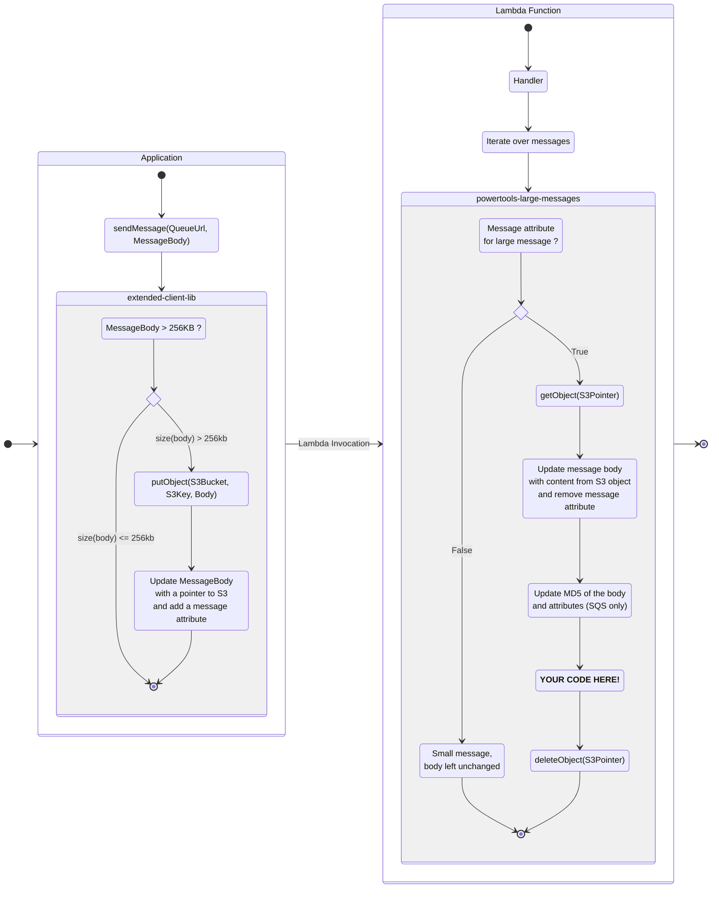

The large message utility handles SQS and SNS messages which have had their payloads
offloaded to S3 if they are larger than the maximum allowed size (256 KB).

!!! Notice
    The large message utility (available in the `powertools-batch` module with v1.16.1 or lower) is now deprecated
    and replaced by the `powertools-large-messages` described in this page.
    You can still get the documentation [here](sqs_large_message_handling.md)
    and the migration guide [here](#migration-from-the-sqs-large-message-utility).

## Features

- Automatically retrieve the content of S3 objects when SQS or SNS messages have been offloaded to S3.
- Automatically delete the S3 Objects after processing succeeds.
- Compatible with the batch module (with SQS).

## Background



SQS and SNS message payload is limited to 256KB. If you wish to send messages with a larger payload, you can leverage the
[amazon-sqs-java-extended-client-lib](https://github.com/awslabs/amazon-sqs-java-extended-client-lib)
or [amazon-sns-java-extended-client-lib](https://github.com/awslabs/amazon-sns-java-extended-client-lib) which
offload the message to Amazon S3. See documentation
([SQS](https://docs.aws.amazon.com/AWSSimpleQueueService/latest/SQSDeveloperGuide/sqs-s3-messages.html)
/ [SNS](https://docs.aws.amazon.com/sns/latest/dg/large-message-payloads.html))

When offloaded to S3, the message contains a specific message attribute and the payload only contains a pointer to the
S3 object (bucket and object key).

This utility automatically retrieves messages which have been offloaded to S3 using the
extended client libraries. Once a message's payload has been processed successfully, the
utility deletes the payload from S3.

This utility is compatible with
versions *[1.1.0+](https://github.com/awslabs/amazon-sqs-java-extended-client-lib/releases/tag/1.1.0)*
of amazon-sqs-java-extended-client-lib
and *[1.0.0+](https://github.com/awslabs/amazon-sns-java-extended-client-lib/releases/tag/1.0.0)*
of amazon-sns-java-extended-client-lib.

## Install

Depending on your version of Java (either Java 1.8 or 11+), the configuration slightly changes.

=== "Maven Java 11+"
```xml hl_lines="3-7 16 18 24-27"
<dependencies>
...
<dependency>
<groupId>software.amazon.lambda</groupId>
<artifactId>powertools-large-messages</artifactId>
<version>{{ powertools.version }}</version>
</dependency>
...
</dependencies>
...
<!-- configure the aspectj-maven-plugin to compile-time weave (CTW) the aws-lambda-powertools-java aspects into your project -->
<build>
<plugins>
...
<plugin>
<groupId>dev.aspectj</groupId>
<artifactId>aspectj-maven-plugin</artifactId>
<version>1.13.1</version>
<configuration>
<source>11</source> <!-- or higher -->
<target>11</target> <!-- or higher -->
<complianceLevel>11</complianceLevel> <!-- or higher -->
<aspectLibraries>
<aspectLibrary>
<groupId>software.amazon.lambda</groupId>
<artifactId>powertools-large-messages</artifactId>
</aspectLibrary>
</aspectLibraries>
</configuration>
<executions>
<execution>
<goals>
<goal>compile</goal>
</goals>
</execution>
</executions>
</plugin>
...
</plugins>
</build>
```

=== "Maven Java 1.8"

    ```xml hl_lines="3-7 16 18 24-27"
    <dependencies>
        ...
        <dependency>
            <groupId>software.amazon.lambda</groupId>
            <artifactId>powertools-large-messages</artifactId>
            <version>{{ powertools.version }}</version>
        </dependency>
        ...
    </dependencies>
    ...
    <!-- configure the aspectj-maven-plugin to compile-time weave (CTW) the aws-lambda-powertools-java aspects into your project -->
    <build>
        <plugins>
            ...
            <plugin>
                 <groupId>org.codehaus.mojo</groupId>
                 <artifactId>aspectj-maven-plugin</artifactId>
                 <version>1.14.0</version>
                 <configuration>
                     <source>1.8</source>
                     <target>1.8</target>
                     <complianceLevel>1.8</complianceLevel>
                     <aspectLibraries>
                         <aspectLibrary>
                             <groupId>software.amazon.lambda</groupId>
                             <artifactId>powertools-large-messages</artifactId>
                         </aspectLibrary>
                     </aspectLibraries>
                 </configuration>
                 <executions>
                     <execution>
                         <goals>
                             <goal>compile</goal>
                         </goals>
                     </execution>
                 </executions>
            </plugin>
            ...
        </plugins>
    </build>
    ```

=== "Gradle Java 11+"

    ```groovy hl_lines="3 11"
        plugins {
            id 'java'
            id 'io.freefair.aspectj.post-compile-weaving' version '8.1.0'
        }
        
        repositories {
            mavenCentral()
        }
        
        dependencies {
            aspect 'software.amazon.lambda:powertools-large-messages:{{ powertools.version }}'
        }
        
        sourceCompatibility = 11 // or higher
        targetCompatibility = 11 // or higher
    ```

=== "Gradle Java 1.8"

    ```groovy hl_lines="3 11"
        plugins {
            id 'java'
            id 'io.freefair.aspectj.post-compile-weaving' version '6.6.3'
        }
        
        repositories {
            mavenCentral()
        }
        
        dependencies {
            aspect 'software.amazon.lambda:powertools-large-messages:{{ powertools.version }}'
        }
        
        sourceCompatibility = 1.8
        targetCompatibility = 1.8
    ```

## Permissions

As the utility interacts with Amazon S3, the lambda function must have the following permissions
on the S3 bucket used for the large messages offloading:

- `s3:GetObject`
- `s3:DeleteObject`

## Annotation

The annotation `@LargeMessage` can be used on any method where the *first* parameter is one of:

- `SQSEvent.SQSMessage`
- `SNSEvent.SNSRecord`

=== "SQS Example"

    ```java hl_lines="8 13 15"
    import software.amazon.lambda.powertools.largemessages.LargeMessage;

    public class SqsMessageHandler implements RequestHandler<SQSEvent, SQSBatchResponse> {

        @Override
        public SQSBatchResponse handleRequest(SQSEvent event, Context context) {
            for (SQSMessage message: event.getRecords()) {
                processRawMessage(message, context);
            }
            return SQSBatchResponse.builder().build();
        }

        @LargeMessage
        private void processRawMessage(SQSEvent.SQSMessage sqsMessage, Context context) {
            // sqsMessage.getBody() will contain the content of the S3 object
        }
    }
    ```

=== "SNS Example"

    ```java hl_lines="7 11 13"
    import software.amazon.lambda.powertools.largemessages.LargeMessage;

    public class SnsRecordHandler implements RequestHandler<SNSEvent, String> {

        @Override
        public String handleRequest(SNSEvent event, Context context) {
            processSNSRecord(event.records.get(0)); // there are always only one message 
            return "Hello World";
        }

        @LargeMessage
        private void processSNSRecord(SNSEvent.SNSRecord snsRecord) {
            // snsRecord.getSNS().getMessage() will contain the content of the S3 object
        }
    }
    ```

When the Lambda function is invoked with a SQS or SNS event, the utility first
checks if the content was offloaded to S3. In the case of a large message, there is a message attribute
specifying the size of the offloaded message and the message contains a pointer to the S3 object.

If this is the case, the utility will retrieve the object from S3 using the `getObject(bucket, key)` API,
and place the content of the object in the message payload. You can then directly use the content of the message.
If there was an error during the S3 download, the function will fail with a `LargeMessageProcessingException`.

After your code is invoked and returns without error, the object is deleted from S3
using the `deleteObject(bucket, key)` API. You can disable the deletion of S3 objects with the following configuration:

=== "Don't delete S3 Objects"
    ```java
    @LargeMessage(deleteS3Object = false)
    private void processRawMessage(SQSEvent.SQSMessage sqsMessage) {
        // do something with the message
    }
    ```

!!! tip "Use together with batch module"
    This utility works perfectly together with the batch module (`powertools-batch`), especially for SQS:

    ```java hl_lines="2 5-7 12 15 16" title="Combining batch and large message modules"
    public class SqsBatchHandler implements RequestHandler<SQSEvent, SQSBatchResponse> {
        private final BatchMessageHandler<SQSEvent, SQSBatchResponse> handler;
    
        public SqsBatchHandler() {
            handler = new BatchMessageHandlerBuilder()
                    .withSqsBatchHandler()
                    .buildWithRawMessageHandler(this::processMessage);
        }

        @Override
        public SQSBatchResponse handleRequest(SQSEvent sqsEvent, Context context) {
            return handler.processBatch(sqsEvent, context);
        }

        @LargeMessage
        private void processMessage(SQSEvent.SQSMessage sqsMessage) {
            // do something with the message
        }
    }
    ```

!!! tip "Use together with idempotency module"
    This utility also works together with the idempotency module (`powertools-idempotency`). 
    You can add both the `@LargeMessage` and `@Idempotent` annotations to the same method. 
    The `@Idempotent` takes precedence over the `@LargeMessage` annotation. 
    It means Idempotency module will use the initial raw message (containing the S3 pointer) and not the large message.
    Using the large message would end up with potential issues when inserting the data in DynamoDB, where items
    are limited to 400 KB (while large messages can be up to 2 GB).

    ```java hl_lines="6 23-25" title="Combining idempotency and large message modules"
    public class SqsBatchHandler implements RequestHandler<SQSEvent, SQSBatchResponse> {
    
        public SqsBatchHandler() {
            Idempotency.config().withConfig(
                        IdempotencyConfig.builder()
                                .withEventKeyJMESPath("body") // get the body of the message for the idempotency key
                                .build())
                .withPersistenceStore(
                        DynamoDBPersistenceStore.builder()
                                .withTableName(System.getenv("IDEMPOTENCY_TABLE"))
                                .build()
                ).configure();
        }

        @Override
        public SQSBatchResponse handleRequest(SQSEvent sqsEvent, Context context) {
            for (SQSMessage message: event.getRecords()) {
                processRawMessage(message, context);
            }
            return SQSBatchResponse.builder().build();
        }

        @Idempotent
        @LargeMessage
        private String processRawMessage(@IdempotencyKey SQSEvent.SQSMessage sqsMessage, Context context) {
            // do something with the message
        }
    }
    ```

## Customizing S3 client configuration

To interact with S3, the utility creates a default S3 Client :

=== "Default S3 Client"
    ```java
    S3Client client = S3Client.builder()
                        .httpClient(UrlConnectionHttpClient.builder().build())
                        .region(Region.of(System.getenv(AWS_REGION_ENV)))
                        .build();
    ```

If you need to customize this `S3Client`, you can leverage the `LargeMessageConfig` singleton:

=== "Custom S3 Client"
    ```java hl_lines="6"
    import software.amazon.lambda.powertools.largemessages.LargeMessage;

    public class SnsRecordHandler implements RequestHandler<SNSEvent, String> {
        
        public SnsRecordHandler() {
            LargeMessageConfig.init().withS3Client(/* put your custom S3Client here */);
        }

        @Override
        public String handleRequest(SNSEvent event, Context context) {
            processSNSRecord(event.records.get(0)); 
            return "Hello World";
        }

        @LargeMessage
        private void processSNSRecord(SNSEvent.SNSRecord snsRecord) {
            // snsRecord.getSNS().getMessage() will contain the content of the S3 object
        }
    }
    ```

## Migration from the SQS Large Message utility

- Replace the dependency in maven / gradle: `powertools-sqs` ==> `powertools-large-messages`
- Replace the annotation: `@SqsLargeMessage` ==> `@LargeMessage` (the new module handles both SQS and SNS)
- Move the annotation away from the Lambda `handleRequest` method and put it on a method with `SQSEvent.SQSMessage`
  or `SNSEvent.SNSRecord` as first parameter.
- The annotation now handles a single message, contrary to the previous version that was handling the complete batch.
  It gives more control, especially when dealing with partial failures with SQS (see the batch module).
- The new module only provides an annotation, the `SqsUtils` is not available anymore in this new version.

Also, if you are still using the `powertools-sqs` library for batch processing, consider moving to `powertools-batch` at the same time to remove the dependency on this library completely; it has been deprecated and will be removed in v2.